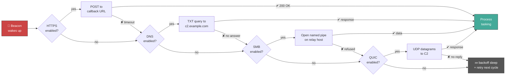
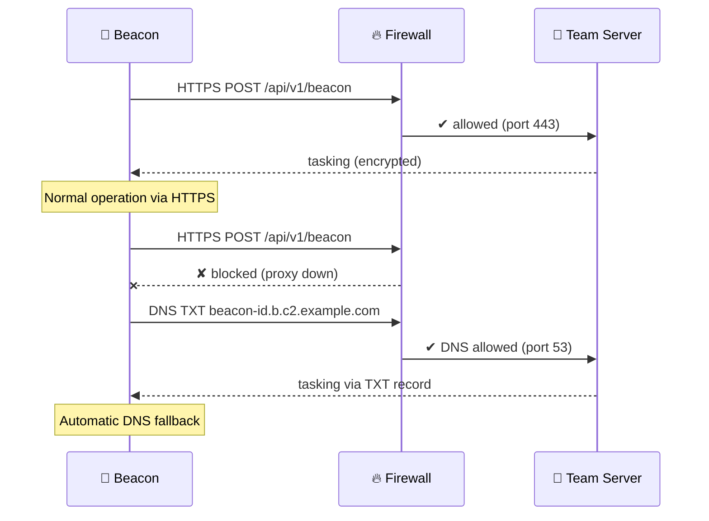
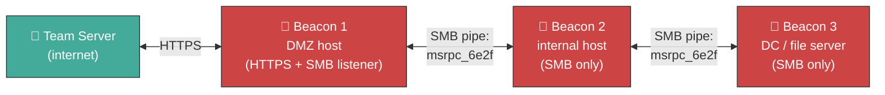
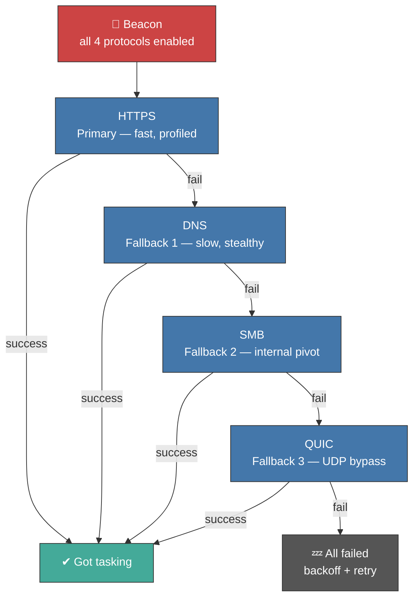
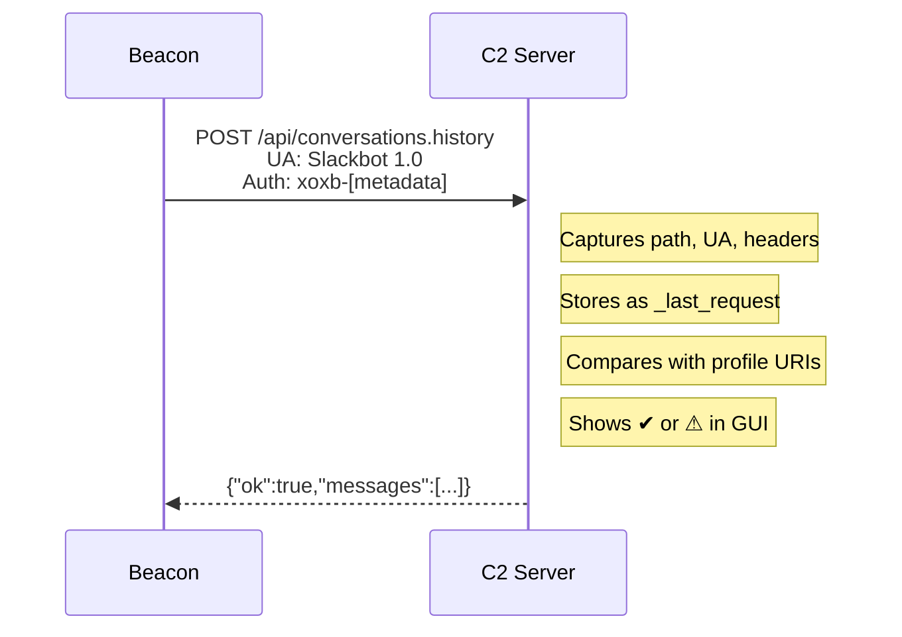
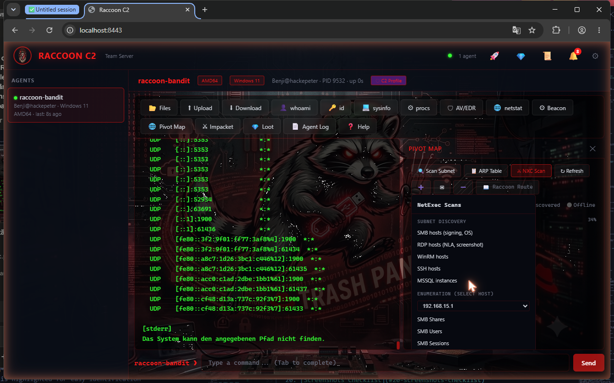
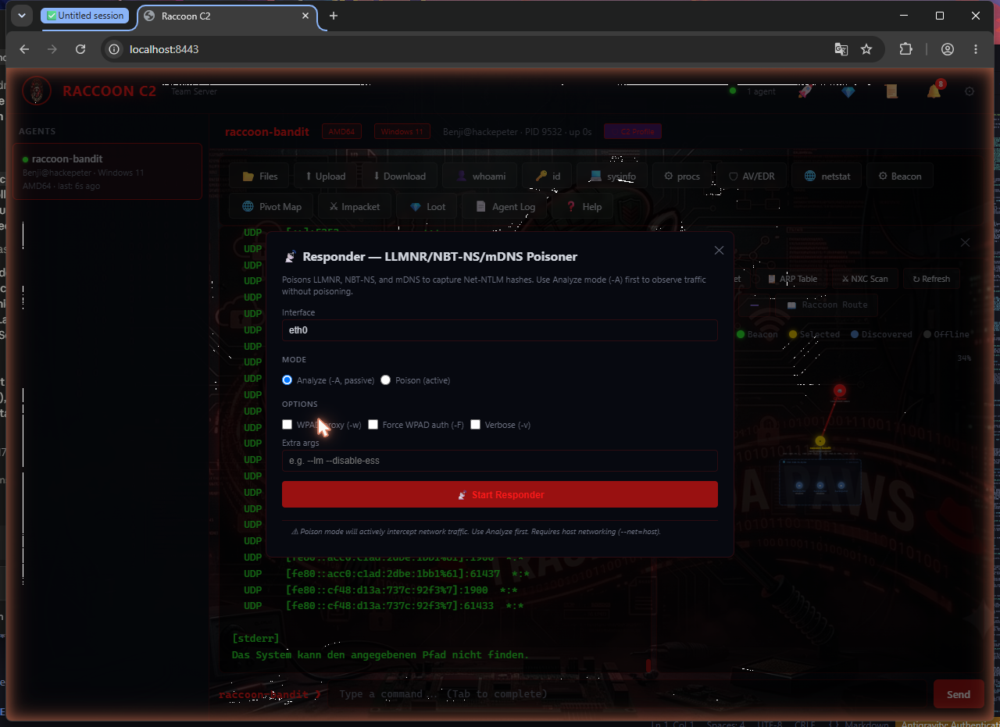
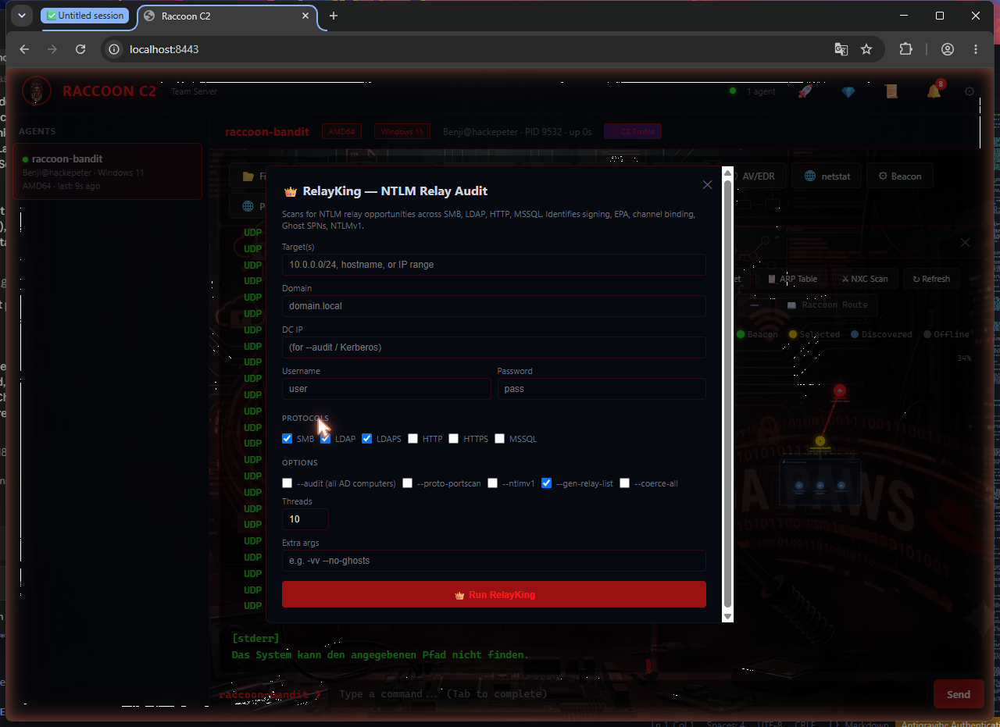
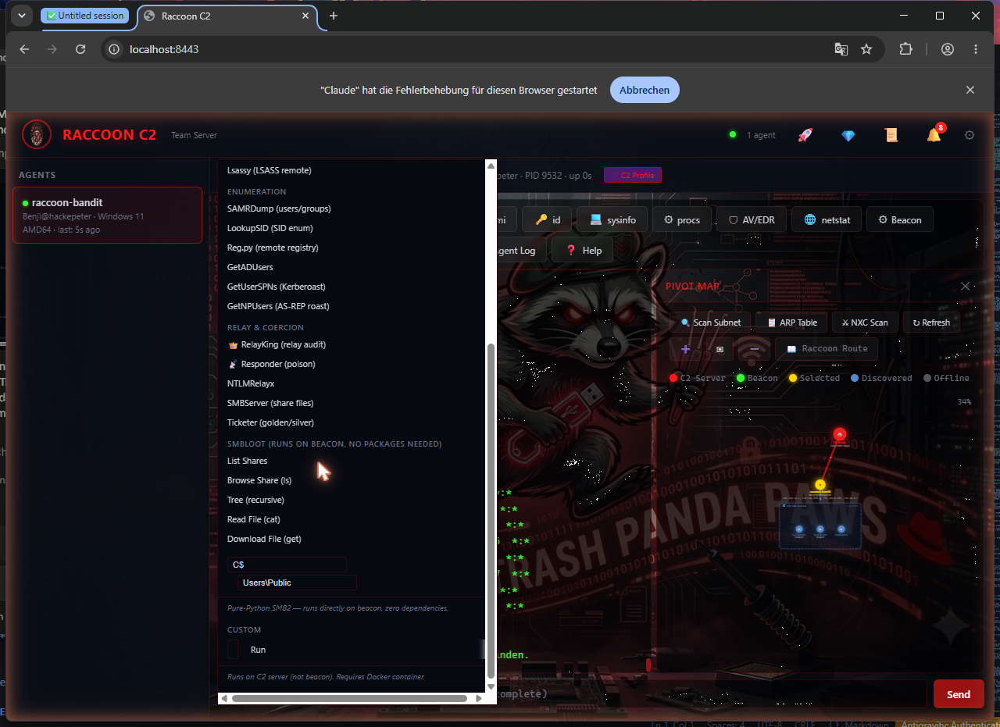
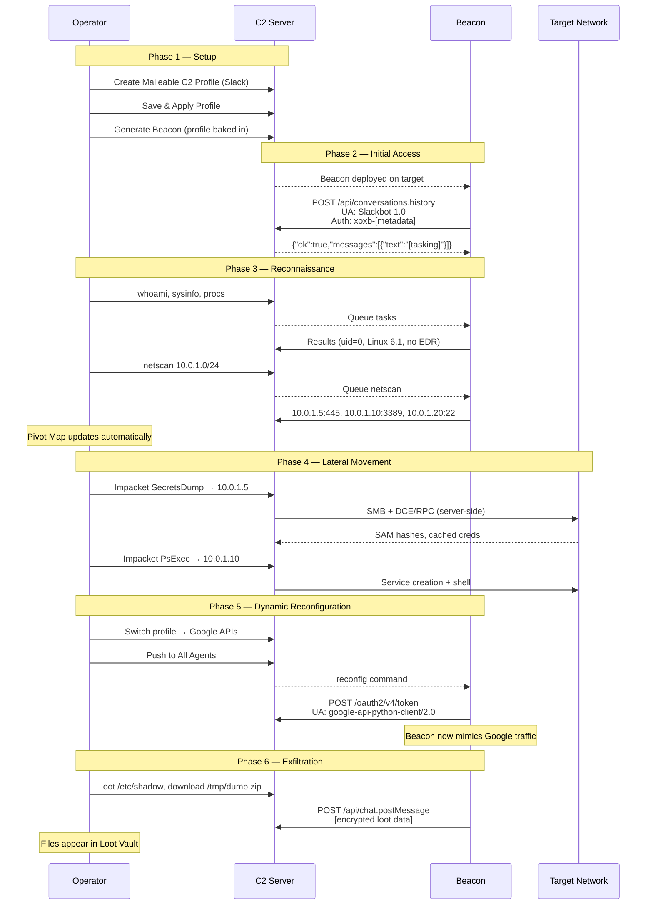

<p align="center">
  
</p>

<h1 align="center">TrashPandaPaws C2 — Demo Tour</h1>

<p align="center">
  Comprehensive walkthrough of the Raccoon C2 team server — from beacon generation
  to post-exploitation, Malleable C2 profiles, and live agent management.
</p>

---

## Table of Contents

1. [Operator Dashboard](#1-operator-dashboard)
2. [Beacon Generator](#2-beacon-generator)
3. [Agent Interaction & Terminal](#3-agent-interaction--terminal)
4. [File Browser](#4-file-browser)
5. [Process Viewer & AV/EDR Detection](#5-process-viewer--avedr-detection)
6. [Network Analysis (Netstat)](#6-network-analysis-netstat)
7. [Pivot Map](#7-pivot-map)
8. [Malleable C2 Profile Editor](#8-malleable-c2-profile-editor)
9. [Profile Library](#9-profile-library)
10. [Burp Suite Import](#10-burp-suite-import)
11. [Beacon Config & Dynamic Reconfiguration](#11-beacon-config--dynamic-reconfiguration)
12. [Profile Verification](#12-profile-verification)
13. [Impacket & NetExec Integration](#13-impacket--netexec-integration)
14. [Responder & RelayKing](#14-responder--relayking)
15. [SMBLoot (Pure-Python SMB2 Browser)](#15-smbloot-pure-python-smb2-browser)
16. [Loot Vault](#16-loot-vault)
17. [Server Log & Notifications](#17-server-log--notifications)
18. [Full Attack Flow](#18-full-attack-flow)
19. [Command Reference](#19-command-reference)

---

## 1. Operator Dashboard

The main view after login. All connected agents are listed in the left sidebar with real-time status indicators, while the right side provides the command terminal and side panels.


### Header Bar

The top bar shows the Raccoon C2 logo with a green server status dot, plus quick-access buttons for Beacon Generator, Loot Vault, Server Log, Notifications, and Settings. Everything is one click away.

### Agent Sidebar (left)

Each agent appears as a card color-coded by status: **green** (online), **yellow** (stale), **red** (offline). Cards display the agent name, `user@hostname`, architecture, and last-seen timestamp. The sidebar auto-refreshes every 3 seconds, so new check-ins appear in real time.

### Agent Header (when selected)

Clicking an agent reveals a detailed header strip:

| Element | What it shows |
|---------|---------------|
| **Name + Arch** | Agent name with architecture tag (e.g. `aarch64`) and OS tag |
| **Identity** | `user@host` with PID and uptime counter |
| **Proxy Status** | Green tag if the agent is routing through a SOCKS proxy |
| **C2 Profile** | Purple tag when a Malleable C2 profile is active, gray for default |

### 14-Button Toolbar

| Button | Function |
|--------|----------|
| Files | File Browser panel |
| Upload | Upload file to agent |
| Download | Download file from agent |
| whoami | Current user identity |
| id | User/group IDs |
| sysinfo | OS and kernel info |
| procs | Process listing + AV/EDR detection |
| AV/EDR | Remote AV/EDR enumeration via SMB |
| netstat | Network connections |
| Beacon | Beacon config (sleep, persist, profile, kill) |
| Pivot Map | Interactive network topology |
| Impacket | Impacket tools dropdown (16 tools) |
| Loot | Loot Vault viewer |
| Agent Log | Per-agent event log |
| Help | Command reference |

---

## 2. Beacon Generator

Generate fully configured, multi-layer obfuscated beacon payloads with encryption, evasion, and C2 profile injection.


### Configuration Options

| Option | Description |
|--------|-------------|
| **Transport Protocols** | HTTPS, DNS, SMB, QUIC — mix and match with automatic fallback |
| **Encryption Key** | AES-GCM 256-bit (auto-generated or custom, Base64-encoded) |
| **Beacon Interval** | Check-in frequency in seconds |
| **Jitter** | Randomization percentage (0–100%) |
| **Obfuscation Layers** | Slider from 1 to 6 layers of nested zlib + base64 encoding |
| **Delivery Method** | Inline (copy-paste) or GitHub Gist (auto-delete on first connect) |

### Anti-Analysis Features (baked into every beacon)

Every generated beacon includes built-in evasion that activates before the main loop starts. The beacon checks for sandbox indicators such as VM artifacts and debugger presence, randomizes its own process name, and applies connection jitter with randomized sleep intervals. No operator configuration required — these are always on.

### Transport Protocols

The beacon supports four transport channels that can be enabled independently and combined for resilient C2 communication. Each channel is implemented in pure Python stdlib — no external dependencies.

| Protocol | Port | When to use |
|----------|------|-------------|
| **HTTPS** | 443/8443 | Default. Blends into normal web traffic. Supports Malleable C2 profiles for deep traffic shaping. |
| **DNS** | 53 | Egress-restricted networks. Data exfil over TXT records. Slow but hard to block. |
| **SMB** | 445 | Internal pivoting. Named-pipe communication between beacons or to an internal C2 relay. |
| **QUIC** | 4433 | UDP-based, fragmented datagrams. Bypasses proxies and deep packet inspection that only inspect TCP. |

### Protocol-Specific Configuration

| Protocol | Parameters |
|----------|------------|
| HTTPS | Callback URL (e.g. `https://c2.example.com:8443/api/v1/beacon`) |
| DNS | Domain (`c2.example.com`), Resolver IP (`8.8.8.8`) |
| SMB | Pipe Name (`msrpc_6e2f`), Server IP (parent beacon or C2 relay) |
| QUIC | Server address + port (`c2.example.com:4433`) |

### Channel Fallback & Prioritization

When multiple protocols are enabled, the beacon tries them in the order they were selected. If the primary channel fails, it falls through to the next available one. This happens on every beacon cycle — a channel that was down can be picked up again on the next iteration.



### Example: Mixed-Protocol Scenarios

**Scenario 1 — Internet-facing host (HTTPS + DNS fallback):**



**Scenario 2 — Internal pivot (SMB between beacons):**

In this setup, only the border beacon has internet access. Interior beacons communicate via SMB named pipes through the compromised network, forming a chain back to the team server.



**Scenario 3 — Maximum resilience (all four channels):**

Enable all protocols for high-value targets. The beacon cycles through every available channel before sleeping, maximizing the chance of getting tasking through even aggressive network controls.



### Protocol Implementation Details

**HTTPS** — Standard `urllib` POST with AES-GCM encrypted JSON body. Supports proxy auto-detection (PAC files, environment variables, manual config). When a Malleable C2 Profile is active, the beacon uses profile-defined URIs, headers, and User-Agent strings to mimic legitimate web traffic (e.g. Azure CDN, Slack API).

**DNS** — Raw DNS queries via `socket` (no `dnspython` needed). The agent ID is Base32-encoded into the subdomain (`<id>.b.c2.example.com`). The team server responds with AES-GCM encrypted TXT records. Bandwidth is limited (~200 bytes per query), so DNS is best suited as a keep-alive or fallback channel.

**SMB** — Full SMB2 protocol stack implemented in pure Python (`socket` + `struct`). The beacon negotiates SMB 2.0/2.1, performs anonymous session setup, connects to `IPC$`, and opens a named pipe (default: `msrpc_6e2f`). Data is exchanged via pipe read/write operations. The pipe name is configurable to blend in with legitimate RPC traffic.

**QUIC** — Lightweight UDP-based transport with QUIC-style framing. Payloads are AES-GCM encrypted, fragmented into 1200-byte datagrams with stream IDs for reassembly. Useful in environments where TCP inspection is heavy but UDP is less scrutinized.

### Pipeline Flow Diagram

The generator includes a collapsible visual pipeline showing how profiles integrate:


### Deobfuscation Chain Viewer

Shows the exact decode pipeline needed to reconstruct the beacon from the obfuscated payload, with platform-specific tabs for Linux, macOS, and Windows. Each tab displays the shell one-liner that reverses the encoding layers.

### GitHub Gist Delivery


The Gist delivery method creates a private GitHub Gist via the `gh` CLI, producing a clean one-liner curl command for target deployment. When the beacon connects for the first time, it automatically deletes the Gist from GitHub, eliminating the payload from the internet.


---

## 3. Agent Interaction & Terminal

The main terminal area provides a full interactive command interface to the selected agent.


### Terminal Features

| Feature | Description |
|---------|-------------|
| **Color-coded output** | Directories appear in blue, IP addresses in cyan, privileged users in red/bold, and errors in red |
| **Command history** | Arrow key navigation (up/down) through previously executed commands |
| **Tab completion** | Autocomplete dropdown with matching commands and path suggestions |
| **Ghost text hints** | Translucent syntax hints appear as you type, showing expected arguments |
| **Task animations** | Spinner animation while waiting for beacon results |
| **Auto-polling** | Results are fetched every 2.5 seconds until the task completes |

### Quick Info Buttons

One-click reconnaissance commands for immediate situational awareness:

```
$ whoami
hackepeter

$ id
uid=0(root) gid=0(root) groups=0(root)

$ sysinfo
Linux hackepeter 6.1.0-rpi7-rpi-v8 #1 SMP PREEMPT aarch64 GNU/Linux
```

---

## 4. File Browser

Full-featured remote file browser with tree view navigation, file operations, and drag-and-drop upload.


### Layout

The panel is split into two regions. The **tree view** on the left shows a collapsible directory hierarchy with expand/collapse icons for quick navigation. The **directory listing** on the right displays files and folders with metadata columns.

### File Details (per entry)

| Column | Content |
|--------|---------|
| **Name** | File name with color-coded type badge (`code`, `text`, `image`, `archive`, `binary`, `cert`, `database`) |
| **Owner / Group** | UNIX owner and group of the file |
| **Permissions** | Standard UNIX string (e.g. `rwxr-xr-x`) |
| **Modified** | Last modification timestamp |
| **Size** | Human-readable file size |

### File Operations

| Action | Description |
|--------|-------------|
| Navigate | Click folder to browse into it |
| View | View file contents inline (via `cat`) |
| Download | Download file from agent to C2 server |
| Loot | Flag file for exfiltration |
| Upload | Drag-and-drop or button upload to current directory |

### Upload

Click the "Upload" button or drag files directly onto the drop zone. The operator is prompted for a remote destination path on the target. The file is transferred as base64-encoded task data within the encrypted C2 channel.

---

## 5. Process Viewer & AV/EDR Detection

### Local Process Viewer (`procs` button)

Lists all running processes on the agent with automatic AV/EDR product detection. The beacon runs `ps aux` (Linux/macOS) or `tasklist /v` (Windows) and cross-references every process name against a built-in detection database.


### Detection Database (30+ products)

| Category | Products Detected |
|----------|-------------------|
| **EDR** | CrowdStrike Falcon, SentinelOne, Carbon Black, Cortex XDR, Elastic EDR, Cybereason, Cynet, HarfangLab |
| **AV** | Windows Defender, Kaspersky, Bitdefender, Sophos, McAfee/Trellix, ESET, Avast, AVG, F-Secure/WithSecure, Symantec SEP, G DATA, Malwarebytes, Panda/WatchGuard, Trend Micro, Acronis |
| **SIEM/Audit** | Splunk, Sysmon, osquery, Wazuh |
| **Other** | FortiClient, FortiEDR, Check Point, Cylance, Tanium, Rapid7, Qualys, Ivanti |

Detected products are highlighted with severity badges: **HIGH** (red) for EDR solutions that actively block, **MED** (yellow) for products that alert but don't prevent, and **LOW** (green) for monitoring-only tools. The beacon's own PID is also highlighted for easy identification.

### Remote AV/EDR Enumeration (`AV/EDR` button)

Server-side remote enumeration via Impacket SMB — no beacon interaction needed. This runs from the C2 server directly against a target host.


### Three Detection Methods

1. **LsarLookupNames** — Unprivileged technique that queries LSA for known AV service accounts. Works without admin rights and leaves minimal forensic artifacts.
2. **Named Pipe Enumeration** — Connects to IPC$ and checks for pipes registered by known AV/EDR products. Also unprivileged, but may trigger network-level alerts.
3. **Service Control Manager** — Queries SCM for AV/EDR service display names and binary paths. Requires local admin or equivalent privileges on the target.

### Input Fields

| Field | Description |
|-------|-------------|
| **Target IP** | Host to enumerate |
| **Domain** | Active Directory domain name |
| **Username** | Account for authentication |
| **Password / Hash** | Cleartext password or NTLM hash |
| **Pass-the-Hash** | Toggle to authenticate with NT hash instead of password |

---

## 6. Network Analysis (Netstat)

Detailed network connection analysis with service identification and attack surface assessment.


### Summary Stats

The header row shows four counters at a glance: total connections, listening ports, established connections, and unique remote hosts. This gives an immediate read on the target's network footprint.

### Service Identification

60+ port-to-service mappings are built in, covering:

| Category | Example Ports |
|----------|---------------|
| **Standard Services** | SSH (22), HTTP (80/443), DNS (53), SMB (445), RDP (3389) |
| **Database Services** | MySQL (3306), PostgreSQL (5432), MSSQL (1433), MongoDB (27017), Redis (6379) |
| **Enterprise** | LDAP (389/636), Kerberos (88), WinRM (5985/5986) |
| **Monitoring** | Prometheus (9090), Grafana (3000), Elasticsearch (9200) |

### Suspicious Port Detection

The analyzer flags uncommon high ports, known backdoor ports, and unusual listeners. Connections to unexpected external hosts are highlighted, drawing operator attention to potential exfiltration or unauthorized tunnels.

### Attack Surface Assessment

Identified listeners on high-value ports (e.g. RDP, WinRM, SQL) are tagged as pivot opportunities. The panel also flags potential lateral movement targets based on open management ports on neighboring hosts discovered during `netscan`.

---

## 7. Pivot Map

Interactive HTML5 Canvas network topology visualization showing the relationship between C2, beacons, and discovered hosts.


### Node Types

| Node | Color | Description |
|------|-------|-------------|
| **C2 Server** | Red | Central node, always visible at the center |
| **Beacon Nodes** | Green | Connected agents with hostname labels |
| **Discovered Hosts** | Blue | Hosts found via `netscan` or `arptable` |

### Subnet Grouping

Hosts are automatically grouped into subnet boxes (`10.0.1.0/24`, `192.168.1.0/24`, etc.) with labels showing the subnet CIDR and host count. This makes large networks scannable at a glance.

### Interactive Controls

| Control | Action |
|---------|--------|
| **Click + drag** | Rearrange nodes to preferred positions |
| **Scroll wheel** | Zoom in and out of the topology |
| **Hover** | Tooltip with IP, open ports, banners, OS guess, MAC vendor (from OUI) |
| **Animated paths** | Packet flow animation along C2 ↔ beacon connections |

### Data Sources

The map aggregates data from three sources: agent registration (IP, hostname), `netscan` results (live hosts, open ports, banners), and `arptable` results (MAC vendor, neighbor info). New data points appear automatically as agents report back.

### Legend

A color-coded legend in the corner maps node types and connection status indicators, so the operator can read the topology without memorizing the schema.

---

## 8. Malleable C2 Profile Editor

Full-featured editor for creating and managing Malleable C2 profiles that make beacon traffic mimic legitimate services.


### Editor Features

| Feature | Description |
|---------|-------------|
| **Syntax Highlighting** | Keywords (`set`, `http-get`, `http-post`, `client`, `server`, `metadata`), strings, and comments are color-coded |
| **Line Numbers** | Synced scrolling between line numbers and the code area |
| **Real-Time Linting** | Validates structure, required blocks, and field values — returns errors, warnings, and info messages |

### Top Bar Actions

| Button | Function |
|--------|----------|
| Lint | Validate profile syntax and structure |
| Save & Apply | Parse profile and activate server-side |
| Push to Agents | Push active profile to all or selected beacons |
| Import from Burp | Generate profile from raw HTTP traffic |
| Library | Open preset profile library |
| Template | Load annotated starter template |
| Clear | Reset editor |

### Tutorial Sidebar (7 sections)

The collapsible sidebar walks operators through profile creation step by step:

1. **Overview** — What Malleable C2 profiles do and why they matter
2. **Global Options** — `sleeptime`, `jitter`, `useragent`, `host_stage`
3. **http-get / http-post** — URI sets, client/server blocks, and how data flows
4. **Data Transforms** — `base64`, `base64url`, `netbios`, `mask`, `prepend`, `append`
5. **https-certificate** — CN, O, C, validity fields for TLS certificate mimicry
6. **Advanced** — `stage`, `process-inject`, `post-ex` blocks for fine-grained control
7. **Example profiles** — Ready-to-use templates with copy-paste support

### Profile Parsing Engine

The server-side parser extracts globals (sleeptime, jitter, useragent), http-get and http-post blocks with their URI sets, client headers, parameters, and metadata/id/output sub-blocks. Each sub-block contains its transform chain and terminator (header, parameter, or print). The parsed profile is then injected into every generated beacon.

### Example: Slack API Profile

```
set sleeptime "30000";
set jitter    "40";
set useragent "Slackbot 1.0 (+https://api.slack.com/robots)";

https-certificate {
    set CN   "hooks.slack.com";
    set O    "Slack Technologies";
}

http-get {
    set uri "/api/conversations.history /api/channels.info /api/users.list";

    client {
        header "Accept" "application/json";
        header "Accept-Charset" "utf-8";

        metadata {
            base64url;
            prepend "xoxb-";
            header "Authorization";
        }
    }

    server {
        header "Content-Type" "application/json; charset=utf-8";
        header "Strict-Transport-Security" "max-age=31536000";

        output {
            mask;
            base64;
            prepend "{\"ok\":true,\"messages\":[{\"text\":\"";
            append "\"}]}";
            print;
        }
    }
}

http-post {
    set uri "/api/chat.postMessage /api/files.upload";

    client {
        header "Content-Type" "application/json; charset=utf-8";

        id {
            base64url;
            parameter "channel";
        }

        output {
            mask;
            base64;
            print;
        }
    }
}
```

---

## 9. Profile Library

Curated collection of 8 Malleable C2 profiles mimicking legitimate SaaS and CDN traffic.


| Profile | Mimics | User-Agent | GET URIs | POST URIs | Category |
|---------|--------|------------|----------|-----------|----------|
| **Amazon CDN** | CloudFront edge | `Amazon CloudFront` | `/cdn/dist/`, `/assets/` | `/cdn/upload/` | CDN |
| **Slack Webhook** | Slack API | `Slackbot 1.0` | `/api/conversations.history` | `/api/chat.postMessage` | SaaS |
| **Google APIs** | Google OAuth | `google-api-python-client/2.0` | `/oauth2/v4/token` | `/upload/drive/v3/files` | API |
| **OneDrive Sync** | Microsoft sync | `Microsoft OneDrive` | `/v1.0/me/drive/root` | `/v1.0/me/drive/items` | SaaS |
| **jQuery CDN** | Static assets | `Mozilla/5.0 ...` | `/jquery-3.6.0.min.js` | `/ajax/libs/` | CDN |
| **GitHub API** | GitHub REST v3 | `GitHub-Hookshot/` | `/api/v3/repos/` | `/api/v3/gists` | API |
| **Outlook/O365** | Office 365 | `Microsoft Office/16.0` | `/api/v2.0/me/messages` | `/api/v2.0/me/sendmail` | SaaS |
| **Cloudflare Workers** | Edge compute | `Cloudflare-Workers` | `/cdn-cgi/trace` | `/client/v4/zones/` | CDN |

Each profile ships with realistic HTTP headers matching the mimicked service, proper metadata encoding chains (base64url with service-specific prefixes like `xoxb-` for Slack), response wrapping that matches the service's JSON schema, and TLS certificate parameters for SNI mimicry.

### Search & Filter

The library supports real-time search by profile name and category filter tags: **CDN** (blue), **SaaS** (purple), **API** (green), **Web** (orange).

---

## 10. Burp Suite Import

Generate a Malleable C2 profile directly from captured HTTP traffic in Burp Suite.


### Workflow

1. Capture a legitimate HTTP request/response in Burp Suite
2. Copy the raw HTTP request and response
3. Paste into the import dialog's two text areas
4. Select where to store beacon metadata, ID, and output:
   > **Header** — blend into an existing header value  
   > **URI Parameter** — append as a query string parameter  
   > **Body** — embed within the request/response body
5. Choose encoding: `base64`, `base64url`, `netbios`, `netbiosu`
6. Click Generate — the profile is created and loaded into the editor

### Use Case

> You observe that the target network allows traffic to `updates.vendor.com`. Capture a legitimate request in Burp, import it, and your beacon traffic becomes indistinguishable from real update checks.

---

## 11. Beacon Config & Dynamic Reconfiguration

Per-agent configuration panel for timing, persistence, C2 profile management, and beacon lifecycle.


### Persistence

7 persistence methods with auto-detection based on target OS:

| Method | OS | Mechanism |
|--------|----|-----------|
| `auto` | Any | Auto-detect best method for OS |
| `registry` | Windows | `HKCU\Software\Microsoft\Windows\CurrentVersion\Run` |
| `startup` | Windows | VBScript in Startup folder |
| `schtask` | Windows | Scheduled task at logon |
| `crontab` | Linux/macOS | Crontab entry (`@reboot`) |
| `bashrc` | Linux | Append to `~/.bashrc` |
| `systemd` | Linux | User-level systemd service |

Select a method and click **Install** to deploy. Click **Remove** to clean up all persistence artifacts the beacon created.

### C2 Profile Section

The panel displays two information cards side by side.

**Agent Profile (from beacon telemetry):**

A purple-bordered card showing what the beacon is actively using. It displays the User-Agent string, beacon interval and jitter percentage, GET URIs (blue tags) that the beacon rotates through, POST URIs (orange tags) for result delivery, GET/POST custom headers (green tags), the metadata encoding chain (e.g. `base64url prepend="xoxb-"`), and the beacon ID encoding (e.g. `base64url → parameter channel`).

**Last Beacon HTTP Request (from server-side capture):**

A blue-bordered card showing the actual HTTP request received from this beacon. It displays the request path (e.g. `/api/v1/api/users.list`), User-Agent header, timestamp, and all custom headers. A green confirmation message appears when the profile is actively applied — *"Profile is actively applied — beacon is using C2 profile URI ... instead of default paths"*.

### Dynamic Reconfiguration

Push a new profile to running beacons without redeployment:

1. Select a profile from the library dropdown or open the editor
2. **Push to Agent** — reconfigure this specific beacon
3. **Push to All** — fleet-wide reconfiguration (with confirmation dialog)
4. Beacon receives `reconfig` command on next check-in
5. Beacon immediately switches: URIs, headers, user-agent, timing
6. Next telemetry confirms the new profile is active

### Kill Agent

The red "Kill Agent" button sends a `kill` command that terminates the beacon process on the target. Before exiting, the beacon removes any installed persistence mechanisms and cleans up on-disk artifacts.

---

## 12. Profile Verification

The C2 server captures every beacon HTTP request server-side. This provides proof that the Malleable C2 profile is actively applied — no Wireshark or TLS decryption needed.

### Without Profile (default random evasion)

```
Path:        /beacon.js?_t=1722081234&sid=84721
User-Agent:  Mozilla/5.0 (Windows NT 10.0; Win64; x64) AppleWebKit/537.36
Headers:     Accept: application/json, text/plain, */*
             X-Requested-With: XMLHttpRequest
```

### With Slack Profile Active

```
Path:        /api/v1/api/users.list
User-Agent:  Slackbot 1.0 (+https://api.slack.com/robots)
Headers:     Accept: application/json
             Accept-Charset: utf-8
             Accept-Encoding: identity

 ✔ Profile is actively applied — beacon is using C2 profile URI
   /api/v1/api/users.list instead of default paths
```


### How It Works



---

## 13. Impacket & NetExec Integration

Server-side tool execution — these tools run on the C2 server, not on the beacon. This keeps the agent footprint minimal while giving operators full access to the Impacket and NetExec tool suites.

### Impacket Tools (16 tools)


| Tool | Purpose |
|------|---------|
| **PsExec** | Remote command execution via SMB service |
| **WMIExec** | Remote execution via WMI |
| **SMBExec** | Remote execution via SMB shares |
| **AtExec** | Remote execution via Task Scheduler |
| **DcomExec** | Remote execution via DCOM |
| **SecretsDump** | Dump SAM, LSA secrets, cached creds, NTDS.dit |
| **Lsassy** | Extract credentials from LSASS memory |
| **SAMRDump** | Enumerate users via SAMR |
| **LookupSID** | Brute-force SID lookup |
| **Reg.py** | Remote registry operations |
| **GetADUsers** | Enumerate Active Directory users |
| **GetUserSPNs** | Kerberoasting — request TGS for SPNs |
| **GetNPUsers** | AS-REP Roasting — find users without preauth |
| **NTLMRelayx** | NTLM relay attack |
| **SMBServer** | Start SMB share for file transfer |
| **Ticketer** | Forge Kerberos tickets (Golden/Silver) |
| **Custom** | Run any Impacket command |

Each tool prompts for: target IP, domain, username, password/hash.

### NetExec (NXC) Scans



**Subnet Discovery:**

| Scan | Finds |
|------|-------|
| SMB scan | Windows hosts with SMB open |
| RDP scan | RDP-enabled hosts |
| WinRM scan | WinRM-enabled hosts |
| SSH scan | SSH servers |
| MSSQL scan | Database servers |

**Per-Host Enumeration:**

| Module | Description |
|--------|-------------|
| Shares | List SMB shares with access permissions |
| Users | Enumerate local user accounts |
| Sessions | List active logon sessions |
| Password Policy | Dump domain password policy |
| Groups | Enumerate local and domain groups |
| LDAP Users | Enumerate users via LDAP |

---

## 14. Responder & RelayKing

### Responder (LLMNR/NBT-NS/mDNS Poisoner)



| Setting | Description |
|---------|-------------|
| **Interface** | Network interface to poison on |
| **Mode** | Analyze (passive, observe only) or Poison (active, capture hashes) |
| **WPAD Proxy** | Serve a malicious WPAD file to redirect HTTP traffic |
| **Force WPAD Auth** | Force authentication on WPAD requests |
| **Verbose** | Detailed logging of all poisoned queries |

Responder captures NTLMv1/v2 hashes from poisoned name resolution requests. These hashes can be cracked offline with hashcat or john, or relayed directly using RelayKing.

### RelayKing (NTLM Relay Audit)



| Setting | Description |
|---------|-------------|
| **Target IP** | Host to relay credentials to |
| **DC IP** | Domain controller for LDAP relay validation |
| **Protocols** | SMB, LDAP, LDAPS, HTTP, HTTPS, MSSQL (checkbox selection) |
| **Audit Mode** | Check relay paths without executing attacks |
| **Port Scan** | Enumerate open relay targets before relaying |
| **NTLMv1 Downgrade** | Attempt to downgrade authentication for easier cracking |
| **Generate Relay List** | Automatically build a target list from network scan |
| **Coerce All** | Trigger authentication from all discovered hosts |
| **Threads** | Concurrent connection count |

RelayKing identifies relay opportunities across the network, mapping which hosts accept relayed credentials and over which protocols.

---

## 15. SMBLoot (Pure-Python SMB2 Browser)

Browse, read, and download files from remote SMB shares — **directly from the beacon**, without loading impacket or any other external package. The entire SMB2 protocol stack (negotiate, NTLM auth, tree connect, create, read, query directory) is implemented in pure Python stdlib.



### Why?

Traditional tools like `smbclient.py` or `impacket` require additional packages on the beacon host. In restricted environments (no pip, no outbound downloads, minimal Python install), this is a problem. SMBLoot solves this by implementing SMB2 with only `socket`, `struct`, and `hashlib`.

### Beacon Usage (C2 Terminal)

```
smbloot <server> <user> <pass_or_hash> [domain] <action> [share] [path]
```

**Actions:**

| Action | Description |
|--------|-------------|
| `shares` | List all available shares on the target |
| `ls <share> [path]` | List directory contents |
| `cat <share> <path>` | Read file content (text preview, max 64KB) |
| `get <share> <path>` | Download file (returned as base64 to C2) |
| `tree <share> [path]` | Recursive directory listing (max 3 levels) |

**Examples:**

```bash
# List shares
smbloot 10.0.1.5 Administrator P@ssw0rd shares

# Browse Users share
smbloot 10.0.1.5 Administrator P@ssw0rd ls Users

# Read a file
smbloot 10.0.1.5 Administrator P@ssw0rd cat SYSVOL corp.local/Policies/GPT.INI

# Download a file
smbloot 10.0.1.5 Administrator P@ssw0rd get C$ Windows\System32\config\SAM

# Recursive tree of SYSVOL
smbloot 10.0.1.5 Administrator P@ssw0rd . tree SYSVOL corp.local

# Pass-the-Hash (LM:NT format)
smbloot 10.0.1.5 Administrator aad3b435b51404ee:31d6cfe0d16ae931b73c59d7e0c089c0 shares

# NT hash only
smbloot 10.0.1.5 Administrator 31d6cfe0d16ae931b73c59d7e0c089c0 CORP shares
```

### Standalone CLI Usage

SMBLoot is also available as a standalone terminal tool (no C2 connection needed):

```bash
python3 smbloot.py <server> <user> <pass_or_hash> [options] <action> [args]
```

**Options:**

| Flag | Description |
|------|-------------|
| `-d`, `--domain` | Domain name (default: `.`) |
| `-p`, `--port` | SMB port (default: 445) |
| `--depth` | Tree recursion depth (default: 3) |

**CLI Examples:**

```bash
# List shares
python3 smbloot.py 10.0.1.5 admin P@ssw0rd shares

# Browse with domain
python3 smbloot.py 10.0.1.5 admin P@ssw0rd -d CORP ls C$ Users\\Public

# Download file to local disk
python3 smbloot.py 10.0.1.5 admin P@ssw0rd get C$ Windows\\win.ini ./win.ini

# Deep tree scan
python3 smbloot.py 10.0.1.5 admin P@ssw0rd --depth 5 tree SYSVOL
```

### GUI Integration

The Impacket tools panel includes a dedicated **"SMBLoot"** section with one-click access to all five actions: **List Shares**, **Browse Share (ls)**, **Tree (recursive)**, **Read File (cat)**, and **Download File (get)**. The GUI reuses the target/user/pass fields from the Impacket panel, plus two additional fields for share name and path.

### Technical Details

| Component | Implementation |
|-----------|---------------|
| SMB2 Negotiate | Dialect 2.0.2 / 2.1 |
| Authentication | NTLMv2 (SPNEGO wrapped) |
| Pass-the-Hash | Direct NT hash injection |
| Share Enumeration | SRVSVC `NetShareEnumAll` via IPC$ named pipe |
| Directory Listing | `QueryDirectory` (FileBothDirectoryInformation) |
| File Read | SMB2 Read with 64KB chunking |
| Dependencies | **None** — stdlib only (`socket`, `struct`, `hashlib`, `hmac`) |

### Limitations

| Constraint | Detail |
|------------|--------|
| No SMB signing | Works against most targets with signing not required |
| No SMB3 encryption | Targets requiring encryption will reject the connection |
| Max file size | 10MB per download |
| Tree recursion | Capped at 2000 entries to prevent timeout |

---

## 16. Loot Vault

Centralized storage for all exfiltrated files across all agents.


### Features

The Loot Vault collects every downloaded and exfiltrated file from all connected agents in one place. Each entry shows the source agent, timestamp, original remote path, and file size. Files are stored in the server's data directory and can be downloaded individually via the download button.

### Exfiltration Methods

| Command | Channel | Description |
|---------|---------|-------------|
| `download <path>` | HTTPS | Download a single file through the primary C2 channel |
| `loot <dir>` | HTTPS | Recursively zip an entire directory and exfiltrate it |
| `exfil <path>` | DNS | Exfiltrate a file via DNS TXT records (for restricted networks where HTTPS is blocked) |

---

## 17. Server Log & Notifications

### Server Log (right-side drawer)


The server log is a filterable event stream accessible from the right-side drawer. It auto-polls every 5 seconds.

| Category | Events |
|----------|--------|
| **All** | Everything |
| **Register** | New agent registrations |
| **Reconnect** | Returning agents |
| **Task** | Tasks queued by operator |
| **Dispatch** | Tasks sent to agents |
| **Result** | Task results received |
| **Download** | File downloads completed |
| **Startup** | Server start events |

### Notifications

The bell icon in the header shows an unread count badge. Real-time toast notifications appear for agent connect/disconnect/reconnect, task completion, tool results, and errors. The notification dropdown panel displays each entry with its type, timestamp, and message, plus a "Clear all" button.

### Server Settings

| Section | Content |
|---------|---------|
| **Network** | Listen address, port, SSL status |
| **Security** | Encryption key (reveal/copy), operator token (reveal/copy) |
| **Storage** | Data directory path |
| **Statistics** | Uptime, online/total agents, total tasks dispatched |

---

## 18. Full Attack Flow



---

## 19. Command Reference

### File Operations

| Command | Arguments | Description |
|---------|-----------|-------------|
| `ls` | `<path>` | List directory contents |
| `cat` | `<path>` | Read file contents |
| `pwd` | | Print working directory |
| `cd` | `<path>` | Change directory |
| `cp` | `<src> <dst>` | Copy file |
| `mv` | `<src> <dst>` | Move or rename file |
| `rm` | `<path>` | Remove file or directory |
| `mkdir` | `<path>` | Create directory |
| `chmod` | `<mode> <file>` | Change file permissions |
| `write` | `<path>` | Write text content to file |
| `upload` | `<path>` | Upload file from operator to agent |
| `download` | `<path>` | Download file from agent to C2 |

### Execution

| Command | Arguments | Description |
|---------|-----------|-------------|
| `shell` | `<cmd>` | Execute shell command |

### Reconnaissance

| Command | Arguments | Description |
|---------|-----------|-------------|
| `netscan` | `[subnet]` | Scan /24 subnet: live hosts, open ports, banners |
| `arptable` | | ARP neighbor table with vendor/OS/port info |
| `proxyinfo` | | Show proxy configuration |
| `avenum` | | Enumerate local AV/EDR/SIEM products |

### SMBLoot (Remote Share Access)

| Command | Arguments | Description |
|---------|-----------|-------------|
| `smbloot` | `<server> <user> <pass/hash> [domain] shares` | List available SMB shares |
| `smbloot` | `<server> <user> <pass/hash> [domain] ls <share> [path]` | List directory on share |
| `smbloot` | `<server> <user> <pass/hash> [domain] cat <share> <path>` | Read remote file as text |
| `smbloot` | `<server> <user> <pass/hash> [domain] get <share> <path>` | Download remote file |
| `smbloot` | `<server> <user> <pass/hash> [domain] tree <share> [path]` | Recursive directory listing |

### Exfiltration

| Command | Arguments | Description |
|---------|-----------|-------------|
| `loot` | `<path>` | Zip and exfiltrate directory recursively |
| `exfil` | `<path>` | Exfiltrate file via DNS channel |

### Beacon Control

| Command | Arguments | Description |
|---------|-----------|-------------|
| `sleep` | `<sec> <jitter%>` | Set beacon interval and jitter |
| `persist` | `<method>` | Install persistence (auto/registry/startup/schtask/crontab/bashrc/systemd) |
| `unpersist` | `<method>` | Remove persistence mechanism |
| `kill` | | Terminate beacon and clean up |

### Internal (not user-facing)

| Command | Description |
|---------|-------------|
| `reconfig` | Push new C2 profile config (triggered via GUI) |
| `lsjson` | JSON directory listing (used by File Browser) |
