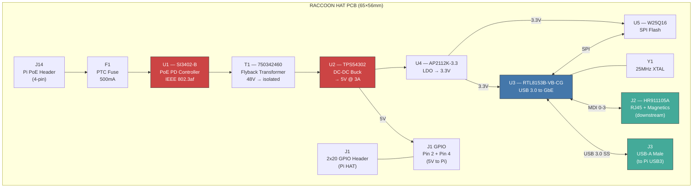
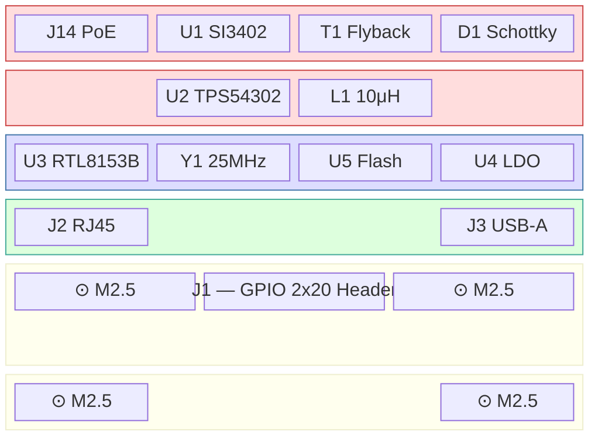

# Raccoon HAT — Circuit Design Guide

Custom HAT PCB for Raspberry Pi 4 (running ParrotOS ARM64).
Two-layer board, 65mm x 56mm (Pi HAT standard).
Mounts via 40-pin GPIO header + 4x M2.5 standoffs.

## Block Diagram



## 1. PoE Power Supply (Sheet: PoE Power Supply)

### 1.1 PoE PD Controller — SI3402-B (U1)

The Raspberry Pi 4 exposes PoE signals on a 4-pin header (J14) from its
built-in Ethernet jack. Our HAT connects to this header to extract power.

**Pi PoE Header J14 Pinout:**
| Pin | Signal    |
|-----|-----------|
| 1   | VC1+ (TR0 CT) |
| 2   | VC1- (TR1 CT) |
| 3   | VC2+ (TR2 CT) |
| 4   | VC2- (TR3 CT) |

**SI3402-B Connections:**
```
VC1+ ──→ F1 (500mA PTC) ──→ VDD (pin 1)
VC1- ──→ VSS (pin 10)
VC2+ ──→ VDD (pin 1) via D3 (BAT54S)
VC2- ──→ VSS (pin 10) via D4 (BAT54S)

DET    (pin 3) ── R4 (25.5K) ──→ VSS     [Detection signature]
CLASS  (pin 4) ── R3 (49.9K) ──→ VSS     [Class 0: 0.44-12.95W]
PWRGD  (pin 7) ──→ TPS54302 EN           [Power good signal]
GATE   (pin 6) ──→ Q1 Gate (NMOS)        [Inrush current control]
VDD    (pin 1) ── C3 (100uF) ──→ VSS     [Input bulk cap]
```

### 1.2 DC-DC Buck Converter — TPS54302 (U2)

Converts the ~48V PoE rail down to 5V for the Pi 4.

```
VIN  ── PoE Rail (via PWRGD enable)
      ── C4 (100uF) to GND
BST  ── C1 (100nF) to SW
SW   ── L1 (10uH) ──→ VOUT (5V)
FB   ── R9/R10 voltage divider from VOUT
      ── R9 (100K) to VOUT
      ── R10 (22K) to GND
      ── FB = VOUT × R10/(R9+R10) = 0.8V reference
EN   ── PWRGD from SI3402-B
VOUT ── C11 (22uF) + C12 (22uF) to GND
      ── → Pi GPIO Pin 2 (5V) and Pin 4 (5V)
GND  ── → Ground plane
```

**VOUT Calculation:**
```
VOUT = 0.8V × (1 + R9/R10) = 0.8 × (1 + 100K/22K) = 0.8 × 5.545 ≈ 4.44V
→ Adjust R10 to 19.1K for VOUT = 5.05V
  VOUT = 0.8 × (1 + 100K/19.1K) = 0.8 × 6.236 = 4.99V ✓
```

### 1.3 3.3V LDO — AP2112K-3.3 (U4)

Local 3.3V rail for RTL8153B and SPI flash.

```
VIN  ── 5V rail ── C5 (100nF)
VOUT ── 3.3V ── C6 (100nF) + C2 (10uF)
EN   ── VIN (always on)
GND  ── Ground plane
```

## 2. USB Ethernet Controller (Sheet: USB Ethernet Controller)

### 2.1 RTL8153B-VB-CG (U3)

USB 3.0 SuperSpeed to Gigabit Ethernet controller. Provides the second
Ethernet port (eth1) for the downstream tap connection.

**Key Connections:**
```
USB3_DP   ──→ J3 USB-A D+     [Differential pair, 90Ω impedance]
USB3_DM   ──→ J3 USB-A D-     [Differential pair, 90Ω impedance]
USB3_SSTX+──→ J3 USB-A SSTX+  [SuperSpeed TX+]
USB3_SSTX-──→ J3 USB-A SSTX-  [SuperSpeed TX-]
USB3_SSRX+──→ J3 USB-A SSRX+  [SuperSpeed RX+]
USB3_SSRX-──→ J3 USB-A SSRX-  [SuperSpeed RX-]

AVDD33    ── C7 (100nF) to GND   [3.3V Analog]
DVDD33    ── C8 (100nF) to GND   [3.3V Digital]
DVDD12    ── Internal LDO output ── C9 (10uF) to GND

XI/XO     ── Y1 (25MHz) ── C13, C14 (10pF load caps)

SPI_CLK   ──→ U5 pin 6 (CLK)
SPI_MOSI  ──→ U5 pin 5 (DI)
SPI_MISO  ──→ U5 pin 2 (DO)
SPI_CS    ──→ U5 pin 1 (CS#)

MDI0+/MDI0- ──→ J2 pins 1,2  [via magnetics]
MDI1+/MDI1- ──→ J2 pins 3,6  [via magnetics]
MDI2+/MDI2- ──→ J2 pins 4,5  [via magnetics]
MDI3+/MDI3- ──→ J2 pins 7,8  [via magnetics]

LED0      ── R7 (1K) ── LED1 (Green, Link/Activity)
LED1      ── R8 (1K) ── LED2 (Amber, Speed)
```

### 2.2 SPI Flash — W25Q16 (U5)

Stores RTL8153B firmware/configuration. Pre-programmed with Realtek
default firmware (available from Realtek vendor tools).

```
VCC  ── 3.3V ── C10 (100nF)
CS#  ── U3 SPI_CS ── R5 (10K pull-up to 3.3V)
CLK  ── U3 SPI_CLK
DI   ── U3 SPI_MOSI
DO   ── U3 SPI_MISO ── R6 (10K pull-up to 3.3V)
WP#  ── 3.3V (write protect disabled)
GND  ── Ground plane
```

## 3. Connectors (Sheet: Connectors)

### 3.1 GPIO Header — J1

Standard Raspberry Pi HAT 40-pin header (2x20, 2.54mm pitch).

**Used Pins:**
| Pi Pin | GPIO | Function                |
|--------|------|-------------------------|
| 2, 4   | —    | 5V Power Output (to Pi) |
| 6, 9   | —    | GND                     |
| 27     | ID_SD | HAT EEPROM SDA (optional) |
| 28     | ID_SC | HAT EEPROM SCL (optional) |

All other GPIO pins pass through unconnected (available for future use).

### 3.2 RJ45 Jack — J2 (HR911105A)

RJ45 with integrated magnetics for Gigabit Ethernet. Connected to the
RTL8153B MDI pairs. This is the downstream port (to target device).

### 3.3 USB Connector — J3

USB 3.0 Type-A male header. Routes from the HAT PCB edge down to one
of the Pi 4's USB 3.0 ports via a short flex cable or right-angle connector.

Alternative: use pogo pins or a board-to-board connector to make direct
contact with the Pi's USB port pads (requires precise alignment).

### 3.4 PoE Header — J14 connector

4-pin, 2.54mm pitch header that mates with the Raspberry Pi 4's PoE header.
Directly connects to the SI3402-B PoE PD controller.

## 4. PCB Layout Notes

### Board Dimensions
- 65mm × 56mm (Raspberry Pi HAT standard)
- 4× M2.5 mounting holes at Pi standard positions
- Board thickness: 1.6mm
- Copper: 1oz (35μm) both layers
- Surface finish: HASL or ENIG

### Layer Stackup (2-layer)
- **F.Cu** — Signal routing, component pads
- **B.Cu** — Ground plane (solid pour), power traces

### Critical Layout Rules
1. **Ethernet differential pairs**: 100Ω impedance, length-matched within 5mm per pair
2. **USB 3.0 differential pairs**: 90Ω impedance, length-matched within 2mm
3. **PoE power traces**: minimum 1mm width for 48V rail, 1.5mm for 5V rail
4. **Decoupling caps**: place within 3mm of IC power pins
5. **Crystal**: place within 5mm of RTL8153B XI/XO pins, ground guard ring
6. **Flyback transformer**: keep high-voltage primary away from low-voltage secondary
7. **Thermal relief**: ground plane vias under TPS54302 thermal pad

### Component Placement Zones



## 5. Manufacturing

### Gerber Generation (KiCad 8)
1. File → Fabrication Outputs → Gerbers
2. Include: F.Cu, B.Cu, F.SilkS, B.SilkS, F.Mask, B.Mask, Edge.Cuts
3. Drill file: Excellon format, PTH + NPTH combined
4. Pick-and-place file for SMD assembly

### Recommended Fabrication
- **PCB**: JLCPCB, PCBWay, or OSH Park
- **Assembly**: JLCPCB SMT assembly (most passives + ICs available)
- **Estimated cost**: ~$15/board (qty 5, assembled)

## 6. Testing Checklist

- [ ] PoE detection and classification (measure VDD after PSE handshake)
- [ ] 5V output voltage (4.9V–5.1V under 2.5A load)
- [ ] 3.3V output voltage (3.25V–3.35V)
- [ ] USB enumeration (RTL8153B appears as `eth1`)
- [ ] Gigabit link on J2 (1000BASE-T negotiation)
- [ ] Bridge mode (traffic passes eth0 ↔ eth1 at wire speed)
- [ ] Power consumption (target: <12W total with Pi 4)
