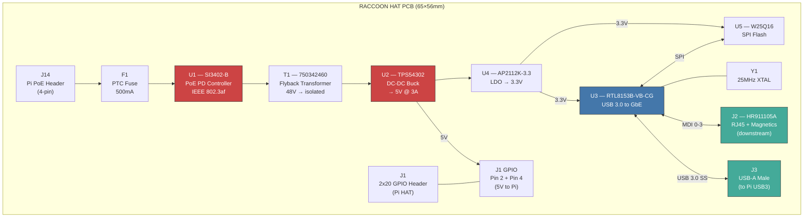
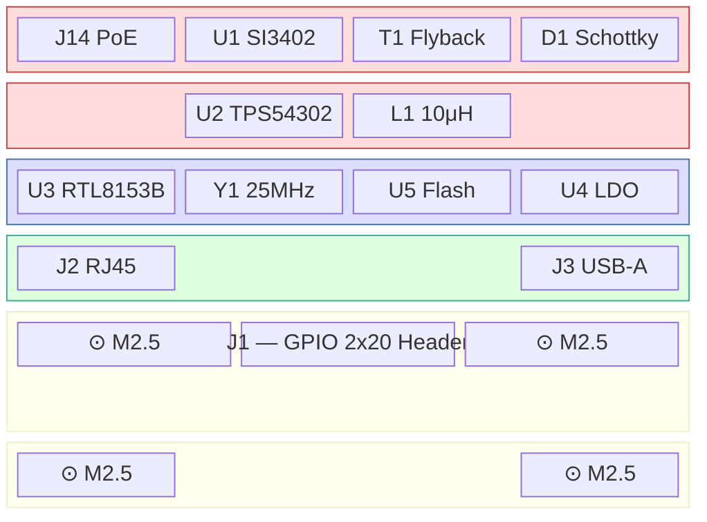

# Raccoon HAT — Circuit Design Guide

> [!WARNING]
> **Concept stage — not manufacturable as written.** A design audit on
> 2026-09-24 found substantive errors in the power section, including a
> connection that would destroy the TPS54302 and a PoE controller that cannot
> supply enough power for a Pi 4 with a USB peripheral. Sections corrected so
> far carry an inline note; §1.1 is marked invalid pending a redesign decision.
> See [`OPEN_QUESTIONS.md`](OPEN_QUESTIONS.md) for the complete findings.

Custom HAT PCB for Raspberry Pi 4 (running ParrotOS ARM64).
Two-layer board, 65mm x 56mm (Pi HAT standard).
Mounts via 40-pin GPIO header + 4x M2.5 standoffs.

## Block Diagram


```mermaid
graph TD
    J14["J14<br/>Pi PoE Header<br/>(4-pin)"] --> F1["F1<br/>PTC Fuse<br/>500mA"]
    F1 --> U1["U1 — SI3402-B<br/>PoE PD Controller<br/>IEEE 802.3af"]
    U1 --> T1["T1 — 750342460<br/>Flyback Transformer<br/>48V → isolated"]
    T1 --> U2["U2 — TPS54302<br/>DC-DC Buck<br/>→ 5V @ 3A"]
    U2 -->|"5V"| GPIO_5V["J1 GPIO<br/>Pin 2 + Pin 4<br/>(5V to Pi)"]
    U2 --> U4["U4 — AP2112K-3.3<br/>LDO → 3.3V"]

    U4 -->|"3.3V"| U3["U3 — RTL8153B-VB-CG<br/>USB 3.0 to GbE"]
    U4 -->|"3.3V"| U5["U5 — W25Q16<br/>SPI Flash"]

    U3 <-->|"USB 3.0 SS"| J3["J3<br/>USB-A Male<br/>(to Pi USB3)"]
    U3 <-->|"MDI 0-3"| J2["J2 — HR911105A<br/>RJ45 + Magnetics<br/>(downstream)"]
    U3 --- Y1["Y1<br/>25MHz XTAL"]
    U3 <-->|"SPI"| U5

    J1["J1<br/>2x20 GPIO Header<br/>(Pi HAT)"] --- GPIO_5V

    subgraph "RACCOON HAT PCB (65×56mm)"
        F1; U1; T1; U2; U4; U3; U5; Y1; J2; J3; J1; J14; GPIO_5V
    end

    style U1 fill:#c44,stroke:#333,color:#fff
    style U2 fill:#c44,stroke:#333,color:#fff
    style U3 fill:#47a,stroke:#333,color:#fff
    style J2 fill:#4a9,stroke:#333,color:#fff
    style J3 fill:#4a9,stroke:#333,color:#fff
```

## 1. PoE Power Supply (Sheet: PoE Power Supply)

### 1.1 PoE PD Controller — SI3402-B (U1)

> ## ⚠ This section is invalid and must be redesigned
>
> Verified against the Si3402-B datasheet and Skyworks AN956 on 2026-09-24.
> The circuit described below does not match the part. Do not build it.
> The full list of defects is in [`OPEN_QUESTIONS.md`](OPEN_QUESTIONS.md).
> Summary of the blocking issues:
>
> 1. **Every pin number is wrong.** The pinout used here matches no Si3402
>    variant — 0 of 16 pins agree with the datasheet. See the correct table below.
> 2. **The topology is redundant.** The Si3402-B already contains the PWM
>    controller *and* the switching FET, and produces the regulated output
>    itself (isolated flyback, or non-isolated buck). Feeding its output into a
>    second TPS54302 buck stage is a double conversion the part does not call for.
> 3. **An isolated (flyback) design needs an opto-coupler** on `EROUT` plus a
>    secondary-side reference (TLV431). Neither exists in the BOM.
> 4. **`PLOSS` is not a power-good output.** It is an open-drain pin pulled to
>    `VPOS` — up to 57 V. Wiring it straight to the TPS54302 `EN` pin, as written
>    below, would destroy the TPS54302.
> 5. **There is no gate driver output.** The hotswap FET is internal and has
>    two-step inrush limiting (140 mA typ.) built in, so Q1 is unnecessary.
>    Datasheet pin 9 is `VNEG`/thermal pad, not a gate.
> 6. **D3/D4 are unnecessary and undersized.** `SP1`/`SP2` are
>    polarity-insensitive HV inputs with integrated bridges. BAT54S is a 200 mA
>    small-signal part and cannot carry the PoE power path.
> 7. **>7 W designs must bypass the internal bridges** with external Schottky
>    diodes to spread heat (AN956). This board targets ~12 W and has no bridge.
> 8. **The `VNEG` thermal pad requires at least nine thermal vias** to a plane.
>    The current PCB has zero vias.
>
> Skyworks strongly recommends starting from their evaluation board design
> (`Si3402B-ISO-EVB` for isolated, `Si3402B-EVB` for non-isolated) and offers a
> free schematic/layout review. That is the recommended path forward.

The Raspberry Pi 4 exposes PoE signals on a 4-pin header (J14) from its
built-in Ethernet jack. Our HAT connects to this header to extract power.

**Pi PoE Header J14 Pinout:**
| Pin | Signal    |
|-----|-----------|
| 1   | VC1+ (TR0 CT) |
| 2   | VC1- (TR1 CT) |
| 3   | VC2+ (TR2 CT) |
| 4   | VC2- (TR3 CT) |

**Si3402-B actual pinout** (QFN-20 5×5 mm, datasheet Table 8):

| Pin | Name | Function |
|-----|------|----------|
| 1 | EROUT | Error-amp output / PWM input; drives the opto-coupler in isolated designs |
| 2 | SSFT | Legacy Si3402-A pin, not internally connected |
| 3 | VDD | 5 V supply rail for the switcher; also drives the opto-coupler |
| 4 | ISOSSFT | Legacy Si3402-A pin, not internally connected |
| 5 | PLOSS | Early power-loss indicator; open drain, pulled to VPOS |
| 6 | RDET | External precision detection resistor |
| 7 | HSO | Hotswap switch output; connects to VNEG through the internal switch |
| 8 | RCL | External precision classification resistor; float if unused |
| 9 + PAD | VNEG | Rectified HV negative rail **and thermal pad** (≥9 thermal vias) |
| 10 | SP2 | HV input from spare pair, polarity-insensitive |
| 11 | SP1 | HV input from spare pair, polarity-insensitive |
| 12 | VPOSF | Rectified HV positive rail (force node) |
| 13 | CT2 | HV input from Ethernet transformer centre tap, polarity-insensitive |
| 14 | CT1 | HV input from Ethernet transformer centre tap, polarity-insensitive |
| 15 | VSSA | Analog ground (may float; internally tied to VSS2) |
| 16 | VPOSS | Legacy Si3402-A pin, not internally connected |
| 17 | VSS1 | Legacy Si3402-A pin, not internally connected |
| 18 | SWO | Switching transistor output — drain of the internal N-FET |
| 19 | VSS2 | Negative supply rail for the switcher; **must be tied externally to HSO** |
| 20 | FB | Regulated feedback input (non-isolated designs only) |

**Signature resistors** (datasheet §3.2.2/§3.2.3, AN956 Table 3):

| Part | Net | Value | Note |
|------|-----|-------|------|
| R4 | RDET → VPOS | **24.3 kΩ ±1%** | Required for Si3402-**B** with the internal bridge. 24.9 kΩ if an external Schottky bridge is fitted. |
| R3 | RCL | **48.7 Ω ±1%** | Class 3 (6.49–12.95 W), which is what a Pi 4 + HAT at ~12 W needs. |

`RCLASS` is specified in **ohms**, not kilohms: Class 0 = open or >681 Ω,
Class 1 = 140 Ω, Class 2 = 75.0 Ω, Class 3 = 48.7 Ω, Class 4 = 33.2 Ω.

> **Corrected 2026-09-24.** R4 was 25.5 kΩ — that is the value for the
> *obsolete Si3402-A*. Skyworks' A→B migration note states the 25.5 kΩ detect
> resistor "must be replaced by 24.3 kΩ 1%". R3 was 49.9 kΩ, roughly 1000× the
> correct value and matching no class; it was most likely a garbled 48.7 Ω.
> A 49.9 kΩ RCL draws ~27 µA of class current, so the PSE would have read the
> PD as Class 0 regardless of the "Class 3" intent.

**Other requirements not yet reflected in this design:**

- `CDET`: the PD must present 50–120 nF at the input; populate ~100 nF (AN1130 §3.2).
- Minimum load: Skyworks recommends ≥250 mW to avoid switcher pulsing and false
  disconnect when the PD draws under 10 mA.
- Keep the `SWO` → transformer/inductor → rectifier → output-cap loop area minimal.

**Original (invalid) connection list, kept only for traceability:**
```
VC1+ ──→ F1 (500mA PTC) ──→ VDD_IN (pin 1)      # pin 1 is EROUT
VC1- ──→ VSS1 (pin 4)                            # pin 4 is ISOSSFT (n.c.)
VC2+ ──→ VDD_IN (pin 1) via D3 (BAT54S)          # D3/D4 unnecessary, undersized
VC2- ──→ VSS1 (pin 4) via D4 (BAT54S)

DET    (pin 2) ── R4 (25.5K) ──→ VSS     # RDET is pin 6; value was Si3402-A's
RCLASS (pin 3) ── R3 (49.9K) ──→ VSS     # RCL is pin 8; value ~1000x too high
PWRGD  (pin 5) ──→ TPS54302 EN           # pin 5 is PLOSS, pulled to VPOS (57V)
GATE   (pin 9) ──→ Q1 Gate (SI2302CDS)   # pin 9 is VNEG/PAD; no gate output exists
VDD_IN (pin 1) ── C3 (100uF) ──→ VSS
D2 (SMBJ58A) across VDD_IN/VSS           # surge suppressor is already integrated
```

### 1.2 DC-DC Buck Converter — TPS54302 (U2)

Converts the ~48V PoE rail down to 5V for the Pi 4.

```
VIN  ── PoE Rail (via PWRGD enable)
      ── C4 (100uF) to GND
BST  ── C1 (100nF) to SW
SW   ── L1 (10uH) ──→ VOUT (5V)
FB   ── R9/R10 voltage divider from VOUT
      ── R9 (100K) to VOUT
      ── R10 (13.3K) to GND
      ── FB = VOUT × R10/(R9+R10) = 0.596V reference
EN   ── PWRGD from SI3402-B
VOUT ── C11 (22uF) + C12 (22uF) to GND
      ── → Pi GPIO Pin 2 (5V) and Pin 4 (5V)
GND  ── → Ground plane
```

**VOUT Calculation:**
```
VOUT = VREF × (1 + R9/R10) = 0.596 × (1 + 100K/13.3K) = 0.596 × 8.519 = 5.08V ✓

R9  = 100K  (top, from VOUT to FB)
R10 = 13.3K (bottom, from FB to GND)

VREF = 0.596V typ. (0.581 … 0.611V, ±2.5%) — TPS54302 datasheet SLVSDF3, §6.3.7
Worst case over VREF tolerance: 4.95V … 5.21V — inside the Pi 4's 4.75–5.25V window.
```

> **Corrected 2026-09-24.** Earlier revisions of this guide assumed a 0.8V
> feedback reference and derived `R10 = 100K × 0.8/(5 − 0.8) ≈ 19.1K`. The
> TPS54302 reference is **0.596V**, not 0.8V, so 19.1K would have produced
> `0.596 × (1 + 100K/19.1K) = 3.72V` — well below the Pi 4's minimum and not
> enough to boot. R10 is now 13.3K, matching the value TI tabulates for a 5V
> output in the TPS54302EVM-716 user's guide (SLVUAP9). The other values in
> this section (L1 = 10µH, C11+C12 = 44µF, C1 = 100nF bootstrap) already
> matched TI's 5V row, which is what made the wrong VREF easy to miss.
>
> Still open: TI's 5V reference design also places a ~75pF feed-forward
> capacitor across R9 to improve phase margin. This board has no such part.
> Evaluate before committing to fabrication — see `OPEN_QUESTIONS.md`.

### 1.3 3.3V LDO — AP2112K-3.3 (U4)

Local 3.3V rail for RTL8153B and SPI flash.

```
VIN  ── 5V rail ── C5 (100nF)
VOUT ── 3.3V ── C6 (100nF) + C2 (10uF)
EN   ── VIN (always on)
GND  ── Ground plane
```

## 2. USB Ethernet Controller (Sheet: USB Ethernet Controller)

### 2.1 RTL8153B-VB-CG (U3)

USB 3.0 SuperSpeed to Gigabit Ethernet controller. Provides the second
Ethernet port (eth1) for the downstream tap connection.

**Package: QFN-40, 5 × 5 mm, exposed pad** (`QFN40_5X5MM_EP`). Earlier revisions
of this guide and the BOM said QFN-48 and the PCB carried a 7 × 7 mm 48-pin
footprint — both wrong. Corrected 2026-09-24.

**Verified pinout.** Taken from the RTL8153B-VB-CG datasheet rev 1.4 (Track ID
JATR-8275-15), pin description tables §5.1–5.11, cross-checked against the
pin-assignment figure on page 4.

| Pin | Name | Type | Pin | Name | Type |
|----:|------|------|----:|------|------|
| 1 | MDIP0 | I/O | 21 | VDD5 | P 5.0 V |
| 2 | MDIN0 | I/O | 22 | DVDD10_UPS | P 1.0 V |
| 3 | AVDD10 | P 1.0 V | 23 | DVDD33 | P 3.3 V |
| 4 | MDIP1 | I/O | 24 | EEDO / LED2 / SPISDO / LANWAKEB / GPIO | shared |
| 5 | MDIN1 | I/O | 25 | EEDI / SPISDI / ENSWREG | shared |
| 6 | MDIP2 | I/O | 26 | VDDREG33 | P 3.3 V |
| 7 | MDIN2 | I/O | 27 | VDDREG5 | P 5.0 V |
| 8 | AVDD10 | P 1.0 V | 28 | REGOUT | O 1.0 V |
| 9 | MDIP3 | I/O | 29 | GND | P |
| 10 | MDIN3 | I/O | 30 | EESK / LED1 / SPISCK | shared |
| 11 | AVDD33 | P 3.3 V | 31 | EECS | O |
| 12 | U3SSTXN | O | 32 | LED0 / SPICSB | shared |
| 13 | U3SSTXP | O | 33 | DVDD33 | P 3.3 V |
| 14 | U3VDD10 | P 1.0 V | 34 | DVDD10 | P 1.0 V |
| 15 | U3SSRXN | I | 35 | CKXTAL1 | I |
| 16 | U3SSRXP | I | 36 | CKXTAL2 | I/O |
| 17 | U2DM | I/O | 37 | AVDD10 | P 1.0 V |
| 18 | U2DP | I/O | 38 | RSET | I |
| 19 | U2VDD10 | P 1.0 V | 39 | AVDD33 | P 3.3 V |
| 20 | AVDD33 | P 3.3 V | 40 | AVDD33 | P 3.3 V |
| | | | 41 | GND | P (exposed pad) |

Grouped supplies: `AVDD33` = 11, 20, 39, 40 · `DVDD33` = 23, 33 ·
`AVDD10` = 3, 8, 37 · `GND` = 29 and 41 (pad).

**Power tree.** The chip needs **both 5 V and 3.3 V supplied externally** and
generates its own 1.0 V rail internally:

```
USB VBUS 5V ─┬─→ VDD5 (21), VDDREG5 (27)
             └─→ U4 AP2112K ─→ 3.3V ─→ VDDREG33 (26), DVDD33 (23, 33),
                                        AVDD33 (11, 20, 39, 40)

REGOUT (28) ─→ 1.0V ─→ DVDD10 (34), AVDD10 (3, 8, 37),
                        U3VDD10 (14), U2VDD10 (19)
```

> **Mandatory, and missing from earlier revisions of this guide:**
>
> 1. **`REGOUT` (28) must be wired externally** to `DVDD10`, `AVDD10`,
>    `U3VDD10` and `U2VDD10`. Datasheet §6.14: it "must be connected only to
>    DVDD10, AVDD10, U3VDD10, and U2VDD10 (do not provide this power source to
>    other devices)." Without this wiring the chip has no 1.0 V core supply.
> 2. **The 3.3 V LDO (U4) is required.** `VDDREG33` is an *input*, not an
>    output — the embedded LDO is for the chip's internal use only (§6.15
>    Note 1). U4 cannot be dropped.
> 3. **`RSET` (38) needs an external reference resistor** to set the internal
>    current reference. No such part exists in the BOM. Read the required value
>    off the datasheet's reference application before layout.
>
> Datasheet §6.14 also warns the switching regulator "requires a well-designed
> PCB layout in order to achieve good power efficiency and lower the output
> voltage ripple and input overshoot."

**Key Connections:**
```
USB3_DP   ──→ J3 USB-A D+     [Differential pair, 90Ω impedance]
USB3_DM   ──→ J3 USB-A D-     [Differential pair, 90Ω impedance]
USB3_SSTX+──→ J3 USB-A SSTX+  [SuperSpeed TX+]
USB3_SSTX-──→ J3 USB-A SSTX-  [SuperSpeed TX-]
USB3_SSRX+──→ J3 USB-A SSRX+  [SuperSpeed RX+]
USB3_SSRX-──→ J3 USB-A SSRX-  [SuperSpeed RX-]

AVDD33    ── C7 (100nF) to GND   [3.3V Analog]
DVDD33    ── C8 (100nF) to GND   [3.3V Digital]
DVDD12    ── Internal LDO output ── C9 (10uF) to GND

XI/XO     ── Y1 (25MHz) ── C13, C14 (10pF load caps each)

SPI_CLK   ──→ U5 pin 6 (CLK)
SPI_MOSI  ──→ U5 pin 5 (DI)
SPI_MISO  ──→ U5 pin 2 (DO)
SPI_CS    ──→ U5 pin 1 (CS#)

MDI0+/MDI0- ──→ J2 pins 1,2  [via magnetics]
MDI1+/MDI1- ──→ J2 pins 3,6  [via magnetics]
MDI2+/MDI2- ──→ J2 pins 4,5  [via magnetics]
MDI3+/MDI3- ──→ J2 pins 7,8  [via magnetics]

LED0      ── R7 (1K) ── LED1 (Green, Link/Activity)
LED1      ── R8 (1K) ── LED2 (Amber, Speed)
```

### 2.2 SPI Flash — W25Q16 (U5)

Stores RTL8153B firmware/configuration. Pre-programmed with Realtek
default firmware (available from Realtek vendor tools).

```
VCC  ── 3.3V ── C10 (100nF)
CS#  ── U3 SPI_CS ── R5 (10K pull-up to 3.3V)
CLK  ── U3 SPI_CLK
DI   ── U3 SPI_MOSI
DO   ── U3 SPI_MISO ── R6 (10K pull-up to 3.3V)
WP#  ── 3.3V (write protect disabled)
GND  ── Ground plane
```

## 3. Connectors (Sheet: Connectors)

### 3.1 GPIO Header — J1

Standard Raspberry Pi HAT 40-pin header (2x20, 2.54mm pitch).

**Used Pins:**
| Pi Pin | GPIO | Function                |
|--------|------|-------------------------|
| 2, 4   | —    | 5V Power Output (to Pi) |
| 6, 9   | —    | GND                     |
| 27     | ID_SD | HAT EEPROM SDA (optional) |
| 28     | ID_SC | HAT EEPROM SCL (optional) |

All other GPIO pins pass through unconnected (available for future use).

### 3.2 RJ45 Jack — J2 (HR911105A)

> [!CAUTION]
> **Wrong part — this is a 10/100Base-TX jack, not gigabit.** Verified
> 2026-09-25: the HR911105A datasheet is titled "…Integrated Magnetics and LED
> for **10/100Base-TX** NIC Applications". 1000BASE-T needs magnetics on all
> four pairs; this part has them on two. The link would negotiate at 100 Mbit/s,
> which is both a bandwidth bottleneck and an OPSEC failure — inserting the
> implant would visibly drop a gigabit switch port to 100 Mbit.
>
> A true 4-pair gigabit MagJack is required. None has been selected yet; the
> replacement will have a different pinout, so symbol and footprint must both be
> rebuilt. See [`OPEN_QUESTIONS.md`](OPEN_QUESTIONS.md) item 4.

RJ45 with integrated magnetics, intended to carry the RTL8153B MDI pairs. This is
the downstream port (to target device).

### 3.3 USB Connector — J3

USB 3.0 Type-A male header. Routes from the HAT PCB edge down to one
of the Pi 4's USB 3.0 ports via a short flex cable or right-angle connector.

Alternative: use pogo pins or a board-to-board connector to make direct
contact with the Pi's USB port pads (requires precise alignment).

### 3.4 PoE Header — J14 connector

4-pin, 2.54mm pitch header that mates with the Raspberry Pi 4's PoE header.
Directly connects to the SI3402-B PoE PD controller.

## 4. PCB Layout Notes

### Board Dimensions
- 65mm × 56mm (Raspberry Pi HAT standard)
- 4× M2.5 mounting holes at Pi standard positions
- Board thickness: 1.6mm
- Copper: 1oz (35μm) both layers
- Surface finish: HASL or ENIG

### Layer Stackup (2-layer)
- **F.Cu** — Signal routing, component pads
- **B.Cu** — Ground plane (solid pour), power traces

### Critical Layout Rules
1. **Ethernet differential pairs**: 100Ω impedance, length-matched within 5mm per pair
2. **USB 3.0 differential pairs**: 90Ω impedance, length-matched within 2mm
3. **PoE power traces**: minimum 1mm width for 48V rail, 1.5mm for 5V rail
4. **Decoupling caps**: place within 3mm of IC power pins
5. **Crystal**: place within 5mm of RTL8153B XI/XO pins, ground guard ring
6. **Flyback transformer**: keep high-voltage primary away from low-voltage secondary
7. **Thermal relief**: ground plane vias under TPS54302 thermal pad

### Component Placement Zones


```mermaid
block-beta
    columns 4

    block:top:4
        J14["J14 PoE"] U1["U1 SI3402"] T1["T1 Flyback"] D1["D1 Schottky"]
    end

    block:pwr:4
        space U2["U2 TPS54302"] L1["L1 10μH"] space
    end

    block:eth:4
        U3["U3 RTL8153B"] Y1["Y1 25MHz"] U5["U5 Flash"] U4["U4 LDO"]
    end

    block:conn:4
        J2["J2 RJ45"] space:2 J3["J3 USB-A"]
    end

    block:gpio:4
        MH1["⊙ M2.5"] J1["J1 — GPIO 2x20 Header"]:2 MH2["⊙ M2.5"]
    end

    block:bottom:4
        MH3["⊙ M2.5"] space:2 MH4["⊙ M2.5"]
    end

    style top fill:#fdd,stroke:#c44
    style pwr fill:#fdd,stroke:#c44
    style eth fill:#ddf,stroke:#47a
    style conn fill:#dfd,stroke:#4a9
```

## 5. Manufacturing

### Gerber Generation (KiCad 8)
1. File → Fabrication Outputs → Gerbers
2. Include: F.Cu, B.Cu, F.SilkS, B.SilkS, F.Mask, B.Mask, Edge.Cuts
3. Drill file: Excellon format, PTH + NPTH combined
4. Pick-and-place file for SMD assembly

### Recommended Fabrication
- **PCB**: JLCPCB, PCBWay, or OSH Park
- **Assembly**: JLCPCB SMT assembly (most passives + ICs available)
- **Estimated cost**: ~$15/board (qty 5, assembled)

## 6. Testing Checklist

- [ ] PoE detection and classification (measure VDD after PSE handshake)
- [ ] 5V output voltage (4.9V–5.1V under 2.5A load)
- [ ] 3.3V output voltage (3.25V–3.35V)
- [ ] USB enumeration (RTL8153B appears as `eth1`)
- [ ] Gigabit link on J2 (1000BASE-T negotiation) — **blocked:** J2 is currently
      a 10/100 part, see `OPEN_QUESTIONS.md` item 4
- [ ] Bridge mode (traffic passes eth0 ↔ eth1 at wire speed)
- [ ] Power consumption (target: <12W total with Pi 4)
