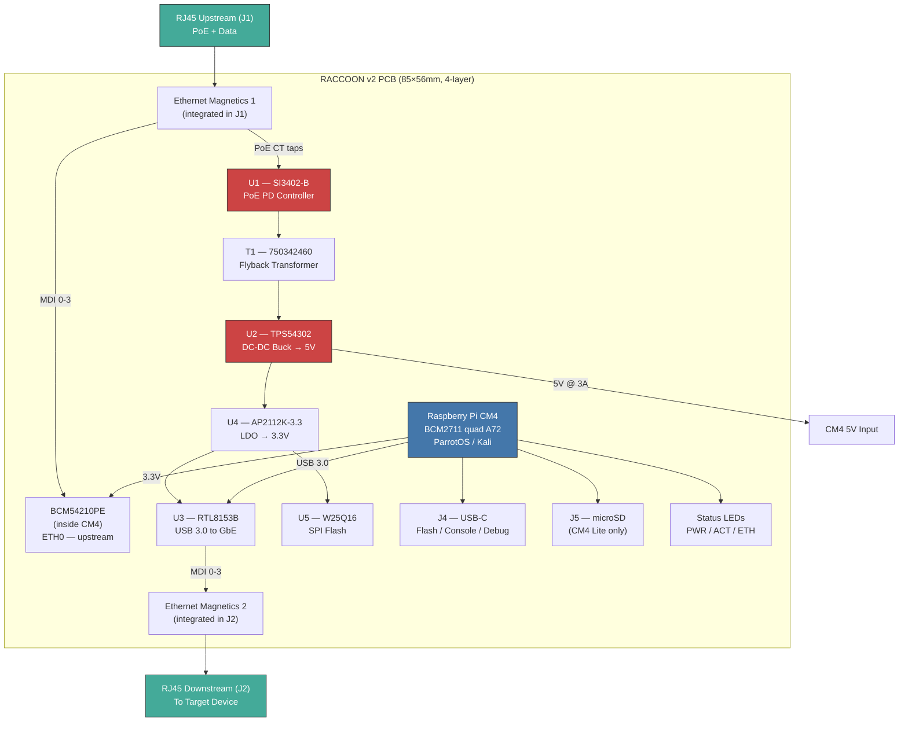

# Raccoon v2 — Integrated Carrier Board

All-in-one PCB: Raspberry Pi CM4 + Dual Gigabit Ethernet + PoE + inline tap.
No separate HAT, no USB adapter — everything on a single 85×56mm board.

## Why CM4?

| | Pi 4 Model B + HAT | CM4 Carrier (this) |
|---|---|---|
| Board count | 2 (Pi + HAT) | 1 |
| Size | 85×56 + 65×56mm stacked | 85×56mm single board |
| Ethernet | 1× native + 1× USB dongle | 2× native (both routed on PCB) |
| PoE | Via HAT header (limited current) | Direct, no header bottleneck |
| USB connection | External cable to Pi port | On-board traces (50mm shorter) |
| Enclosure fit | Tight with stacking | Flat, fits phone/printer shell |
| OS support | ParrotOS, Kali ARM64 | Same (identical BCM2711 SoC) |
| eMMC option | No (SD only) | Yes (CM4 Lite = SD, CM4 = eMMC) |

## CM4 Module Selection

| Variant | RAM | Storage | Wireless | Recommended for |
|---------|-----|---------|----------|-----------------|
| CM4001008 | 1GB | No eMMC | No WiFi | Budget, SD boot |
| CM4002008 | 2GB | No eMMC | No WiFi | Good balance |
| CM4004032 | 4GB | 32GB eMMC | No WiFi | **Recommended** — no SD needed |
| CM4104032 | 4GB | 32GB eMMC | WiFi+BT | If wireless C2 needed |

> WiFi adds a second antenna connector and FCC/CE complexity.
> Skip it unless you need a wireless C2 fallback channel.

## Block Diagram



## Schematic (by section)

### 1. CM4 Module Socket

The CM4 connects via two Hirose DF40C-100DS-0.4V(51) connectors (J6, J7).

**Connector 1 (J6) — key signals used:**

| Pin | Signal | Function |
|-----|--------|----------|
| 2, 6 | GND | Ground |
| 4, 8 | VBAT | 5V power input to CM4 |
| 76 | USB_OTG_N | USB 2.0 data– (to J4 USB-C) |
| 78 | USB_OTG_P | USB 2.0 data+ (to J4 USB-C) |
| 80 | nRPIBOOT | Pull low to enter USB boot mode |
| 82 | EMMC_DIS | Pull high for SD card boot (CM4 Lite) |
| 84 | GPIO44/SD_CLK | microSD CLK |
| 86 | GPIO45/SD_CMD | microSD CMD |
| 88-94 | GPIO46-49/SD_DAT0-3 | microSD data |

**Connector 2 (J7) — key signals used:**

| Pin | Signal | Function |
|-----|--------|----------|
| 2, 6 | GND | Ground |
| 30, 32 | ETH_nLED0, ETH_nLED1 | Ethernet activity/link LEDs |
| 34-47 | ETHA_P/N, ETHB_P/N, ETHC_P/N, ETHD_P/N | Ethernet diff pairs to J1 magnetics |
| 74 | USB_P | USB 3.0 host data+ (to U3 RTL8153B) |
| 76 | USB_N | USB 3.0 host data– (to U3 RTL8153B) |
| 78, 80 | USB_SSTXP, USB_SSTXN | USB 3.0 SS TX (to U3) |
| 82, 84 | USB_SSRXP, USB_SSRXN | USB 3.0 SS RX (from U3) |

### 2. Upstream Ethernet (ETH0) — J1

CM4 has a native BCM54210PE Gigabit PHY. We route its 4 MDI diff pairs
directly to an RJ45 jack with integrated magnetics and PoE center taps.

```
CM4 J7 pin 34 (ETHA_P) ──╮
CM4 J7 pin 35 (ETHA_N) ──┤── 100Ω diff pair ──→ J1 RJ45 pins 1,2
                          │                       │
CM4 J7 pin 38 (ETHB_P) ──┤                       ├── CT tap → PoE PD (VC1)
CM4 J7 pin 39 (ETHB_N) ──┤── 100Ω diff pair ──→ J1 pins 3,6
                          │                       │
CM4 J7 pin 42 (ETHC_P) ──┤                       ├── CT tap → PoE PD (VC2)
CM4 J7 pin 43 (ETHC_N) ──┤── 100Ω diff pair ──→ J1 pins 4,5
                          │
CM4 J7 pin 46 (ETHD_P) ──┤
CM4 J7 pin 47 (ETHD_N) ──┘── 100Ω diff pair ──→ J1 pins 7,8
```

**J1 RJ45 Jack:** HR911105A or equivalent with integrated magnetics.
Must have center tap access for PoE extraction (Mode B: pairs 4-5, 7-8).

**LED routing:**
```
CM4 J7 pin 30 (ETH_nLED0) ── R1 (1K) ── LED1 (Green, Link)
CM4 J7 pin 32 (ETH_nLED1) ── R2 (1K) ── LED2 (Amber, Activity)
```

### 3. PoE Power Supply

Identical to v1 HAT design but taps directly from J1 center taps
instead of the Pi's PoE header. This eliminates the current-limited
4-pin header bottleneck.

```
J1 CT (pair 4,5) ──→ VC1+ ── F1 (PTC 500mA) ──→ U1 SI3402-B VDD
J1 CT (pair 7,8) ──→ VC2+ ── D3 (BAT54S) ──→ U1 VDD
                     VC1- ──→ U1 VSS
                     VC2- ── D4 (BAT54S) ──→ U1 VSS

U1 SI3402-B:
  DET   ── R3 (25.5K) → GND     [802.3af detection]
  CLASS ── R4 (49.9K) → GND     [Class 0]
  PWRGD ──→ U2 TPS54302 EN      [enable buck when PoE ready]
  GATE  ──→ Q1 gate             [inrush control MOSFET]
  VDD   ── C3 (100µF) → GND    [input bulk]

U2 TPS54302 (48V → 5V):
  VIN   ── PoE rail ── C4 (100µF)
  BST   ── C_BST (100nF) → SW
  SW    ── L1 (10µH) → VOUT
  FB    ── R9 (100K)/R10 (19.1K) divider    [VOUT = 5.05V]
  VOUT  ── C11, C12 (22µF each) → GND
        ──→ CM4 VBAT (J6 pins 4, 8)
        ──→ U4 AP2112K-3.3 VIN

U4 AP2112K-3.3 (5V → 3.3V):
  VIN   ── 5V ── C5 (100nF)
  VOUT  ── 3.3V ── C6 (100nF) + C2 (10µF)
        ──→ U3 RTL8153B
        ──→ U5 W25Q16
```

### 4. Downstream Ethernet (ETH1) — U3 + J2

Same RTL8153B design as v1 but routed on-board to CM4 USB 3.0 host port.

```
CM4 J7 pin 74 (USB_P)     ──→ U3 USB D+        [90Ω diff pair]
CM4 J7 pin 76 (USB_N)     ──→ U3 USB D-
CM4 J7 pin 78 (USB_SSTXP) ──→ U3 USB SSRX+     [note: TX↔RX crossover]
CM4 J7 pin 80 (USB_SSTXN) ──→ U3 USB SSRX-
CM4 J7 pin 82 (USB_SSRXP) ──→ U3 USB SSTX+
CM4 J7 pin 84 (USB_SSRXN) ──→ U3 USB SSTX-

U3 RTL8153B-VB-CG:
  AVDD33  ── C7 (100nF) → GND
  DVDD33  ── C8 (100nF) → GND
  DVDD12  ── C9 (10µF) → GND     [internal LDO output]
  XI/XO   ── Y1 (25MHz) ── C13, C14 (10pF)
  SPI_*   ──→ U5 W25Q16
  MDI0-3  ──→ J2 HR911105A (downstream RJ45)
  LED0    ── R7 (1K) ── LED3 (Green)
  LED1    ── R8 (1K) ── LED4 (Amber)
```

### 5. USB-C Debug / Flash Port — J4

```
J4 USB-C:
  CC1  ── R11 (5.1K) → GND    [sink role, 5V only]
  CC2  ── R12 (5.1K) → GND
  D+   ──→ CM4 J6 pin 78 (USB_OTG_P)
  D-   ──→ CM4 J6 pin 76 (USB_OTG_N)
  VBUS ── not connected (CM4 powered by PoE, not USB)
```

Used for:
- `rpiboot` to flash eMMC on CM4 (pull nRPIBOOT low via button)
- Serial console (CM4 USB gadget mode)
- Firmware updates in the field

### 6. microSD Slot — J5 (CM4 Lite only)

```
J5 microSD:
  CLK   ── CM4 J6 pin 84 (GPIO44)
  CMD   ── CM4 J6 pin 86 (GPIO45) ── R_CMD (10K pull-up)
  DAT0  ── CM4 J6 pin 88 (GPIO46)
  DAT1  ── CM4 J6 pin 90 (GPIO47)
  DAT2  ── CM4 J6 pin 92 (GPIO48)
  DAT3  ── CM4 J6 pin 94 (GPIO49) ── R_CD (10K pull-up)
  VDD   ── 3.3V ── C_SD (100nF)
  GND   ── Ground
```

`EMMC_DIS` (J6 pin 82) must be pulled HIGH via R13 (10K) for SD boot
on CM4 Lite variants. On eMMC variants, leave floating (internal pull-down).

### 7. Boot Mode & Reset

```
nRPIBOOT (J6 pin 80):
  ── R14 (10K) pull-up to 3.3V   [normal boot from eMMC/SD]
  ── SW1 (tactile button) to GND [hold during power-on for USB boot]

RUN (J6 pin 66):
  ── R15 (10K) pull-up to 3.3V
  ── SW2 (tactile button) to GND [reset]

GLOBAL_EN (J6 pin 68):
  ── R16 (10K) pull-up to 5V     [CM4 power enable]
```

### 8. Status LEDs

| LED | Color | Signal | Function |
|-----|-------|--------|----------|
| LED1 | Green | ETH0 Link | CM4 ETH_nLED0 |
| LED2 | Amber | ETH0 Activity | CM4 ETH_nLED1 |
| LED3 | Green | ETH1 Link | RTL8153B LED0 |
| LED4 | Amber | ETH1 Activity | RTL8153B LED1 |
| LED5 | Green | Power Good | 5V rail via R (1K) |
| LED6 | Red | CM4 Activity | CM4 GPIO ACT (active low) |

## PCB Specifications

| Parameter | Value |
|-----------|-------|
| Dimensions | 85 × 56 mm |
| Layers | 4 (signal/GND/power/signal) |
| Thickness | 1.6 mm |
| Copper weight | 1 oz outer, 0.5 oz inner |
| Surface finish | ENIG (for fine-pitch CM4 connector) |
| Min trace/space | 0.1mm / 0.1mm (DF40 connector) |
| Min via | 0.3mm drill / 0.6mm pad |
| Impedance control | 100Ω diff (Ethernet), 90Ω diff (USB 3.0) |

### Layer Stackup (4-layer)

```
┌─────────────────────────────────┐
│ L1 — F.Cu (Signal)             │  Components, high-speed diff pairs
│    FR4 (0.2mm prepreg)         │
│ L2 — In1.Cu (GND plane)       │  Solid ground reference
│    FR4 (0.8mm core)           │
│ L3 — In2.Cu (Power plane)     │  5V, 3.3V, PoE rails
│    FR4 (0.2mm prepreg)         │
│ L4 — B.Cu (Signal)            │  Low-speed routing, CM4 connector
└─────────────────────────────────┘
```

4 layers are required (not optional) because:
- USB 3.0 SuperSpeed needs a continuous ground reference plane
- Ethernet 100Ω impedance control requires known stackup
- CM4 DF40 connector has 0.4mm pitch — cannot break out on 2 layers

### Component Placement

```
┌──────────────────────────────────────────────────────┐
│  J1 [RJ45]    ┌─U1─┐ ┌T1┐ ┌─U2──┐ L1    ●LED5     │
│  upstream      SI3402  XFMR TPS543              PoE  │
│  + PoE        └────┘ └──┘ └─────┘               pwr │
│                                                      │
│  ┌───────────────────────────────────────────┐       │
│  │                                           │       │
│  │       CM4 Module (55 × 40 mm)             │       │
│  │       ┌──J6──┐         ┌──J7──┐           │       │
│  │       │100pin│         │100pin│           │       │
│  │       └──────┘         └──────┘           │       │
│  │                                           │       │
│  └───────────────────────────────────────────┘       │
│                                                      │
│  ┌U3──┐ Y1   U5    U4     [J5 µSD]    [J4 USB-C]   │
│  RTL8153     Flash  LDO                              │
│  └────┘                    [SW1] [SW2]  ●LED6        │
│  J2 [RJ45]   ●LED3 ●LED4                            │
│  downstream                                          │
└──────────────────────────────────────────────────────┘
        85 mm
```

## BOM (integrated board)

| Ref | Qty | MPN | Description | Source |
|-----|-----|-----|-------------|--------|
| — | 1 | CM4004032 | Raspberry Pi CM4, 4GB, 32GB eMMC | RPi reseller |
| J6, J7 | 2 | DF40C-100DS-0.4V(51) | Hirose 100-pin CM4 connector | Mouser |
| J1 | 1 | HR911105A | RJ45 + magnetics (upstream) | LCSC |
| J2 | 1 | HR911105A | RJ45 + magnetics (downstream) | LCSC |
| J4 | 1 | USB4125-GF-A | USB-C 2.0 receptacle | LCSC |
| J5 | 1 | HRS-DM3AT-SF-PEJM5 | microSD push-push | LCSC |
| U1 | 1 | SI3402-B-FS | PoE PD controller | Mouser |
| U2 | 1 | TPS54302DDCR | 3A buck converter | Mouser |
| U3 | 1 | RTL8153B-VB-CG | USB 3.0 to GbE | LCSC |
| U4 | 1 | AP2112K-3.3TRG1 | 3.3V LDO | Mouser |
| U5 | 1 | W25Q16JVSSIQ | 16Mbit SPI flash | LCSC |
| T1 | 1 | 750342460 | PoE flyback transformer | Mouser |
| Y1 | 1 | 25MHz 3215 | Crystal oscillator | LCSC |
| D1 | 1 | MBRS340T3G | Schottky 40V 3A | Mouser |
| D2 | 1 | SMBJ58A | TVS 58V | Mouser |
| D3, D4 | 2 | BAT54S | Dual Schottky | Mouser |
| L1 | 1 | SRN6045TA-100M | 10µH 3A inductor | Mouser |
| L2 | 1 | LQM21FN4R7M | 4.7µH inductor | LCSC |
| F1 | 1 | nSMD050-24V | 500mA PTC fuse | Mouser |
| C1-C2 | 2 | CL21A106KOQNNNG | 10µF 25V 0805 | LCSC |
| C3-C4 | 2 | UVR1H101MDD1TD | 100µF 50V electrolytic | Mouser |
| C5-C10 | 6 | CL05B104KO5NNNC | 100nF 0402 | LCSC |
| C11-C12 | 2 | CL21A226MQQNNNG | 22µF 10V 0805 | LCSC |
| C13-C14 | 2 | CL05C100JB5NNNC | 10pF 0402 | LCSC |
| C_SD | 1 | CL05B104KO5NNNC | 100nF 0402 | LCSC |
| C_BST | 1 | CL05B104KO5NNNC | 100nF 0402 | LCSC |
| R1-R2 | 2 | RC0402FR-071KL | 1K 0402 (ETH0 LEDs) | LCSC |
| R3 | 1 | RC0402FR-0725K5L | 25.5K 0402 (PoE DET) | LCSC |
| R4 | 1 | RC0402FR-0749K9L | 49.9K 0402 (PoE CLASS) | LCSC |
| R5-R6 | 2 | RC0402FR-0710KL | 10K 0402 (SPI pull-ups) | LCSC |
| R7-R8 | 2 | RC0402FR-071KL | 1K 0402 (ETH1 LEDs) | LCSC |
| R9 | 1 | RC0402FR-07100KL | 100K 0402 (FB divider) | LCSC |
| R10 | 1 | RC0402FR-0719K1L | 19.1K 0402 (FB divider) | LCSC |
| R11-R12 | 2 | RC0402FR-075K1L | 5.1K 0402 (USB-C CC) | LCSC |
| R13 | 1 | RC0402FR-0710KL | 10K 0402 (EMMC_DIS) | LCSC |
| R14-R16 | 3 | RC0402FR-0710KL | 10K 0402 (pull-ups) | LCSC |
| LED1, LED3 | 2 | 19-217/GHC-YR1S2/3T | Green 0402 | LCSC |
| LED2, LED4 | 2 | 19-217/Y2C-CQ2R2L/3T | Amber 0402 | LCSC |
| LED5 | 1 | 19-217/GHC-YR1S2/3T | Green 0402 (power) | LCSC |
| LED6 | 1 | 150060RS75000 | Red 0402 (activity) | LCSC |
| SW1, SW2 | 2 | SKQGAFE010 | Tactile switch 6mm | LCSC |

**Estimated cost:** ~$18 PCB assembled (qty 5, JLCPCB) + ~$35 CM4 module = **~$53 total**

## vs. Raspberry Pi 4 + HAT (v1)

| | v1 (Pi 4 + HAT) | v2 (CM4 carrier) |
|---|---|---|
| Total size | 85×56 + 65×56mm (stacked) | 85×56mm (single) |
| Height | ~25mm (Pi + HAT + standoffs) | ~10mm (carrier + CM4) |
| Weight | ~80g | ~45g |
| Board cost | ~$15 (HAT) + $60 (Pi 4) | ~$18 + $35 (CM4) |
| ETH1 connection | USB cable/dongle | On-board traces |
| PoE input | Via Pi header (limited) | Direct from RJ45 |
| USB 3.0 path | ~100mm external | ~30mm on-board |
| PCB layers | 2 | 4 (required for CM4) |
| Assembly difficulty | Easy (THT header) | Medium (fine-pitch) |
| Enclosure options | Cisco phone shell, printer box | Same + smaller enclosures |

## Manufacturing

### JLCPCB Order Settings

| Parameter | Value |
|-----------|-------|
| Layers | 4 |
| Dimensions | 85 × 56 mm |
| PCB thickness | 1.6mm |
| Impedance control | Yes (JLC04161H-7628 stackup) |
| Surface finish | ENIG |
| Copper weight | 1oz outer / 0.5oz inner |
| Via type | Tented |
| Min trace/space | 0.1mm/0.1mm |
| PCBA | Economic (most parts from JLCPCB library) |

### Parts NOT in JLCPCB library (hand-solder)

- CM4 module (plug-in, no soldering)
- Hirose DF40 connectors (reflow or hand-solder with flux)
- PoE transformer T1 (through-hole)

### Gerber file naming (JLCPCB)

```
raccoon-v2-F_Cu.gbr
raccoon-v2-In1_Cu.gbr
raccoon-v2-In2_Cu.gbr
raccoon-v2-B_Cu.gbr
raccoon-v2-F_SilkS.gbr
raccoon-v2-B_SilkS.gbr
raccoon-v2-F_Mask.gbr
raccoon-v2-B_Mask.gbr
raccoon-v2-Edge_Cuts.gbr
raccoon-v2.drl
raccoon-v2-NPTH.drl
```

## Flashing the CM4

### eMMC variant (recommended)

```bash
# On a workstation with USB connected to J4:
# Hold SW1 (BOOT) while powering on
sudo rpiboot                      # from usbboot package
# CM4 eMMC appears as /dev/sdX

sudo dd if=parrotos-arm64.img of=/dev/sdX bs=4M status=progress
sync
# Release SW1, power cycle
```

### CM4 Lite (microSD)

Flash the SD card normally with Raspberry Pi Imager or `dd`.

## Testing Checklist

- [ ] CM4 boots from eMMC/SD (LED6 blinks)
- [ ] 5V rail: 4.95–5.10V under load
- [ ] 3.3V rail: 3.25–3.35V
- [ ] ETH0 (J1): link LED, `ip link show eth0` = UP
- [ ] ETH1 (J2): link LED, `ip link show eth1` = UP (RTL8153B)
- [ ] Bridge: `br0` passes traffic eth0 ↔ eth1 at wire speed
- [ ] PoE: device powers from 802.3af switch (no USB-C needed)
- [ ] USB-C (J4): `rpiboot` flashes eMMC
- [ ] PoE power consumption < 12W
- [ ] Fits inside Cisco 7960 shell / HP printer enclosure
